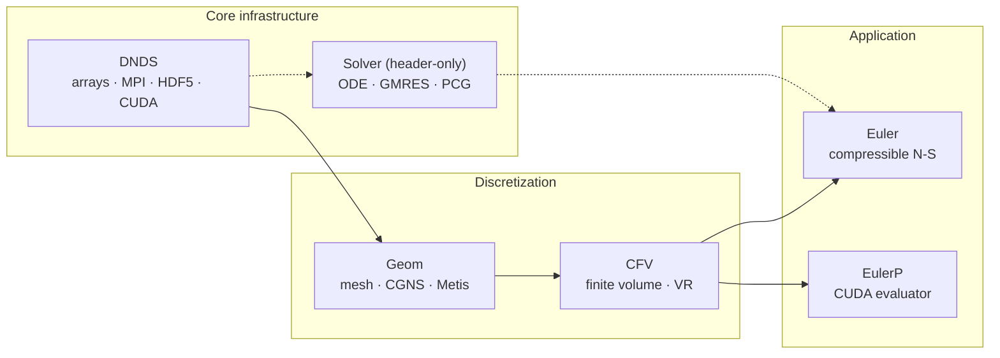

<!-- _footer: "docs/architecture/Paradigm.md:4,119,161" -->

## Why another CFD code?

<div class="cols-60-40">
<div>

**The unstructured-CFD design space sits awkwardly:**

- **CG/CAD** — complex polymorphic topology, small compute per
  element (Blender, FreeCAD, Gmsh).
- **Deep-learning frameworks** — massive homogeneous arrays,
  simple fixed-width tensors (PyTorch, JAX).
- **Unstructured CFD needs both** — heterogeneous topology + dense
  numeric kernels.

**Two dominant existing paradigms leak abstractions:**

- **OpenFOAM-style** — `primitiveMesh` owns topology + geometry
  inside a monolithic class hierarchy; communication lives at
  the class level.
- **SU2-style** — polymorphic `CDualGrid` / `CVertex` objects
  carry per-entity geometric and solution state.

Every new communicated field forces an edit to the object model.

</div>
<div>

**DNDSR thesis**

> *"DNDS is dedicated to providing c-like random-access arrays*
> *without the concern of MPI communication. Higher-level*
> *abstraction is left for the caller."*
> — `docs/architecture/Paradigm.md:161`

```cpp
// NOT this:
struct Face {
    real area;
    vec  cent;
    // …more fields…
};
std::vector<Face> faces;

// THIS:
std::vector<real> faceArea;
std::vector<vec>  faceCent;
// each manages its
// own MPI pattern.
```

</div>
</div>

---
<!-- _footer: "README.md:11-26 · app/Euler/*.cpp" -->

## DNDSR at a glance

<div class="cols">
<div>

### Capabilities

- **Solvers** — Euler / N-S (2D/3D), SA-IDDES, k-ω RANS (Wilcox & SST), reactive `NS_EX`, realizable k-ε.
- **Numerics** — CFV + variational reconstruction (orders 1–3), 13 Riemann variants, ESDIRK / HM3 / BDF2, p-Multigrid, WBAP / CWBAP limiters.
- **Parallelism** — persistent MPI + OpenMP throughout; CUDA via `DeviceTransferable` CRTP; EulerP purpose-built GPU evaluator.
- **Bindings** — pybind11 for DNDS · Geom · CFV · EulerP; PEP-561 typed (`.pyi` auto-generated).
- **Config** — typed JSON + auto-generated JSON Schema (`--emit-schema`); unknown-key detection built in.

</div>
<div>

### Solver executables

| Executable                   | Model                              |
|------------------------------|------------------------------------|
| `euler` / `euler3D`          | Compressible Navier–Stokes         |
| `eulerSA` / `eulerSA3D`      | Spalart–Allmaras RANS (IDDES)      |
| `euler2EQ` / `euler2EQ3D`    | k-ω two-equation RANS              |
| `eulerEX` / `eulerEX3D`      | Reactive / multi-species           |

Each `app/Euler/euler*.cpp` is a **one-line `main`** that instantiates
`DNDS::Euler::RunSingleBlockConsoleApp<Model>` — a template dispatch on
the `EulerModel` enum.

Shared code path, eight binaries.

</div>
</div>

---
<!-- _footer: "RELEASE_NOTES.md · docs/architecture/ · docs/dev/" -->

## Project shape in numbers

<div class="cols-3">
<div>

### Code

- **~110 k** insertions (v0.1.0)
- **701** files changed
- **241** commits in the tagged release
- **6** C++ modules + header-only Solver
- **4** pybind11 extension modules
- **8** solver executables

</div>
<div>

### Tests

- **25+** C++ doctest executables
- **np ∈ {1, 2, 4, 8}** for every MPI-aware test
- **~32** Python FV/VR regression tests
- **Metis seed = 42** → deterministic golden values
- 43 CFV · 59 Euler · 24 Solver assertions

</div>
<div>

### Docs

- **Sphinx + Breathe + Doxygen**
- Full class / call / include graphs (Graphviz)
- Incremental build < 1 s (no-op), ~2.5 min (full)
- Live at `cfdlab-thu.github.io/DNDSR`
- One-source Markdown for both engines via `doxygen_compat.py`

</div>
</div>

<br>

> 🧹 Clang-tidy milestone: the DNDS core module dropped from
> **24 597 → 1** diagnostic across 26 cleanup passes.

---
<!-- _footer: "docs/guides/project_structure.md:101-114" -->
<!-- _class: denser -->

## The one-slide map



<div class="callout">

**Reading this graph.** Every module depends only on those above it. `Solver`
is header-only and depends only on `DNDS` data types — the Krylov and ODE code
knows nothing about CFD. `EulerP` is a parallel-track CUDA evaluator alongside
`Euler`, reusing `CFV` but replacing the flux/limiter pipeline with device-callable
scalar loops.

</div>

---
<!-- _footer: "README.md:28-68 · docs/guides/building.md" -->

## From zero to a running solver in six commands

```bash
# 1. Fetch code and submodules
git clone --recursive https://github.com/CFDLAB-THU/DNDSR.git && cd DNDSR

# 2. Build binary external libraries (HDF5, CGNS, Metis, ParMetis, zlib, ...)
cd external/cfd_externals && CC=mpicc CXX=mpicxx python cfd_externals_build.py && cd ../..

# 3. Fetch header-only libraries (Eigen, Boost, CGAL, fmt, pybind11, nanoflann, ...)
curl -L -o external/external_headeronlys.tar.gz \
  https://github.com/harryzhou2000/cfd_externals_headeronlys/releases/latest/download/external_headeronlys.tar.gz
cd external && tar -xzf external_headeronlys.tar.gz && cd ..

# 4. Configure with a preset
cmake --preset release-test        # Release + DNDS_BUILD_TESTS=ON

# 5. Build a specific solver
cmake --build build -t euler -j32

# 6. Run
mpirun -np 4 ./build/app/euler.exe cases/euler_config_IV.json
```

Presets available: `release-test`, `debug`, `cuda`, `ci`. Python path:
`pip install -e .` uses `scikit-build-core` under the hood.

