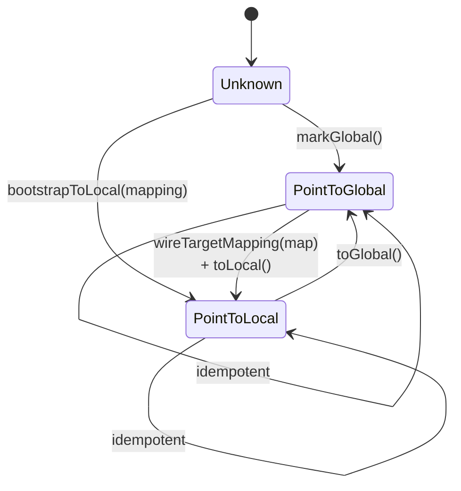

<!-- _footer: "docs/guides/project_structure.md:5-17 · docs/index.md:10-17" -->

## Six modules — responsibilities

| Module     | Directory    | Role                                                              | LoC   |
|------------|--------------|-------------------------------------------------------------------|-------|
| **DNDS**   | `src/DNDS`   | MPI arrays, serialization (JSON + HDF5), profiling, CUDA, config  | large |
| **Geom**   | `src/Geom`   | Unstructured mesh, CGNS I/O, Metis/ParMetis partitioning          | large |
| **CFV**    | `src/CFV`    | Compact Finite Volume, Variational Reconstruction, limiters       | medium |
| **Euler**  | `src/Euler`  | Compressible N-S, SA, k-ω, dual-time orchestration                | large |
| **EulerP** | `src/EulerP` | Alternative CUDA-optimized evaluator                              | medium |
| **Solver** | `src/Solver` | ODE integrators + Krylov — **header-only**                        | small |

<br>

<div class="callout">

**Why the split.** Each layer depends only on those above. `Solver` depends on
DNDS data types only — the Krylov and ODE code knows nothing about CFD; this is
how the same `GMRES_LeftPreconditioned` works across Euler, VR's `uRec` system,
and the k-ω equations. `EulerP` sits alongside `Euler`, reusing all of `CFV` but
replacing the flux kernel with device-callable scalar loops.

</div>

---
<!-- _footer: "docs/architecture/Paradigm.md:119-161" -->
<!-- _class: dense -->

## Delayed abstraction ⇒ independent comm patterns

Different field genres need different communication patterns.
**Baking them into one class forces a monolithic serializer.**

<div class="cols">
<div>

**Fragile: combined struct**

```cpp
class Solution {
    real rho, ru, rv, rw, E;   // comm phase A
    real u, v, w, p, T;        // derived, no comm
    real rho_1, ru_1, rv_1,
         rw_1, E_1;             // comm phase B
public:
    void WriteStream(ByteStream &);
    void ReadStream (ByteStream &);
};
std::vector<Solution> sols;
```

A single `WriteStream` can't express *which* fields participate in *which*
MPI phase — any new field requires editing both methods.

</div>
<div>

**DNDSR: split by genre**

```cpp
ArrayDof<5, 1>          u;       // conservative now
ArrayDof<5, 1>          u_prev;  // previous snapshot
ArrayDof<2, 5>          grad_u;  // gradients, 2D × 5 vars
ArrayDof<DynamicSize,5> uRec;    // variable-order reconstruction
```

Each array owns its own `ArrayTransformer`. Ghost footprints and
communication phases are **independent and composable**:

- `u` and `u_prev` share the same ghost map → `BorrowGGIndexing`.
- `uRec` may have a different row size — new MPI types, same map.
- `grad_u` lives in a larger halo for gradient stencils.

</div>
</div>

---
<!-- _footer: "src/DNDS/ArrayBasic.hpp:17-25 · array_infrastructure.md:50-95" -->
<!-- _class: denser -->

## `Array<T, rs, rm>` — five layouts in one template

```cpp
template <class T,
          rowsize _row_size = 1,             // fixed | DynamicSize | NonUniformSize
          rowsize _row_max  = _row_size,     // controls padding vs CSR
          rowsize _align    = NoAlign>
class Array;

enum DataLayout {
    ErrorLayout,        // invalid template combination (compile error)
    TABLE_StaticFixed,  // fixed width, compile-time
    TABLE_Fixed,        // fixed width, runtime (uniform across rows)
    TABLE_Max,          // padded variable rows, runtime max
    TABLE_StaticMax,    // padded variable rows, compile-time max
    CSR,                // flat buffer + pRowStart[n+1]
};
```

**`ComputeDataLayout()` maps `(rs, rm)` → layout tag:**

| `_row_size`      | `_row_max`      | Layout              | Use case                                            |
|------------------|-----------------|---------------------|-----------------------------------------------------|
| `>= 0`           | —               | `TABLE_StaticFixed` | Cell volume (1 real), Euler state (5 reals)         |
| `DynamicSize`    | —               | `TABLE_Fixed`       | VR coefficients (order decided at runtime)          |
| `NonUniformSize` | `>= 0`          | `TABLE_StaticMax`   | `cell2node` (tri=3, quad=4, compile-time max)       |
| `NonUniformSize` | `DynamicSize`   | `TABLE_Max`         | Padded variable rows, runtime max                   |
| `NonUniformSize` | `NonUniformSize`| `CSR`               | Truly sparse rows (wide-stencil adjacency)          |

<div class="tiny">`rowsize = int32_t`. Sentinels: `DynamicSize = -1`, `NonUniformSize = -2`.
Alignment stub exists but only `NoAlign` is implemented today.</div>

---
<!-- _footer: "src/DNDS/Array.hpp · array_infrastructure.md:82-95" -->
<!-- _class: denser -->

## CSR has two internal modes

<div class="cols">
<div>

### Decompressed mode

`std::vector<std::vector<T>>` — one inner vector per row.

```cpp
ArrayAdjacency<NonUniformSize, NonUniformSize> c2n;
c2n.Decompress();           // → vector<vector<index>>
for (index iCell = 0; iCell < nCell; ++iCell) {
    c2n.ResizeRow(iCell, /*width*/ vertexCount[iCell]);
    for (int k = 0; k < vertexCount[iCell]; ++k)
        c2n(iCell, k) = globalNodeId[iCell][k];
}
c2n.Compress();             // required before MPI
```

**Use during mesh construction** — rows grow incrementally.

</div>
<div>

### Compressed mode

Flat `std::vector<T>` + `pRowStart[n+1]` index.

- O(1) row access via `pRowStart[i]`.
- Zero overhead after construction.
- **Required** before any MPI call or serialization.
- Retains row-resizing only through `Decompress()` → edit → `Compress()`.

### ArrayView

A device-callable non-owning view (`ArrayView<T, rs, rm>`) implements
`operator[]` and `at()` for every layout — this is what ships to the GPU.

</div>
</div>

<div class="callout callout-warn">

⚠ **Element-type constraint:** `array_comp_acceptable<T>()` requires
`std::is_trivially_copyable_v<T>` **or** `is_fixed_data_real_eigen_matrix_v<T>`.
No `std::string` rows, no `std::vector` rows — it would break MPI.

</div>

---
<!-- _footer: "src/DNDS/ArrayTransformer.hpp:429-1496" -->
<!-- _class: denser -->

## `ArrayTransformer` — anatomy

<div class="cols-40-60">
<div>

**Members**

- `MPIInfo mpi;`
- `t_pArray father, son;`
- `pLGlobalMapping`   — local row → global index
- `pLGhostMapping`    — global index → local father+son
- `pPushTypeVec / pPullTypeVec` — cached `(rank, MPI_Datatype)`
- `PushReqVec / PullReqVec` — persistent request handles
- `pushDevice / pullDevice` — Host or CUDA

**Two strategies**

- `HIndexed` — `MPI_Type_create_hindexed` scatter/gather (default).
- `InSituPack` — contiguous pack buffers, `MPI_Isend/Irecv` on packed memory.

Chosen per-process via `MPI::CommStrategy::Instance().GetArrayStrategy()`.

</div>
<div>

**Lifecycle**

```cpp
// Setup — all collective
trans.setFatherSon(father, son);
trans.createFatherGlobalMapping();
trans.createGhostMapping(pullIdxGlobal);   // pull-based
// or:
trans.createGhostMapping(pushIdxLocal, pushStarts); // push-based
trans.createMPITypes();                    // hindexed datatypes

// Persistent init
trans.initPersistentPull();                // MPI_Recv_init + Send_init
trans.initPersistentPush();                // reverse direction

// Hot loop — any number of times
for (step = 0; step < N; ++step) {
    trans.startPersistentPull();           // MPI_Startall
    computeFluxes(/* reads ghosts */);
    trans.waitPersistentPull();            // MPI_Waitall
}

// Cleanup
trans.clearPersistentPull();
trans.clearMPITypes();
```

</div>
</div>

---
<!-- _footer: "src/DNDS/ArrayTransformer.hpp · array_infrastructure.md:115-184" -->

## Father / son addressing

```
 index:   0 .......... fatherSize-1 | fatherSize ...... fatherSize+sonSize-1
          └───── owned (father) ─────┘ └─ ghost (son, copies from other ranks) ─┘

  • father owns data — writes are legal
  • son  mirrors remote data — writes are ignored after the next pull
  • operator[](i) routes to father or son by index range
```

<div class="cols">
<div>

**Pull = father → son (read ghosts)**

```cpp
trans.initPersistentPull();
trans.startPersistentPull();      // non-blocking
// ... overlap computation ...
trans.waitPersistentPull();
```

Typical in flux-evaluation loops: read neighbor cell values.

</div>
<div>

**Push = son → father (accumulate)**

```cpp
trans.initPersistentPush();
trans.startPersistentPush();
trans.waitPersistentPush();
```

Typical in node-based FEM-style assembly: accumulate partial sums from
ghost copies back into the father.

</div>
</div>

> **Sharing ghost structure across arrays.** `BorrowGGIndexing(primary)`
> skips the expensive collective `createFatherGlobalMapping` +
> `createGhostMapping` phase; only `createMPITypes()` is rebuilt because
> the MPI datatypes depend on element size.

---
<!-- _footer: "src/DNDS/ArrayPair.hpp · src/DNDS/ArrayDerived/*.hpp" -->

## Typed wrappers: `ArrayDerived`

Each derived class inherits from `ParArray<T, rs, rm>` and overrides `operator[]`
to return a **typed row view** instead of a raw pointer.

| Type                              | `operator[](i)` returns              | Use                                |
|-----------------------------------|--------------------------------------|------------------------------------|
| `ArrayAdjacency<rs, rm>`          | `AdjacencyRow` — lightweight span    | mesh topology (`cell2node`, …)     |
| `ArrayEigenVector<N>`             | `Eigen::Map<Vector<real, N>>`        | node coordinates (`coords`)        |
| `ArrayEigenMatrix<M, N>`          | `Eigen::Map<Matrix<real, M, N>>`     | per-cell Jacobians, gradients      |
| `ArrayEigenUniMatrixBatch<M, N>`  | `j`-th matrix of a per-row batch     | quadrature-point data              |

<div class="cols">
<div>

### `ArrayPair<TArray>` — the convenience bundle

```cpp
template <class TArray = ParArray<real, 1>>
struct ArrayPair {
    ssp<TArray>   father;
    ssp<TArray>   son;
    TTrans        trans;
    auto operator[](index i);       // → father or son by range
};
```

</div>
<div>

### Common type aliases

| Alias                              | Purpose                           |
|------------------------------------|-----------------------------------|
| `ArrayAdjacencyPair<rs, rm>`       | mesh connectivity                 |
| `ArrayEigenVectorPair<N>`          | coords                            |
| `ArrayEigenMatrixPair<M, N>`       | per-entity matrices               |
| `ArrayEigenUniMatrixBatchPair<M,N>`| quadrature data                   |

</div>
</div>

---
<!-- _footer: "src/DNDS/ArrayDOF.hpp:174-395 · CFV/VRDefines.hpp:27" -->
<!-- _class: dense -->

## `ArrayDof` — the solver's vector space

```cpp
template <int n_m, int n_n>
class ArrayDof : public ArrayEigenMatrixPair<n_m, n_n>;
```

Wraps `father + son + transformer` and adds **MPI-collective vector-space ops** —
directly consumable by the Krylov solvers in `src/Solver`.

<div class="cols">
<div>

### Operations (CPU + CUDA specializations)

```cpp
void setConstant(real R);
void setConstant(const Eigen::Ref<...> &M);

void operator+=(const ArrayDof &R);
void operator-=(const ArrayDof &R);
void operator*=(real R);
void operator*=(const ArrayDof &R);    // Hadamard
void operator/=(const ArrayDof &R);

void addTo(const ArrayDof &R, real r); // AXPY

// MPI-collective reductions
real norm2();                  real norm2(const ArrayDof &R);
real dot(const ArrayDof &R);
real min();                    real max();    real sum();
```

</div>
<div>

### CFV aliases

```cpp
// src/CFV/VRDefines.hpp
template <int N>  using tUDof    = ArrayDof<N, 1>;
template <int N>  using tURec    = ArrayDof<DynamicSize, N>;
template <int N,
          int d>  using tUGrad   = ArrayDof<d, N>;
```

- `tUDof<N>` — cell-mean conservative variables (ρ, ρu, ρv, ρw, ρE).
- `tURec<N>` — reconstruction coefficients (nDOF chosen at runtime per order).
- `tUGrad<N, d>` — dim × N gradient matrix per cell.

Explicit instantiation covers `(n_m ∈ {1..8, Dynamic, NonUniform}, n_n ∈ {1..5})`.

</div>
</div>

---
<!-- _footer: "src/DNDS/ArrayDOF_op.hxx · ArrayDOF_op_CUDA.cuh" -->
<!-- _class: dense -->

## Host / CUDA dispatch for DOF ops

```cpp
template <DeviceBackend B, int n_m, int n_n>
class ArrayDofOp;

template <int n_m, int n_n>
class ArrayDofOp<DeviceBackend::Host, n_m, n_n> {  /* OpenMP-parallel impl  */ };

#ifdef DNDS_USE_CUDA
template <int n_m, int n_n>
class ArrayDofOp<DeviceBackend::CUDA, n_m, n_n> { /* thrust / raw kernels */ };
#endif
```

**Runtime dispatch:**

```cpp
#define DNDS_ARRAY_OP_SWITCHER(backend, expr)  \
    switch (backend) {                          \
        case DeviceBackend::Host: { using Op = ArrayDofOp<DeviceBackend::Host, n_m, n_n>; expr; break; } \
        case DeviceBackend::CUDA: { using Op = ArrayDofOp<DeviceBackend::CUDA, n_m, n_n>; expr; break; } \
        default: DNDS_assert_info(false, "Unknown device");                 \
    }
```

<div class="callout callout-ok">

**Consequence.** The solver's `norm2()` / `dot()` / `addTo()` calls are the
same in C++ regardless of where the data lives — the host code just checks
`father->device()` and routes. No `#ifdef CUDA` in Euler or Solver.

</div>

---
<!-- _footer: "docs/architecture/MeshConnectivity.md:179-336 · Mesh_DeviceView.hpp:89-94" -->
<!-- _class: tight -->

## State-tracked mesh adjacency (1 / 2)

12+ adjacency arrays (`cell2node`, `face2cell`, `cell2cell`, `node2bnd`, …)
must each be **globally or locally indexed** at any given moment — a classic
bug surface.

```cpp
enum MeshAdjState {
    Adj_Unknown      = 0,
    Adj_PointToLocal,
    Adj_PointToGlobal,
};
```



---
<!-- _footer: "src/Geom/Mesh/AdjIndexInfo.hpp:27-341" -->
<!-- _class: denser -->

## State-tracked mesh adjacency (2 / 2)

<div class="cols">
<div>

### `AdjIndexInfo` — private state + target map

```cpp
struct AdjIndexInfo {
private:
    MeshAdjState     _state{Adj_Unknown};
    t_pLGhostMapping _targetMapping;     // map of the TARGET kind
public:
    // queries
    MeshAdjState state() const;
    bool isLocal(), isGlobal(), isBuilt(), isWired();
    // transitions
    void markGlobal();                   // Unknown|Global → Global
    void markLocal();                    // Unknown → Local (wired only)
    void wireTargetMapping(map);         // not when Local
    // conversions
    void toLocal (adj, nRows);           // & toLocalOMP
    void toGlobal(adj, nRows);           // & toGlobalOMP
    // bootstrap (one-shot)
    void bootstrapToLocal(map, adj, nRows);
};
```

Not-found entries after `toLocal` are encoded as `(-1 - globalIdx)` so they
survive round-trips and remain distinguishable from valid local indices.

</div>
<div>

### `AdjPairTracked<TPair>`

```cpp
template <class TPair>
struct AdjPairTracked : public TPair {
    AdjIndexInfo idx;

    void toLocal();  void toGlobal();
    void toLocalOMP(); void toGlobalOMP();
    void bootstrapToLocal(map);
    MeshAdjState state() const;
    bool isLocal(), isGlobal(), isWired();

    template <DeviceBackend B>
    auto deviceView();
};
```

**Three-layer DSL**

| Layer | File | State-aware? |
|---|---|---|
| DSL | `MeshConnectivity.hpp` | ❌ |
| Checked wrappers | `MeshConnectivity_StateChecked.hpp` | ✅ asserts `idx.state()` |
| `UnstructuredMesh` | `Mesh.cpp` | ✅ owns `AdjPairTracked` members |

</div>
</div>

