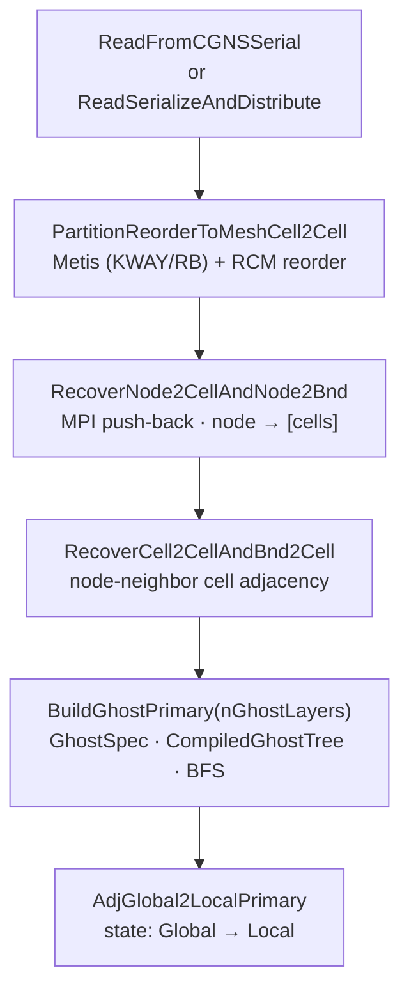
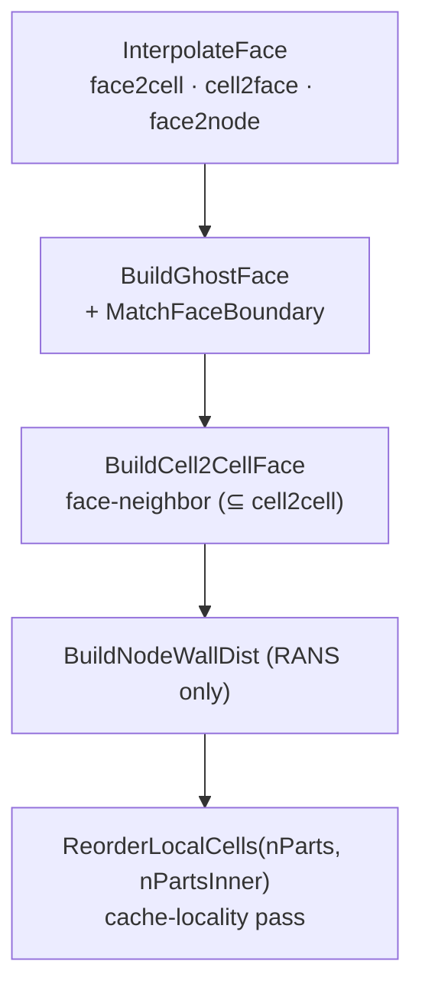

<!-- _footer: "docs/elements/ · src/Geom/Elements/" -->

## Supported elements — O1 / O2 pairs

<div class="elem-grid">
<figure><figcaption>Tri3</figcaption></figure>
<figure><figcaption>Quad4</figcaption></figure>
<figure><figcaption>Tet4</figcaption></figure>
<figure><figcaption>Hex8</figcaption></figure>
<figure><figcaption>Prism6</figcaption></figure>
<figure><figcaption>Pyramid5</figcaption></figure>

<figure><figcaption>Tri6</figcaption></figure>
<figure><figcaption>Quad9</figcaption></figure>
<figure><figcaption>Tet10</figcaption></figure>
<figure><figcaption>Hex27</figcaption></figure>
<figure><figcaption>Prism18</figcaption></figure>
<figure><figcaption>Pyramid14</figcaption></figure>
</div>

<div class="cols">
<div>

- **2D cells:** Tri3, Tri6, Quad4, Quad9.
- **3D cells:** Tet4, Tet10, Hex8, Hex27, Prism6, Prism18, Pyramid5, Pyramid14.
- **1D (BC / boundary meshes):** Line2, Line3.

</div>
<div>

- **Order elevation:** `BuildO2FromO1Elevation()` — Tri3→Tri6, Quad4→Quad9, Tet4→Tet10, Hex8→Hex27, Prism6→Prism18, Pyramid5→Pyramid14.
- **h-refinement:** `BuildBisectO1FormO2()` — one-step bisection from an O2 mesh.

</div>
</div>

---
<!-- _footer: "src/Geom/Mesh/Mesh.hpp:57-127" -->
<!-- _class: denser -->

## `UnstructuredMesh` — what it owns

```cpp
class UnstructuredMesh : public DeviceTransferable<UnstructuredMesh> {
    // === State flags (five groups) ==========================================
    MeshAdjState adjPrimaryState   {Adj_Unknown};  // cell2node, cell2cell, bnd2node, bnd2cell
    MeshAdjState adjFacialState    {Adj_Unknown};  // face2cell, face2node, face2bnd
    MeshAdjState adjC2FState       {Adj_Unknown};  // cell2face, bnd2face
    MeshAdjState adjN2CBState      {Adj_Unknown};  // node2cell, node2bnd
    MeshAdjState adjC2CFaceState   {Adj_Unknown};  // cell2cellFace

    // === Source-of-truth arrays (read / written to HDF5) ====================
    tCoordPair                coords;                     // node positions
    AdjPairTracked<tAdjPair>  cell2node, bnd2node;        // topology
    tElemInfoArrayPair        cellElemInfo, bndElemInfo;  // element type + zone
    tPbiPair                  cell2nodePbi, bnd2nodePbi;  // periodic bits

    // === Derived arrays (rebuilt each load) =================================
    AdjPairTracked<tAdjPair>  cell2cell, node2cell, node2bnd;
    AdjPairTracked<tAdj2Pair> bnd2cell, face2cell;
    AdjPairTracked<tAdjPair>  cell2face, face2node;
    AdjPairTracked<tAdj1Pair> bnd2face, face2bnd;
    AdjPairTracked<tAdjPair>  cell2cellFace;
    tElemInfoArrayPair        faceElemInfo;

    // === Reorder tracking (restart lineage) =================================
    tAdj1Pair cell2cellOrig, node2nodeOrig, bnd2bndOrig;
};
```

<div class="callout">

Every `AdjPairTracked` member carries its own `AdjIndexInfo idx` — so each adjacency knows whether it is global or local, **independently of the 5 group flags**. Group flags remain as a coarse assertion tool.

</div>

---
<!-- _footer: "docs/architecture/MeshConnectivity.md:46-90 · src/Geom/Mesh/Mesh.hpp:442-1011" -->
<!-- _class: denser -->

## Mesh build pipeline — end-to-end

<div class="cols">
<div>

**Setup & adjacency**



</div>
<div>

**Faces & finalization**



</div>
</div>

<div class="callout callout-warn">

⚠ **`cell2cell` audit** — every runtime call in CFV / Euler / EulerP was surveyed; `cell2cell` is queried **zero times** in hot loops. It exists exclusively to determine the ghost set, after which face-based traversal takes over. This motivates the DMPlex-style evolution on the roadmap.

</div>

---
<!-- _footer: "src/Geom/Mesh/Mesh.hpp:1083-1105" -->
<!-- _class:  -->

## Partitioning — `PartitionOptions`

```cpp
struct PartitionOptions {
    std::string metisType        = "KWAY";  // or "RB" (recursive-bisection)
    int         metisUfactor     = 20;      // load imbalance factor
    int         metisSeed        = 0;       // 42 in tests → deterministic
    int         edgeWeightMethod = 0;       // 0: none, 1: face size
    int         metisNcuts       = 3;       // multiple cuts, keep best
};
```

<div class="cols">
<div>

### Two partitioners

- **Metis (serial)** — initial cell partition after a serial CGNS read. `MeshPartitionCell2Cell(options)` drives it, then `PartitionReorderToMeshCell2Cell` reorders cells using the partition.
- **ParMetis (distributed)** — used inside `ReadSerializeAndDistribute` to **refine** an even-split load after an H5 restart or cross-np read.

</div>
<div>

### Determinism

Tests fix `metisSeed = 42`. Combined with the `Jacobi` iteration in VR (instead of SOR) and the deterministic LU-SGS replacement, this yields **byte-stable golden values** across re-runs at any `np`.

### Ordering

`ReorderLocalCells(nParts, nPartsInner)` runs a two-level cache-locality pass (inner + outer); `ObtainLocalFactFillOrdering` runs AMD / MMD for ILU.

</div>
</div>

---
<!-- _footer: "src/Geom/Mesh/MeshConnectivity.hpp:43-237" -->
<!-- _class: dense -->

## The ghost specification DSL — types

```cpp
enum class EntityKind : int8_t {
    Cell = 0, Face = 1, Edge = 2, Node = 3, Bnd = 4, NUM_KINDS = 5,
};
```

```cpp
struct AdjKind {
    EntityKind from, to;
    EntityKind via;                 // for intra-level (from == to)
    constexpr AdjKind(EntityKind from, EntityKind to);               // direct cone/support
    constexpr AdjKind(EntityKind from, EntityKind to, EntityKind via); // intra-level
};

namespace Adj {
    // Direct cones (downward)
    constexpr AdjKind Cell2Node, Cell2Face, Cell2Edge, Face2Node, Face2Edge, Edge2Node, Bnd2Node;
    // Direct supports (upward)
    constexpr AdjKind Node2Cell, Node2Face, Node2Edge, Node2Bnd,
                      Face2Cell, Edge2Face, Edge2Cell,
                      Bnd2Cell,  Bnd2Face,  Face2Bnd;
    // Intra-level (via Node)
    constexpr AdjKind Cell2Cell, Bnd2Bnd, Face2Face;
    // Intra-level (via Face)
    constexpr AdjKind Cell2CellFace;
}

struct GhostChain  { EntityKind anchor; std::vector<AdjKind> hops; EntityKind target; };
struct GhostSpec   { std::vector<GhostChain> chains;
                     static GhostSpec defaultPrimary(int nLayers = 1); };
```

---
<!-- _footer: "src/Geom/Mesh/MeshConnectivity.hpp:244-335,1241" -->
<!-- _class:  -->

## The ghost DSL — compile & evaluate

```cpp
GhostSpec spec = GhostSpec::defaultPrimary(nLayers);
// Or customize:
spec.chains = {
    { EntityKind::Cell, {Adj::Cell2Cell, Adj::Cell2Cell},              EntityKind::Cell }, // 2 layers
    { EntityKind::Cell, {Adj::Cell2Cell, Adj::Cell2Cell, Adj::Cell2Node}, EntityKind::Node },
    { EntityKind::Bnd,  {Adj::Bnd2Node,  Adj::Node2Bnd},               EntityKind::Bnd  },
};

CompiledGhostTree tree   = CompiledGhostTree::compile(spec);   // merges prefixes → trie
GhostResult       result = dag.evaluateGhostTree(tree, mpi);
```

<div class="cols">
<div>

### Evaluator pseudocode (BFS per level)

```text
for level in 0..tree.maxLevel:
    for entry in tree.levels[level]:
        collect owned-side non-owned indices
    Allreduce: did any adjacency set grow?
    if yes → scratch-pull that adjacency
    traverse hop, populate next level
```

</div>
<div>

### `GhostResult`

```cpp
struct GhostResult {
    std::unordered_map<EntityKind,
        std::vector<index>> ghostIndices;  // sorted, deduped, global
    std::unordered_set<EntityKind>
        activeKinds;                       // collective (Allreduce)
    bool  hasGhosts(EntityKind) const;
    index totalGhosts() const;
};
```

</div>
</div>

---
<!-- _footer: "src/Geom/Mesh/MeshConnectivity.hpp:858-1220" -->
<!-- _class: dense -->

## DSL primitives on `MeshConnectivity`

Beyond the ghost evaluator, `MeshConnectivity` is a reusable DSL for distributed adjacency operations — used in many mesh-build steps.

| Primitive | Signature | What it does |
|---|---|---|
| `Inverse<cone_rs>` | `(cone, nToLocal, mpi, fromL2G, toL2G, toGlobalMap) → tAdjPair` | A→B cone to B→A support, MPI push-back |
| `Compose<rs_AB, rs_BC, out_rs>` | `(AB, BC, ...) → tAdjPair` | A→B ∘ B→C → A→C |
| `ComposeFiltered` | `... pred, matchExtra=nullptr` | Compose with `SharedCountPredicate` filter |
| `Interpolate<p2n_rs>` | `(parent2node, SubEntityQuery, nParent, nNode, mpi)` | Local-only sub-entity extraction |
| `InterpolateGlobal<p2n_rs, e2p_rs>` | | N-parent distributed interpolation with pbi-aware dedup |
| `evaluateGhostTree` | `(tree, mpi) → GhostResult` | BFS ghost evaluation |

<div class="cols">
<div>

### `SharedCountPredicate`

```cpp
struct SharedCountPredicate {
    int  minShared  = 1;
    bool removeSelf = false;
};
```

Used to implement Jacobian-like stencils, e.g. "cells sharing ≥ 2 nodes" to filter face-neighbors from node-neighbors.

</div>
<div>

### Adjacency registry

```cpp
void registerAdj(AdjKind, ssp<AdjVariant>);
void registerGlobalMapping(EntityKind, ssp<GlobalOffsetsMapping>);

ssp<AdjVariant> resolveAdj(AdjKind) const;
bool            hasAdj(AdjKind) const;
```

Mesh build methods populate this registry so `evaluateGhostTree` can look up each hop's adjacency by kind at runtime.

</div>
</div>

---
<!-- _footer: "src/Geom/Mesh/Mesh.hpp:699-709 · RELEASE_NOTES.md:45" -->

## Order elevation & bisection

<div class="cols">
<div>

### O1 → O2 elevation

```cpp
void BuildO2FromO1Elevation(UnstructuredMesh &meshO1);
void ElevatedNodesGetBoundarySmooth();
void ElevatedNodesSolveInternalSmooth();
void ElevatedNodesSolveInternalSmoothV1();
void ElevatedNodesSolveInternalSmoothV1Old();
void ElevatedNodesSolveInternalSmoothV2();
```

- **Boundary smooth** — RBF-based placement of added nodes on curved surfaces.
- **Internal smooth** — V1/V1Old/V2 variants of a Laplace-like solve to interpolate interior added-node positions.

</div>
<div>

### O2 → O1 bisection

```cpp
void BuildBisectO1FormO2(UnstructuredMesh &meshO2);
bool IsO1() const;
bool IsO2() const;
```

**Per element type** (see `docs/elements/*_nodes.png`):

- Tri3 → Tri6 → 4× Tri3 (bisect).
- Quad4 → Quad9 → 4× Quad4.
- Hex8 → Hex27 → 8× Hex8.
- Prism6 / Pyramid5 elevated + bisected analogously.

</div>
</div>

Used in practice for:

- **p-adaptivity studies** via order elevation, and
- **h-refinement benchmarks** via bisection, while keeping the same topology file.

---
<!-- _footer: "src/Geom/Mesh/Mesh.hpp:986-1011" -->

## Wall-distance computation

`BuildNodeWallDist(fBndIsWall, WallDistOptions = {})` (`Mesh.hpp:1011`). Used by SA / k-ω / DDES / IDDES models.

<div class="cols-40-60">
<div>

### Options

```cpp
struct WallDistOptions {
    int  subdivide_quad    = 1;   // refine quads for brute-force
    int  method            = 0;   // 0 = brute, 1 = tree (CGAL AABB)
    int  wallDistExecution = 0;   // 0 = all parallel,
                                  // 1 = serial rank 0,
                                  // N = N-batch ranks
    real minWallDist       = 1e-10;
    int  verbose           = 0;
};
```

</div>
<div>

### Strategies

- **Brute force** — O(N · M) pair loop; trivially vectorizable; used for small cases.
- **CGAL AABB tree** — per-rank tree over wall faces; O(log M) per query.
- **Batched** — mitigate single-rank-memory ceiling by doing the tree build on subsets of ranks (`wallDistExecution > 1`).
- **Poisson** — `GetWallDist_Poisson()` in EulerEvaluator; p-Poisson solve on the mesh, gradient inverted → distance.

Distance is also computed *per face* for use in the SST blending functions.

</div>
</div>

---
<!-- _footer: "docs/architecture/Serialization.md:107-172 · src/Geom/Mesh/Mesh.hpp:912-949" -->

## Cross-`np` restart

<div class="cols-40-60">
<div>

### Offset sentinels

```cpp
static const index Offset_Parts     = -1;
static const index Offset_One       = -2;
static const index Offset_EvenSplit = -3;
static const index Offset_Unknown   = UnInit;
```

| Mode              | Meaning                           |
|-------------------|-----------------------------------|
| `Unknown`         | auto-detect from `rank_offsets`   |
| `Parts`           | `MPI_Scan` over local sizes       |
| `One`             | rank 0 owns the whole dataset     |
| `EvenSplit`       | read-time split into `~N/np`      |
| `isDist()`        | explicit `{localSize, globalStart}` |

</div>
<div>

### `ReadSerializeRedistributed` — three cases

1. **No `origIndex`, same `np`** → falls back to `ReadSerialize`.
2. **`origIndex` present, same `np`** → normal read + local remap.
3. **`origIndex` present, different `np`** → `EvenSplit` read, then **3-round `MPI_Alltoallv` rendezvous** to build the directory `origIdx → globalReadIdx`, followed by one `ArrayTransformer` pull.

```text
SerializerBase            (abstract)
├── SerializerH5          (collective HDF5)
└── SerializerJSON        (per-rank)
Array → ParArray → ArrayPair → ArrayRedistributor
```

</div>
</div>

> Write from 4 ranks, restart on 8 — `EulerSolver::ReadRestart` handles all three cases transparently.
