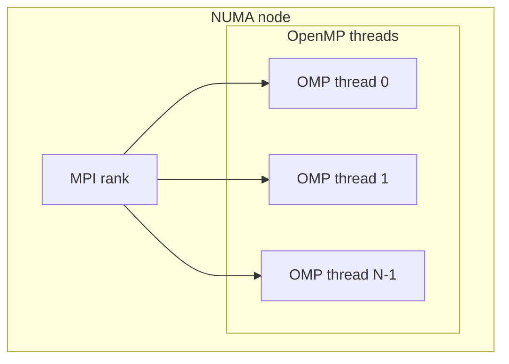

<!-- _footer: "src/DNDS/ArrayTransformer.hpp · array_infrastructure.md" -->
<!-- _class: dense -->

## MPI — the "set up once" discipline

> *Setup is collective and expensive. Communication is local and cheap.*

<div class="cols">
<div>

**Build-once phase — collective**

```cpp
trans.setFatherSon(father, son);

trans.createFatherGlobalMapping();
  // collective: MPI_Allgather over local sizes

trans.createGhostMapping(pullGlobal);
  // collective: sorts + dedups pullGlobal IN PLACE
  // — saves a copy if you need the original

trans.createMPITypes();
  // local: MPI_Type_create_hindexed describes
  // the scattered rows to send/recv
  // — ALSO resizes the son array to hold them

trans.initPersistentPull();
  // local: MPI_Recv_init + MPI_Send_init
```

The derived MPI datatypes persist with the transformer — teardown costs them nothing until destruction.

</div>
<div>

**Hot-loop phase — local only**

```cpp
for (int step = 0; step < N; ++step) {
    trans.startPersistentPull();    // MPI_Startall
    computeFluxes(/* reads ghosts */);
    trans.waitPersistentPull();     // MPI_Waitall
}

trans.clearPersistentPull();
```

<div class="callout callout-bug">

🐛 **v0.1.0 bug-fix:** `globalSize()` used to be collective and could deadlock when some ranks took short-cut paths. It's now cached at `createFatherGlobalMapping` time — fully local.

</div>

</div>
</div>

---
<!-- _footer: "src/DNDS/ArrayTransformer.hpp · HIndexed vs InSituPack" -->

## Two communication strategies

`MPI::CommStrategy::Instance().GetArrayStrategy()` selects:

<div class="cols">
<div>

### `HIndexed` — default

```cpp
MPI_Type_create_hindexed(count, blocklengths, displacements,
                         base_type, &new_type);
```

- Describes **scattered rows** directly in MPI's datatype system.
- MPI library + driver are free to pipeline and vectorize the pack.
- Zero-copy on the application side.
- Best on well-tuned MPI stacks over InfiniBand / Slingshot.

</div>
<div>

### `InSituPack`

```cpp
inSituBuffer[rank].clear();
for (index i : pushingIndexLocal[rank])
    inSituBuffer[rank].append(row(i));
MPI_Isend(inSituBuffer[rank].data(), ...);
```

- Explicit pack into contiguous buffers.
- Beats `HIndexed` on some **older MPI stacks** and on **CUDA-aware MPI** with GPU-Direct where the driver prefers flat buffers.
- One extra memory pass per phase — tradeoff.

</div>
</div>

> Both strategies live behind the same public API. The choice is a tuning knob — no application-level changes needed.

---
<!-- _footer: "src/DNDS/ArrayTransformer.hpp:606" -->

## `BorrowGGIndexing` — avoid collective setup twice

```cpp
// Primary array: does the full collective setup
ArrayTransformer<real, 5> cellUTrans;
cellUTrans.setFatherSon(uFather, uSon);
cellUTrans.createFatherGlobalMapping();
cellUTrans.createGhostMapping(pullGlobal);
cellUTrans.createMPITypes();

// Secondary array: reuses the *global + ghost* mapping.
// Only the MPI datatypes (which depend on the row size) are rebuilt.
ArrayTransformer<real, DynamicSize> recTrans;
recTrans.setFatherSon(uRecFather, uRecSon);
recTrans.BorrowGGIndexing(cellUTrans);   // <-- key line
recTrans.createMPITypes();
recTrans.initPersistentPull();
```

<div class="callout callout-ok">

**Consequence.** In the Euler pipeline every DOF array (`u`, `uPrev`, `uInc`, `uRec`, `uRecInc`, `uRecB`, …) shares a single ghost map established from the `cell2cell` adjacency. Only the MPI datatypes differ, keyed on the row size of each array.

</div>

---
<!-- _footer: "AGENTS.md · src/Geom/Mesh/AdjIndexInfo.hpp:218-223" -->
<!-- _class: tight -->

## OpenMP in the stack

`-DDNDS_DIST_MT_USE_OMP=ON` activates threaded paths throughout:

<div class="cols">
<div>

### Where OMP is already applied

- **ILU-OMP preconditioner** — parallel forward/backward sweeps (new in v0.1.0).
- **Eigen reductions** — `EigenVecMin`, `EigenVecSum` fold per thread, then combine.
- **State transitions** — `toLocalOMP` / `toGlobalOMP` / `bootstrapToLocalOMP` parallelize over the rows of adjacency arrays.
- **FV metric construction** — many `ConstructX()` methods in `FiniteVolume` loop over cells / faces with `#pragma omp parallel for`.
- **VR iteration** — `DoReconstructionIter` has an OMP variant.

</div>
<div>

### Hybrid model



**CI default** `OMP_NUM_THREADS=2` (override at configure time via `DNDS_TEST_OMP_THREADS`). MPI-rank count per test configurable via `DNDS_TEST_NP_LIST`.

Typical production deployment: **1 MPI rank per NUMA node × OMP threads** within. MPI handles cross-socket / cross-node; OMP handles within.

</div>
</div>

---
<!-- _footer: "src/DNDS/Device/ · CMakePresets.json:37-44" -->
<!-- _class: denser -->

## CUDA path — `DeviceTransferable` CRTP

```cpp
template <class TDerived>
class DeviceTransferable {
public:
    // Derived implements: device_array_list() returning a tuple of host-device arrays
    void to_device(DeviceBackend B = DeviceBackend::CUDA);
    void to_host();
    DeviceBackend device() const;
    template <DeviceBackend B> auto deviceView();
};

// Example user
class FiniteVolume : public DeviceTransferable<FiniteVolume> {
    auto device_array_list() {
        return std::tie(volumeLocal, faceArea, faceUnitNorm, cellBary,
                        cellInertia, cellIntJacobiDet, /* ... */);
    }
};
```

<div class="cols">
<div>

### Usage

```cpp
fv.to_device();
auto dv = fv.deviceView<CUDA>();
launchKernel<<<blocks, threads>>>(dv);
fv.to_host();
```

</div>
<div>

### Already transferable

- `UnstructuredMesh` (connectivity)
- `FiniteVolume` (metrics)
- `VariationalReconstruction` (via base)
- `VRDefines` DOF arrays
- Per-element shape function tables

</div>
</div>

Build: `cmake --preset cuda` → `-DDNDS_USE_CUDA=ON` · Thrust fixes via `CMAKE_CUDA_ARCHITECTURE=native`.

---
<!-- _footer: "src/EulerP/EulerP_Evaluator.hpp · EulerP_Evaluator_impl.{hpp,cpp,cu}" -->
<!-- _class:  -->

## EulerP — the purpose-built GPU evaluator

**Problem:** the stock `Euler` evaluator uses Eigen with compile-time `nVars`; Eigen matrix ops do not cleanly lower to device-callable scalar loops. CUDA kernel launches over tiny matrices cost more than the math.

**Solution:** a parallel-track evaluator in `src/EulerP/` that:

1. Drops the Eigen matrix abstraction inside kernels — scalar loops over `nVars`.
2. Splits into `EvaluatorDeviceView<B>` with `B ∈ {Host, CUDA}` — same interface, two implementations compiled in separate translation units (`.cpp` and `.cu`).
3. Bundles per-call arguments into `*_Arg` structs (e.g. `RecGradient_Arg`, `Flux2nd_Arg`) so the launching host code doesn't need to know argument order.

```cpp
template <DeviceBackend B>
struct EvaluatorDeviceView {
    FiniteVolume::t_deviceView<B>   fv;
    BCHandlerDeviceView<B>          bc;
    PhysicsDeviceView<B>            physics;
};
```

Python driver: `python/DNDSR/EulerP/EulerP_Solver.py` orchestrates the full EulerP pipeline from Python with CUDA selected by runtime flag.

---
<!-- _footer: "src/EulerP/EulerP_Evaluator.hpp:149-918" -->
<!-- _class: dense -->

## EulerP — the kernel pipeline

```cpp
class Evaluator {
    ssp<CFV::FiniteVolume>  fv;
    ssp<BCHandler>           bcHandler;
    ssp<Physics>             physics;
    // face buffers (dense packed from ghost father+son)
    tUFaceBuffer u_face_bufferL, u_face_bufferR;
    tUScalarFaceBuffer uScalar_face_bufferL, uScalar_face_bufferR;

public:
    // Setup
    void BuildFaceBufferDof(TUDof &u);
    void BuildFaceBufferDofScalar(TUScalar &u);
    void PrepareFaceBuffer(int nVarsScalar);

    // Pipeline kernels (each host-or-device via Evaluator_impl<B>)
    void RecGradient   (RecGradient_Arg &arg);    // Green-Gauss + Barth-Jespersen
    void Cons2PrimMu   (Cons2PrimMu_Arg &arg);
    void Cons2Prim     (Cons2Prim_Arg   &arg);
    void RecFace2nd    (RecFace2nd_Arg  &arg);    // 2nd-order face reconstruction
    void Flux2nd       (Flux2nd_Arg     &arg);    // inviscid + viscous face flux
};
```

### Why the arg-bundle struct

- All array references in one place → simple to serialize for a device kernel.
- Host/CUDA dispatch happens at a single call site (`Evaluator_impl<B>`).
- The launching host code sees the same identifier `EvaluateRHS` regardless of backend.

---
<!-- _footer: "docs/dev/cudaNotes.md · RELEASE_NOTES.md:50-52" -->

## GPU engineering notes

<div class="cols">
<div>

### Benchmarks already shipped

- **Block-sparse MatVec** — `src/Geom/Mesh/BenchmarkFiniteVolume.cu` exercises the metric arrays on-device with varied block sizes.
- **SoA vs AoS** — multiple layout variants benchmarked for the per-cell DOF blocks.

### Memory model

- `host_device_vector<T>` — a vector that can shadow itself on device; used throughout `FiniteVolume` / `UnstructuredMesh`.
- Transfers are explicit (`to_device` / `to_host`) — no hidden synchronization.

</div>
<div>

### Pitfalls avoided

- **Thrust + CMake:** `CMAKE_CUDA_ARCHITECTURE=native` fixes a class of compile errors in Thrust's internal machinery.
- **Accidental `to_device`:** a bug in the face-buffer creation path was copying host buffers to device needlessly; fixed in v0.1.0.
- **`py::classh` holders:** ensure safe Python↔C++ ownership when CUDA pointers survive across Python GC boundaries.

### Work in progress

- Extend full `Euler` evaluator to CUDA (not just `EulerP`).
- GPU-aware MPI via `MPI_Type_create_hindexed` over pinned device memory.

</div>
</div>
