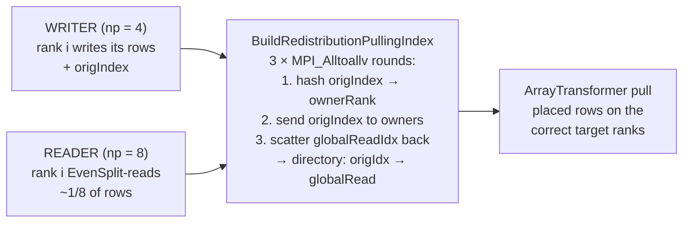
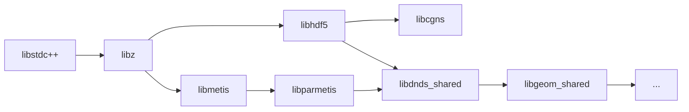

<!-- _footer: "docs/architecture/Serialization.md:11-172" -->

## Serialization — a five-layer cake

| Layer                  | Responsibility                                              |
|------------------------|-------------------------------------------------------------|
| `SerializerBase`       | Abstract scalar / vector / byte-array interface             |
| `SerializerH5`         | MPI-parallel HDF5 (collective I/O)                          |
| `SerializerJSON`       | Per-rank JSON (`IsPerRank() == true`), no MPI coordination  |
| `Array`                | Per-array metadata, structure tags, flat data buffer        |
| `ParArray`             | Global offsets, `EvenSplit`, CSR global row-starts          |
| `ArrayPair`            | Father-son bundle · `ReadSerializeRedistributed`            |
| `ArrayRedistributor`   | Rendezvous redistribution via `ArrayTransformer`            |

<div class="callout">

**Key property.** Every method in `SerializerH5` is **MPI-collective** — every rank must call them in the same order, even when that rank has `size == 0`. Failing to participate causes a hang, not a crash.

</div>

---
<!-- _footer: "src/DNDS/Serializer/SerializerBase.hpp:153-303" -->
<!-- _class: dense -->

## `SerializerBase` — the public interface

```cpp
// File lifecycle
virtual void OpenFile(const std::string &fName, bool read) = 0;
virtual void CloseFile() = 0;

// Path navigation (think HDF5 group structure)
virtual void CreatePath(const std::string &p) = 0;
virtual void GoToPath(const std::string &p)  = 0;
virtual std::string              GetCurrentPath() = 0;
virtual std::set<std::string>    ListCurrentPath() = 0;
virtual bool                     IsPerRank() = 0;   // true for JSON
virtual int   GetMPIRank() = 0;   int GetMPISize() = 0;
virtual const MPIInfo &getMPI() = 0;

// Scalars (per-rank)
virtual void WriteInt(const std::string &name, int64_t v) = 0;
virtual void WriteIndex/WriteReal/WriteString(...) = 0;
virtual void ReadInt /ReadIndex / ReadReal / ReadString(...) = 0;

// Vectors (COLLECTIVE under H5)
virtual void WriteIndexVector(const std::string &name, const std::vector<index> &v,
                              ArrayGlobalOffset offset) = 0;
virtual void ReadIndexVector (const std::string &name,       std::vector<index> &v,
                              ArrayGlobalOffset &offset) = 0;   // offset is in/out
// ... Rowsize, Real, SharedIndex, SharedRowsize
virtual void WriteUint8Array(const std::string &name, const uint8_t *data,
                             index size, ArrayGlobalOffset offset) = 0;
virtual void ReadUint8Array (const std::string &name, uint8_t *data,
                             index &size, ArrayGlobalOffset &offset) = 0;
```

---
<!-- _footer: "src/DNDS/Serializer/SerializerBase.hpp:14-124" -->
<!-- _class: dense -->

## `ArrayGlobalOffset` — five offset modes

```cpp
static const index Offset_Parts     = -1;
static const index Offset_One       = -2;
static const index Offset_EvenSplit = -3;
static const index Offset_Unknown   = UnInitIndex;

class ArrayGlobalOffset {
    index _size{0};
    index _offset{0};
public:
    ArrayGlobalOffset(index sz, index ofs);
    index size()   const;
    index offset() const;
    ArrayGlobalOffset operator*(index R) const;   // scales size (and offset if real)
    ArrayGlobalOffset operator/(index R) const;
    void CheckMultipleOf(index R) const;
    bool operator==(const ArrayGlobalOffset &other) const;
    bool isDist() const;                           // _offset >= 0
};

extern ArrayGlobalOffset ArrayGlobalOffset_Unknown, _One, _Parts, _EvenSplit;
```

| Sentinel             | Meaning                                              |
|----------------------|------------------------------------------------------|
| `Unknown`            | Auto-detect from companion `rank_offsets` dataset    |
| `Parts`              | Compute offset via `MPI_Scan` over local sizes       |
| `One`                | Rank 0 writes / reads the whole dataset              |
| `EvenSplit`          | Read: each rank gets `~nGlobal / nRanks` rows        |
| `isDist()`           | Explicit `{localSize, globalStart}`                  |

---
<!-- _footer: "docs/architecture/Serialization.md:60-83" -->

## Zero-size partition safety

<div class="cols">
<div>

### The trap

When `nGlobal < nRanks` (5 entries across 8 ranks), `EvenSplitRange` assigns 0 rows to some ranks. Collective HDF5 calls still demand every rank participates — and `std::vector<>::data()` on an empty vector may return `nullptr`.

```cpp
std::vector<index> v(size);        // size may be 0
ReadDataVector<index>(name, v.data(), ...);  // may pass nullptr → hang
```

Caller-side helpers like `__ReadSerializerData` and `ReadUint8Array` would skip the `H5Dread` when `buf == nullptr`, and the collective hangs.

</div>
<div>

### The fix

Every caller in `SerializerBase.cpp` passes a **stack-allocated dummy pointer** when `size == 0`:

```cpp
index dummy;
ReadDataVector<index>(name,
    size == 0 ? &dummy : v.data(),
    ...);
```

`ReadUint8Array` exposes the two-pass pattern:

1. First call: `data = nullptr`, returns the size.
2. Second call: allocate + call again with a real (or dummy) pointer.

All collectives proceed with 0-count hyperslabs on the empty ranks — no application-level branching.

</div>
</div>

---
<!-- _footer: "docs/architecture/Serialization.md:87-172" -->

## Write-N-read-M — the rendezvous pattern



<div class="callout callout-ok">

**Consequence.** `EulerSolver::ReadRestart` is a single call. The user writes from 4 ranks on a login node, restarts on 1024 ranks on a compute partition, and the same JSON config runs. Ranks with `localRows == 0` participate in every collective with empty buffers.

</div>

---
<!-- _footer: "src/DNDS/Config/ConfigParam.hpp:47-176 · ConfigRegistry.hpp:228-465" -->
<!-- _class: dense -->

## Typed JSON configs — `DNDS_DECLARE_CONFIG`

```cpp
struct ImplicitCFLControl {
    real CFL                   = 10.0;
    int  nForceLocalStartStep  = INT_MAX;
    bool useLocalDt            = true;
    real RANSRelax             = 1.0;

    DNDS_DECLARE_CONFIG(ImplicitCFLControl) {
        DNDS_FIELD(CFL,                  "CFL for implicit local dt");
        DNDS_FIELD(nForceLocalStartStep, "Step to force local dt",
                   DNDS::Config::range(0));
        DNDS_FIELD(useLocalDt,           "Use local (vs uniform) dTau");
        DNDS_FIELD(RANSRelax,            "RANS under-relaxation factor",
                   DNDS::Config::range(0.0, 1.0));

        config.check([](const T &s) -> DNDS::CheckResult {
            if (s.RANSRelax <= 0) return {false, "RANSRelax must be positive"};
            return {true, ""};
        });
    }
};
```

<div class="callout">

**What the macro gives you.** No base class, no virtual members, no per-instance data — the struct stays a POD safe for CUDA. Underneath, a static `_dnds_do_register()` method is generated that fills a `ConfigRegistry<T>` singleton with `FieldMeta` records.

</div>

---
<!-- _footer: "src/DNDS/Config/ConfigParam.hpp:71-81" -->
<!-- _class: dense -->

## Configs — field kinds & cross-field checks

```cpp
// Simple scalars & bounded scalars
DNDS_FIELD(CFL,         "CFL number");
DNDS_FIELD(nInternalIt, "Inner iterations",  DNDS::Config::range(0));
DNDS_FIELD(relax,       "Relaxation factor", DNDS::Config::range(0.0, 1.0));

// Enum with value names (appears in schema as enum constraint)
DNDS_FIELD(rsType,      "Riemann solver type",
           DNDS::Config::enum_values({"Roe","HLLC","HLLEP","HLLEP_V1",
                                      "Roe_M1","Roe_M2","Roe_M3","Roe_M4",
                                      "Roe_M5","Roe_M6","Roe_M7","Roe_M8","Roe_M9"}));

// Documentation kwargs — emitted as "x-..." extensions in schema
DNDS_FIELD(CFL, "CFL number", DNDS::Config::info("units", "nondim"),
                              DNDS::Config::info("ref",   "Jameson 1985"));

// Nested sub-section
config.field_section(&T::frameRotation, "frameConstRotation", "Rotating frame");

// Arrays / maps of sub-objects
config.field_array_of<BoxInit>   (&T::boxInits,   "boxInitializers", "Box initializers");
config.field_map_of<CoarseCtrl>  (&T::coarseList, "coarseGridList",  "Per-level controls");

// Opaque JSON (for scheme-specific extras)
config.field_json  (&T::extra,    "odeSettingsExtra", "Opaque ODE scheme settings");

// Renaming / aliases (backward compatibility)
config.field_alias (&T::rsType,   "riemannSolverType", "Riemann solver type");
```

---
<!-- _footer: "src/DNDS/Config/ConfigRegistry.hpp:379-441" -->
<!-- _class: dense -->

## Configs — auto-generated JSON Schema & validation

```cpp
// Emit the schema (run-time or ahead-of-time)
nlohmann::ordered_json schema = ConfigRegistry<EulerConfig>::Instance().emitSchema("Euler solver config");
```

```json
{
  "$schema": "http://json-schema.org/draft-07/schema#",
  "type": "object",
  "description": "Euler solver config",
  "properties": {
    "CFL":     { "type": "number", "default": 10.0, "description": "..." },
    "rsType":  { "type": "string", "default": "Roe",
                 "enum": ["Roe","HLLC",...,"Roe_M9"] }
  }
}
```

<div class="cols">
<div>

### CLI + tooling

```bash
./build/app/euler.exe --emit-schema > euler_schema.json
# drops ~107 KB per-solver schema
```

VS Code + any JSON-schema-aware editor give autocompletion and in-line validation. Pre-computed schemas ship in `cases/euler_schema.json`, `eulerSA3D_schema.json`, etc.

</div>
<div>

### Runtime validation

```cpp
auto &reg = ConfigRegistry<EulerConfig>::Instance();
reg.readFromJson(j, cfg);            // deserialize + range checks
reg.validate(cfg);                   // cross-field
reg.validateWithContext(cfg, ctx);   // uses nVars, dim, modelCode
reg.validateKeys(userJson);          // throws on unknown keys
```

**`validateKeys`** is automatic — no hand-maintained list of allowed fields.

</div>
</div>

---
<!-- _footer: "python/DNDSR/ · docs/guides/project_structure.md:116-145" -->

## Python bindings — the import chain

```text
from DNDSR import DNDS
  ↓
python/DNDSR/__init__.py
  ↓
python/DNDSR/DNDS/__init__.py
  ├── _loader.preload("dnds")                    # ctypes.CDLL · RTLD_GLOBAL
  ├── from ._ext.dnds_pybind11 import *          # pybind11 extension
  └── _init_mpi()                                # MPI_Init_thread AT IMPORT TIME
```

<div class="cols">
<div>

### The preload order matters

`_loader.py` loads external dependencies with `RTLD_GLOBAL` **before** the pybind11 extension opens. If they were loaded later with the default `RTLD_LOCAL`, the extension would not find the symbols it depends on.



</div>
<div>

### Four modules, one package

- `DNDSR.DNDS` — arrays, MPI, serializer
- `DNDSR.Geom` — mesh reading & manipulation
- `DNDSR.CFV`  — finite volume / VR / Fourier analysis
- `DNDSR.EulerP` — GPU-friendly Euler evaluator

Top-level `__init__.py` imports all four so a single `from DNDSR import *` works.

</div>
</div>

---
<!-- _footer: "docs/guides/python_geom_guide.md" -->
<!-- _class: dense -->

## Python mesh-read — the demo case

```python
from DNDSR import DNDS
from DNDSR.Geom.utils import read_mesh, prepare_mesh, build_bnd_mesh

# 1. MPI bootstrap (implicit MPI_Init_thread already ran at import)
mpi = DNDS.MPIInfo(); mpi.setWorld()

# 2. Read a CGNS mesh with elevation and bisection
result = read_mesh(
    "data/mesh/UniformSquare_10.cgns",
    mpi       = mpi,
    dim       = 2,
    elevation = "O2",      # Quad4 → Quad9
    bisect    = 1,         # one round of h-refinement
)

# 3. Finish the mesh (build ghosts, interpolate faces, reorder cells)
prepare_mesh(result.mesh, result.reader)

# 4. Extract surface mesh and dump VTK
bnd = build_bnd_mesh(result.mesh)
result.mesh.BuildVTKConnectivity()
```

<div class="callout callout-ok">

**PEP 561 compliant.** A `py.typed` marker ships in the package; `.pyi` stubs are auto-generated by `pybind11-stubgen` during `cmake --install`. Pyright, mypy, and Pylance see full C++ type signatures.

</div>

---
<!-- _footer: "src/CFV/ModelEvaluator.hpp · RELEASE_NOTES.md:25" -->
<!-- _class: dense -->

## CFV Python — Fourier dissipation-dispersion analysis

```python
from DNDSR.CFV import ModelEvaluator  # pure-Python wrapper over pybind11 class

me = ModelEvaluator(mesh, fv, vr)
me.set_order(3)

# Fourier analysis: plug in a plane wave, read back the complex amplification
kx_range = np.linspace(-pi, pi, 200)
for kx in kx_range:
    lam = me.fourier_amplification_factor(kx)
    print(kx, lam.real, lam.imag)
```

<div class="callout">

**Why this matters for a research code.** VR's dispersion/dissipation properties depend on order, limiter, and inner-product choice. Having a Python harness to sweep them over a discrete Fourier spectrum means parameter studies (limiter combinations, inner-product choices, derivative weights) are done in hours, not weeks.

</div>

Other Python-exposed bits:

- `ArrayPair`, `ArrayEigenMatrix/Vector/Batch`
- `BuildUDof / BuildURec / BuildUGrad` (typed constructors)
- VTK output, wall-distance, `to_device / to_host`
- The full `MeshAdjState` enum and `AdjPairTracked::idx` queries (query-only, no mutation from Python — intentional)
