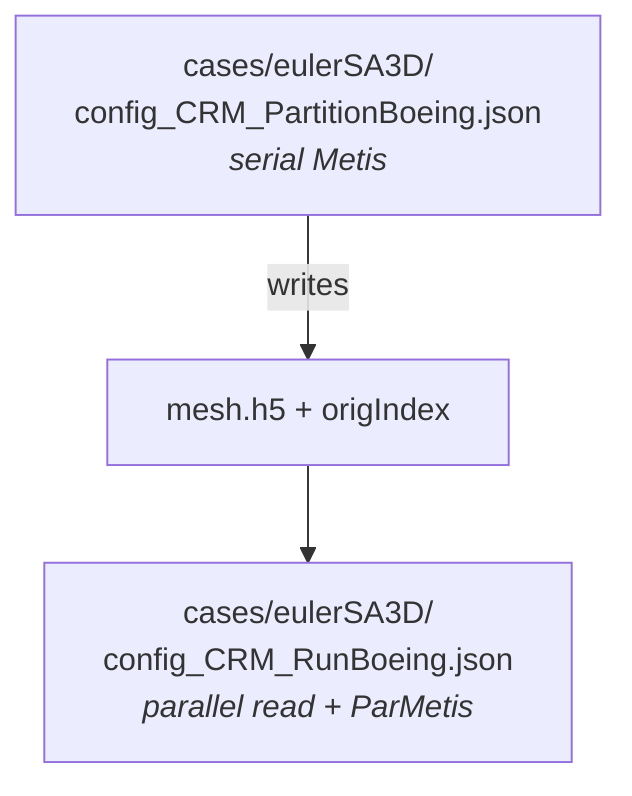

<!-- _footer: "src/Euler/Euler.hpp:874-905 · app/Euler/*.cpp" -->
<!-- _class: dense -->

## The Euler / N-S family — one binary per model

```cpp
// app/Euler/euler.cpp — the entire file
#include "EulerSolver.hpp"
int main(int argc, char *argv[]) {
    return DNDS::Euler::RunSingleBlockConsoleApp<
               DNDS::Euler::NS>(argc, argv);
}
```

<div class="cols">
<div>

### Model enum (`EulerModel`)

```cpp
enum EulerModel {
    NS,        // 2D Navier-Stokes
    NS_3D,
    NS_SA,     // 2D Spalart-Allmaras
    NS_SA_3D,
    NS_2D,     // alias for NS
    NS_2EQ,    // k-omega two-equation
    NS_2EQ_3D,
    NS_EX,     // reactive / multi-species
    NS_EX_3D,
};
```

Template dispatch on `EulerModel` produces one binary per solver — shared source, separated object files.

</div>
<div>

### RANS model enum

```cpp
enum RANSModel {
    RANS_None,
    RANS_SA,       // Spalart-Allmaras (IDDES capable)
    RANS_KOWilcox, // Wilcox k-omega
    RANS_KOSST,    // Menter k-omega SST
    RANS_RKE,      // Realizable k-epsilon
};
```

Each has a `RANSModelTraits<>` specialization with its own wall BC, source terms, and spectral radius.

</div>
</div>

---
<!-- _footer: "src/Euler/EulerSolver.hpp:73-148" -->
<!-- _class: dense -->

## `EulerSolver` — the top-level conductor

```cpp
template <EulerModel model>
class EulerSolver {
    typedef EulerEvaluator<model> TEval;
    static const int nVarsFixed = TEval::nVarsFixed;

    MPIInfo                              mpi;
    ssp<Geom::UnstructuredMesh>          mesh, meshBnd;
    TpVFV                                 vfv;              // VariationalReconstruction
    ssp<Geom::UnstructuredMeshSerialRW>  reader, readerBnd;
    ssp<EulerEvaluator<model>>           pEval;
    ssp<BoundaryHandler<model>>          pBCHandler;

    // Solver state (DOF arrays)
    ArrayDOFV<nVarsFixed>                u, uIncBufODE, wAveraged, uAveraged;
    ObjectPool<ArrayDOFV<nVarsFixed>>    uPool;             // rent/return buffers
    ArrayRECV<nVarsFixed>                uRec, uRecLimited, uRecNew, uRecNew1,
                                         uRecOld, uRec1, uRecInc, uRecInc1,
                                         uRecB, uRecB1;
    JacobianDiagBlock<nVarsFixed>        JD, JD1, JDTmp, JSource, JSource1, JSourceTmp;
    ssp<JacobianLocalLU<nVarsFixed>>     JLocalLU;
    ArrayDOFV<1>                         alphaPP, alphaPP1, betaPP, betaPP1,
                                         alphaPP_tmp, dTauTmp;

    // Config + output
    Configuration                        config;            // nested sub-configs
    nlohmann::ordered_json               gSetting;
    std::string                          output_stamp;
    // ... outDist* / outSerial* / outDist2SerialTrans* for VTK
};
```

---
<!-- _footer: "src/Euler/EulerSolver.hpp:160-246 · nested Configuration struct" -->
<!-- _class: dense -->

## `Configuration` — everything that tunes a run

Every sub-section uses `DNDS_DECLARE_CONFIG` so the full JSON schema is auto-generated.

<div class="cols">
<div>

- **`TimeMarchControl`** — `dtImplicit`, `nTimeStep`, `steadyQuit`, `useRestart`, `useImplicitPP`, `odeCode`, `odeSetting1..4`, `odeSettingsExtra` (opaque JSON), `dtCFLLimitScale`, …
- **`ImplicitReconstructionControl`** — `useExplicit`, `nInternalRecStep`, `recLinearScheme` (0 = SOR, 1 = GMRES), `nGmresSpace/Iter`, `fpcgReset*`, `recThreshold`.
- **`OutputControl`** — `outputIntervalStep`, `outputFormat` (VTK, PLT, VTKHDF, series), parallel vs serial write.
- **`CFLControl`** — initial / max CFL, ramping schedule.

</div>
<div>

- **`ConvergenceControl`** — residual thresholds, monitor variables.
- **`DataIOControl`** — read/write paths, restart checkpointing.
- **`BoundaryDefinition`** — per-face-zone BC types, free-stream state.
- **`LimiterControl`** — `limiterProcedure`, `usePPRecLimiter`, WBAP order.
- **`LinearSolverControl`** — `gmresCode`, Krylov sub-space, iterations.
- **`TimeAverageControl`** — long-time averaging for statistics.
- **`EvaluatorSettings`** wraps `EulerEvaluatorSettings<model>`.
- **`VFVSettings`** wraps `VRSettings`.

</div>
</div>

> `--emit-schema` dumps the entire tree as a single JSON Schema document — `euler_schema.json` / `eulerSA3D_schema.json` / etc., each ~107 KB.

---
<!-- _footer: "src/Euler/EulerEvaluator.hpp:399-612" -->
<!-- _class: denser -->
## `EulerEvaluator<model>` — the spatial operator

```cpp
void EvaluateRHS(ArrayDOFV<nVarsFixed>            &rhs,
                 JacobianDiagBlock<nVarsFixed>    &JSource,
                 ArrayDOFV<nVarsFixed>            &u,
                 ArrayRECV<nVarsFixed>            &uRecUnlim,
                 ArrayRECV<nVarsFixed>            &uRec,
                 ArrayDOFV<1>                     &uRecBeta,
                 ArrayDOFV<1>                     &cellRHSAlpha,
                 bool  onlyOnHalfAlpha,
                 real  t,
                 uint64_t flags = RHS_No_Flags);
```

<div class="cols">
<div>

### Flags

- `RHS_Ignore_Viscosity`
- `RHS_Dont_Update_Integration`
- `RHS_Dont_Record_Bud_Flux`
- `RHS_Direct_2nd_Rec` — bypass VR, use GG-based 2nd-order
- `RHS_Direct_2nd_Rec_1st_Conv` — 2nd-order rec but 1st-order convective
- `RHS_Direct_2nd_Rec_use_limiter`
- `RHS_Direct_2nd_Rec_already_have_uGradBufNoLim`
- `RHS_Recover_IncFScale`

Flags compose bitwise — they cover fallback / diagnostic modes used by p-MG and PP sub-steps.

</div>
<div>

### Other top-level calls

- `EvaluateDt(...)` — CFL-based local dt, spectral-radius based.
- `EvaluateURecBeta` — PP limiter β per cell.
- `EvaluateCellRHSAlpha` — per-cell RHS scaling for PP.
- `LimiterUGrad` — gradient limiter, optional shock detection.
- `LUSGSMatrixInit/Vec/ToJacobianLU` and `UpdateSGS(WithRec)`.
- Wall distance: `GetWallDist_AABB`, `GetWallDist_BatchedAABB`, `GetWallDist_Poisson`.
- Viscosity: `muEff(U, T)` with Sutherland or constant models.

</div>
</div>

---
<!-- _footer: "src/Euler/BoundaryConditions/ · BoundaryHandler<model>" -->
<!-- _class: dense -->

## Boundary conditions — strategy pattern

Each BC is a class implementing a common interface; `BoundaryHandler<model>` routes face-zone IDs to BC instances at runtime.

| BC                   | Use                                         |
|----------------------|---------------------------------------------|
| `BCWall`             | No-slip wall (adiabatic)                    |
| `BCWallIsothermal`   | No-slip wall at fixed temperature           |
| `BCWallInvis`        | Slip / symmetry                             |
| `BCSym`              | Explicit symmetry plane                     |
| `BCFarField`         | Riemann-invariant farfield                  |
| `BCIn`               | Specified inflow                            |
| `BCOut` / `BCOutP`   | Specified outflow / pressure-outflow        |
| `BCPeriodic`         | Standard periodic                           |
| `BCPeriodicRot`      | Rotating periodic (turbomachinery)          |
| `BCProfileIn`        | Tabulated profile (boundary layer, RANS)    |
| `BCActuator`         | Actuator disk source term                   |

Specialized turbomachinery BCs: `BCTotalInlet`, `BCRadialEqOutlet`, `BCMixingPlane`, and the **CL driver** for AoA-adaptive lift matching (`pCLDriver` in the evaluator).

---
<!-- _footer: "cases/euler/ · cases/euler3D/" -->
<!-- _class: dense -->

## Canonical benchmarks — Riemann, shocks, smooth

<div class="cols">
<div>

### Riemann / blast

- **Sod** `euler_config_1DRiemann.json`
- **LeBlanc** `euler_config_1DRiemann_LeBlanc.json`
- **Sedov 1D** `euler_config_1DSedov.json`
- **Sedov 2D** `euler_config_2DSedov.json`
- **Noh (3D)** `euler3D_config_Noh.json`
- **Cylindrical blast** `euler_config_blast.json`
- **M2000 astrophysical jet** `euler_config_M2000Jet.json`

### Hypersonic / shock interaction

- **Double Mach Reflection** 2D + 3D
- **M5 shock diffraction** `euler_config_M5Diffraction.json`
- **Hypersonic cylinder** `euler_config_cylinderHS.json`
- **Double ellipse / double cone** 3D
- **Sphere shock** `euler3D_config_SphereShock.json`

</div>
<div>

### Smooth / steady / unsteady

- **Isentropic Vortex** `euler_config_IV.json` — convergence study
- **Taylor-Green Vortex 3D** `euler3D_config_TGV.json`, `euler3D_config_BenchTGV.json`
- **Lid-driven cavity** (incl. hypersonic variant)
- **Von Kármán vortex street** 2D + 3D
- **Laminar flat-plate BL**
- **Inviscid cylinder (MG bench)** `config_cylinderInvis_mg_bench.json`

### Rotating / periodic frames

- Rotating-frame simple convergence test
- Rotating-periodic Isentropic Vortex

</div>
</div>

---
<!-- _footer: "cases/eulerSA/ · cases/eulerSA3D/ · cases/euler2EQ/" -->
<!-- _class: tight -->

## Aerospace & industrial benchmarks

<div class="cols">
<div>

### External aerodynamics

- **NACA 0012** — SA (`eulerSA_config_0012_AOA15.json`) and k-ω (`euler2EQ/...`) variants, with O2 elevation (`..._Elev.json`) and MG benchmarks (`config_0012_mg_bench.json`).
- **30p30n** high-lift `eulerSA_config_30p30n.json`.
- **NASA CRM** — regular + CRM-HL high-lift.
- **DLR-F6** transport wing-body.
- **DPW-W1** drag-prediction wing.
- **Periodic hill** — LES vs RANS comparison.

</div>
<div>

### Turbomachinery

- **Rotor 37** transonic compressor `eulerSA3D_config_Rotor37.json`.
- **Axial fan A1** `eulerSA3D_config_FanA1.json`.

### Industry workflow — "partition on login, run on compute"



This pattern also stresses `ReadSerializeRedistributed` across different rank counts.

</div>
</div>

---
<!-- _footer: "RELEASE_NOTES.md:9-21" -->
<!-- _class: dense -->

## New solver features in v0.1.0

<div class="cols">
<div>

### ODE & preconditioning

- **HM3 revamp** — U2R2 / U2R1 / U3R1 modes, `tpMG`, `incFScale`, positivity-preserving coupling with `LimiterUGrad`.
- **ESDIRK2 / ESDIRK3 / Trapezoidal** added.
- **ILU-OMP** preconditioner.

### Turbulence

- **DES → DDES → IDDES** progression on SA.
- **ψ-term fixes**, rotation correction variants, ft2 toggle.
- **k-ω two-equation** model with dedicated `euler2EQ / euler2EQ3D` executables.
- **BCProfileIn** for RANS inlet profiles.

</div>
<div>

### Flux / limiter / BC

- **Roe_M8** flux; **HLLE+** (experimental).
- **incFScale** (incremental flux scaling) integrated into entropy fix.
- **Isothermal wall BC** (`BCWallIsothermal`).
- **Axisymmetric wedge** metric in reconstruction.
- **Positivity-preserving** reconstruction limiter in `LimiterUGrad`.

### Physics

- **Rotating frames** (periodic + simple convergence).
- **Overset grid exploration** — hole cutting, distance map, cell-cell connectivity (2D demo).

### Workflow

- `source2nd`, `mergeMultiResidual`, `normOrd`, `restartOutAtInit`, `resBaseType` options.

</div>
</div>

---
<!-- _footer: "src/Euler/EulerSolver.hpp:1270-1486" -->
<!-- _class: dense -->

## The main loop — `RunImplicitEuler`

```cpp
void RunImplicitEuler() {
    InitializeRunningEnvironment(env);
    // optional restart
    if (config.restartState.useRestart)
        ReadRestart(config.dataIO.readRestart);

    for (int step = 1; step <= config.timeMarch.nTimeStep; ++step) {
        EvaluateDt(dt, u, uRec, CFL, dtMinAll, config.timeMarch.dtImplicit,
                   config.cflControl.useLocalDt, t);

        // Inner pseudo-time loop (driven by the chosen ODE integrator)
        odeIntegrator.Step(
            u, uInc,
            /*frhs*/     [&](rhs, u, dTau, iter, alpha, upos) { pEval->EvaluateRHS(...); },
            /*fdt */     [&](u,   dTau, alpha, upos)          { pEval->EvaluateDt(...); },
            /*fsolve*/   [&](x, rhs, uInc, dTau, alpha, ...)  { Krylov + LUSGS; },
            maxInnerIter, fStop, fIncrement, config.timeMarch.dtImplicit);

        UpdateCFL();
        if (step % config.outputControl.outputIntervalStep == 0)
            PrintData(fname, series, …);
        if (step % config.outputControl.restartInterval == 0)
            PrintRestart(fname);
        if (Converged() && config.timeMarch.steadyQuit) break;
    }
}
```

The lambdas above are where `EulerEvaluator`, `GMRES_LeftPreconditioned`, and `LUSGSMatrix*` plug in — the ODE integrator never knows which solver is instantiating it.
