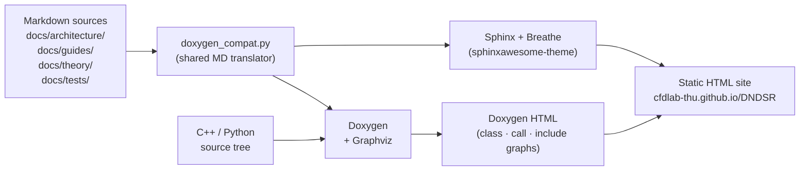

<!-- _footer: "docs/tests/overview.md:11-40" -->

## Test suite at a glance

| Module  | C++ executables | C++ assertions | Python tests | np values         |
|---------|------------------|----------------|--------------|-------------------|
| DNDS    | 7                | ~400           | ~10          | 1, 2, 4, 8        |
| Geom    | 8                | —              | 1            | 1, 2, 4, 8        |
| CFV     | 3 (+1 CUDA)      | ~340 (43 tests)| 32           | 1, 2, 4           |
| Euler   | 4                | ~310 (59 tests)| —            | 1, 2, 4           |
| Solver  | 4                | ~65 (24 tests) | —            | 1                 |

<div class="callout">

**Totals.** 25+ C++ executables, ~1100 assertions, ~32 Python tests.
All MPI-aware tests are CTest-registered at each np value. Serial tests have
a 60–120 s timeout; parallel tests 120–600 s depending on module.

</div>

```bash
# Build + run everything
cmake -B build -DDNDS_BUILD_TESTS=ON
cmake --build build -t all_unit_tests -j8
ctest --test-dir build --output-on-failure
```

---
<!-- _footer: "test/cpp/DNDS/ · test/cpp/Geom/" -->
<!-- _class: denser -->

## C++ test catalogue (1 / 2)

<div class="cols">
<div>

### DNDS

- `test_array` — layouts, row views, iterators
- `test_mpi` — MPI wrapper, collective ops
- `test_array_transformer` — father/son ghost exchange
- `test_array_derived` — AdjacencyRow, EigenMap rows
- `test_array_dof` — vector-space ops, norms, AXPY
- `test_index_mapping` — global ↔ local, EvenSplit
- `test_serializer` — H5 + JSON, redistribute

### Geom

- `test_elements` — shape functions, jacobians
- `test_quadrature` — orders, weights
- `test_mesh_index_conversion` — state transitions
- `test_mesh_pipeline` — full build chain
- `test_mesh_distributed_read` — ParMetis repartition
- `test_mesh_connectivity` — Inverse / Compose DSL
- `test_mesh_connectivity_ghost` — GhostSpec BFS
- `test_mesh_connectivity_interpolate` — face interp

</div>
<div>

### Typical test structure

```cpp
TEST_CASE("ArrayTransformer: round-trip ghost pull" *
          doctest::description("np=1,2,4") *
          doctest::timeout(120.0)) {
    MPIInfo mpi; mpi.setWorld();
    auto father = make_ssp<ParArray<real, 5>>();
    auto son    = make_ssp<ParArray<real, 5>>();
    father->Resize(localN);  father->createGlobalMapping();
    // ... populate father ...

    ArrayTransformer<real, 5> trans;
    trans.setFatherSon(father, son);
    trans.createFatherGlobalMapping();
    trans.createGhostMapping(pullGlobal);
    trans.createMPITypes();
    trans.initPersistentPull();
    trans.pullOnce();

    CHECK(son->operator[](0).isApprox(expected, 1e-14));
}
```

</div>
</div>

---
<!-- _footer: "test/cpp/CFV/ · test/cpp/Euler/ · test/cpp/Solver/" -->

## C++ test catalogue (2 / 2)

<div class="cols-3">
<div>

### CFV

- `test_reconstruction`
  · tests of VR convergence on analytic fields.
- `test_reconstruction3d`
  · 3D variants; Jacobi/SOR comparison.
- `test_limiters`
  · WBAP / CWBAP on contrived data; exercises the full limiter menu.
- `test_device_transferable`
  *(CUDA only)* · round-trip of `FiniteVolume` to GPU and back.

</div>
<div>

### Euler

- `test_gas_thermo`
  · ideal gas Cv/Cp, T/p relations, Mach→state.
- `test_riemann_solvers`
  · 13 variants, exact-solution agreement on 1D Riemann problems.
- `test_rans`
  · SA + k-ω source terms, wall distance integration, trip location.
- `test_evaluator_pipeline`
  · full `EvaluateRHS` on a fixed mesh — **golden values**.

</div>
<div>

### Solver

- `test_ode`
  · BDF / SDIRK / HM3 on ODE benchmarks (Van der Pol, stiff scalar).
- `test_linear`
  · GMRES + PCG convergence on canonical matrices.
- `test_direct`
  · small-block LU / LDLT correctness.
- `test_scalar`
  · scalar transport advection-diffusion regression.

</div>
</div>

---
<!-- _footer: "docs/tests/overview.md:87-111" -->

## Determinism — how golden values stay stable

Many tests compare computed results against pre-captured **golden values**
with relative tolerance `1e-6` to `1e-8`. For this to be meaningful, runs
must be byte-stable across re-executions.

<div class="cols">
<div>

### Sources of non-determinism — eliminated

- **Partitioning order** → `metisSeed = 42` (fixed).
- **SOR update order** (depends on partition) → Jacobi iteration used
  instead in VR tests.
- **LU-SGS sweep direction** (partition-ordered) → Jacobi-style updates
  in Euler pipeline tests.
- **OMP reduction order** (thread count) → scalar reductions are
  deterministic at fixed thread count.

</div>
<div>

### Sentinel value pattern

When a golden value **has not yet been captured**, the test stores the
sentinel `1e300`:

```cpp
const real gold_kinetic = 1e300;           // TODO: capture
const real computed     = evaluate();
if (gold_kinetic < 1e299)
    CHECK(computed == doctest::Approx(gold_kinetic).epsilon(1e-8));
else
    CHECK(std::isfinite(computed) && computed >= 0);
```

So the first run of a new test is a finite/non-negative sanity check,
and the developer updates the golden in a follow-up commit.

</div>
</div>

---
<!-- _footer: "docs/tests/overview.md:104-124" -->
<!-- _class: dense -->

## Python tests — pytest + pytest-mpi

<div class="cols">
<div>

### What's covered

- `test/DNDS/test_basic.py` — import chain, MPIInfo, small array round-trip.
- `test/Geom/test_read_mesh.py` — CGNS read, elevation, bisection.
- `test/CFV/test_fv_correctness.py` — cell volume / face area / jacobian
  correctness on wall meshes (~32 tests).
- `test/CFV/test_reconstruction.py` — VR order convergence on sin(x)sin(y).
- `test/EulerP/test_eulerP_pipeline.py` — host + CUDA round-trip.

### Running

```bash
# Serial
pytest test/DNDS/test_basic.py -v

# MPI
mpirun -np 4 python -m pytest test/DNDS/test_basic.py

# Some tests support standalone
python           test/DNDS/test_basic.py
mpirun -np 2 python test/DNDS/test_basic.py
```

</div>
<div>

### Critical rebuild dance

```bash
# 1. Rebuild pybind11 shared libs
cmake --build build -t dnds_pybind11 geom_pybind11 \
                       cfv_pybind11 eulerP_pybind11 -j32

# 2. Reinstall into python/DNDSR/ (MANDATORY)
cmake --install build --component py

# 3. Only now, run tests
source venv/bin/activate
PYTHONPATH=<root>/python pytest test/ -v
```

<div class="callout callout-warn">

⚠ Skipping the install step after changing C++ source leaves stale `.so`
files and produces misleading segfaults that look like code bugs.
`git checkout` changes source but does **not** rebuild binaries.

</div>

</div>
</div>

---
<!-- _footer: "CMakePresets.json" -->
<!-- _class: dense -->

## Build system — presets

```jsonc
{
  "configurePresets": [
    {
      "name": "release-test",
      "generator": "Ninja",
      "binaryDir": "${sourceDir}/build",
      "cacheVariables": {
        "CMAKE_BUILD_TYPE":    "Release",
        "DNDS_BUILD_TESTS":    "ON",
        "DNDS_USE_OMP":        "ON"
      }
    },
    { "name": "debug",  "inherits": "release-test",
      "cacheVariables": { "CMAKE_BUILD_TYPE": "Debug" } },
    { "name": "cuda",   "inherits": "release-test",
      "cacheVariables": { "DNDS_USE_CUDA": "ON",
                          "CMAKE_CUDA_ARCHITECTURES": "native" } },
    { "name": "ci",     "inherits": "release-test",
      "cacheVariables": { "DNDS_TEST_NP_LIST":     "1;2;4",
                          "DNDS_TEST_OMP_THREADS": "2" } }
  ]
}
```

Aggregate targets: `dnds_unit_tests`, `geom_unit_tests`, `cfv_unit_tests`,
`euler_unit_tests`, `solver_unit_tests`, `all_unit_tests` — all
`EXCLUDE_FROM_ALL` so plain `cmake --build` stays fast.

---
<!-- _footer: "pyproject.toml · RELEASE_NOTES.md:32-40" -->
<!-- _class: dense -->

## Python packaging — `scikit-build-core`

```toml
# pyproject.toml
[build-system]
requires = ["scikit-build-core>=0.8", "pybind11", "pybind11-stubgen"]
build-backend = "scikit_build_core.build"

[project]
name = "DNDSR"
version = "0.1.0"              # synchronized with VERSION file + git describe

[tool.scikit-build]
cmake.args = ["-DDNDS_BUILD_PYTHON=ON", "-DDNDS_PYBIND11_NO_LTO=ON"]
install.components = ["py"]     # only install the py component
```

<div class="cols">
<div>

### Build & install

```bash
CC=mpicc CXX=mpicxx \
    CMAKE_BUILD_PARALLEL_LEVEL=32 \
    pip install -e .
```

- Builds all `*_pybind11` targets.
- Copies them into `python/DNDSR/*/_ext/`.
- Runs `pybind11-stubgen` to produce `.pyi` files.
- Copies external shared libs into `python/DNDSR/_lib/`.

</div>
<div>

### Why system Python (not conda)

> Conda/Anaconda Python embeds an `RPATH` to conda's bundled libstdc++, which
> may be older than what the MPI compiler produces. System Python uses the
> system libstdc++ and avoids this conflict.
> — `README.md`

macOS has a dedicated fmtlib workaround, also shipped.

</div>
</div>

---
<!-- _footer: "docs/dev/clang_tidy_plan.md · RELEASE_NOTES.md:32-40" -->
<!-- _class: denser -->

## Clang-tidy sanitation

<div class="cols">
<div>

### DNDS core — the cleanup

- **24 597 diagnostics** at start of the sweep.
- **26 passes** applied in careful slice order.
- **1 remaining** — an unrelated Eigen PCH `omp.h` include issue.
- Full per-pass record and `.clang-tidy` rationale preserved in
  `docs/dev/clang_tidy_plan.md`.

### The `.clang-tidy` disables (representative)

- `cppcoreguidelines-pro-bounds-pointer-arithmetic` — unavoidable in
  CSR / row-flat arrays.
- `fuchsia-default-arguments-declarations` — MPI defaults.
- `llvm-header-guard` — we use `#pragma once`.
- `modernize-use-trailing-return-type` — style preference.

</div>
<div>

### Running it yourself

```bash
# Per-module histogram
python scripts/run_clang_tidy.py DNDS
python scripts/run_clang_tidy.py Geom
python scripts/run_clang_tidy.py CFV
python scripts/run_clang_tidy.py Euler
python scripts/run_clang_tidy.py Solver
```

### What's next

Solver / Geom / CFV / Euler / EulerP are **not yet sanitised** — same recipe
to apply. The `.clang-tidy` disables carry forward.

</div>
</div>

---
<!-- _footer: "docs/sphinx/conf.py · docs/doxygen/ · RELEASE_NOTES.md:61-70" -->
<!-- _class: dense -->

## Documentation system — architecture



<div class="cols">
<div>

### Key features

- **One Markdown source** renders in both Sphinx and Doxygen via
  `doxygen_compat.py`.
- **Doxygen HTML** is embedded at `/doxygen/` on the Sphinx site.
- **Graphviz** class inheritance, call graphs, include graphs.
- **sphinxawesome-theme** with rich code highlighting.

</div>
<div>

### Build speeds

| Trigger | Time |
|---|---|
| No-op rebuild | **< 1 s** |
| Markdown-only edit | ~10 s |
| Full (Doxygen + Sphinx) | ~2.5 min |

```bash
cmake --build build -t serve-docs
# → http://localhost:8000 with hot reload
```

</div>
</div>

---
<!-- _footer: ".github/workflows/ · RELEASE_NOTES.md:68-70" -->
<!-- _class: denser -->

## CI & release automation

<div class="cols">
<div>

### GitHub Actions — Pages deployment

- **Manual dispatch** workflow (avoid spending minutes on every push).
- **3-layer caching:**
  1. Ubuntu apt packages (doxygen, graphviz, libmpich-dev).
  2. External `cfd_externals` binary libraries (HDF5, CGNS, Metis, ParMetis).
  3. Python venv + Sphinx build cache.
- Cache hit → full docs build in ~3 minutes; cache miss → ~20 minutes.

### Style + hygiene

- `.clang-format` ships at repo root; CI checks a diff in a separate job.
- `POSIX index()` ambiguity guard — code style requires `DNDS::index`
  whenever `using namespace DNDS;` is active (documented in
  `docs/tests/overview.md`).

</div>
<div>

### Version string

- `VERSION` file at repo root (`0.1.0`).
- CMake combines it with `git describe --tags --long`.
- Exposed as:
  - C++ macro `DNDS_VERSION_STRING`.
  - Python `DNDSR.__version__` (PEP 440 compliant).
  - JSON schema `x-version` field.

### Release workflow

```bash
# Bump VERSION file
echo 0.2.0 > VERSION
git tag v0.2.0
git push --tags
# Pages workflow + release notes kick off.
```

</div>
</div>

