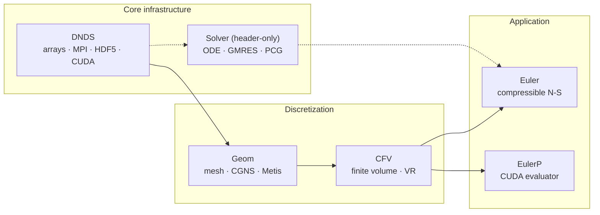

<!-- _footer: "docs/architecture/Paradigm.md:4,119,161" -->

## 为何又写一个CFD框架？

<div class="cols-60-40">
<div>

**非结构CFD的设计空间处境：**

- **CG/CAD** — 复杂的多态拓扑，每单元计算量小（Blender、FreeCAD、Gmsh）。
- **深度学习框架** — 大规模同构数组，简单的定宽张量（PyTorch、JAX）。
- **非结构CFD两者都需要** — 异构拓扑 + 密集数值内核。

**两大主流范式存在抽象泄漏：**

- **OpenFOAM风格** — `primitiveMesh` 在单一类层级中同时拥有拓扑与几何；通信逻辑内嵌在类层面。
- **SU2风格** — 多态 `CDualGrid` / `CVertex` 对象承载每个实体的几何和求解状态。

每增加一个需通信的场，就要修改对象模型。

</div>
<div>

**DNDS: Distributed Numerical Data Structure**

> *"DNDS致力于提供类C的随机访问数组，无需关心MPI通信。更高层的抽象留给调用者处理。"*
> — `docs/architecture/Paradigm.md:161`

```cpp
// NOT this:
struct Face {
    real area;
    vec  cent;
    // …more fields…
};
std::vector<Face> faces;

// THIS:
std::vector<real> faceArea;
std::vector<vec>  faceCent;
// each manages its
// own MPI pattern.
```

</div>
</div>

---
<!-- _footer: "README.md:11-26 · app/Euler/*.cpp" -->

## DNDSR概览

<div class="cols">
<div>

### 功能特性

- **求解器** — Euler / N-S (2D/3D), SA-IDDES, k-ω RANS (Wilcox & SST), 反应流 `NS_EX`, realizable k-ε。
- **数值方法** — CFV + 变分重构（1—3阶）, 13种Riemann变体, ESDIRK / HM3 / BDF2, p-多重网格, WBAP / CWBAP 限制器。
- **并行计算** — 全流程持久化 MPI + OpenMP；CUDA 通过 `DeviceTransferable` CRTP 实现；EulerP 专用GPU求解器。
- **Python绑定** — pybind11 封装 DNDS · Geom · CFV · EulerP；PEP-561 类型标注（`.pyi` 自动生成）。
- **Configuration系统** — 带类型的 JSON + 自动生成 JSON Schema（`--emit-schema`）；内建未知键检测。

</div>
<div>

### 求解器可执行文件

| 可执行文件                   | 模型                                |
|------------------------------|------------------------------------|
| `euler` / `euler3D`          | 可压缩 Navier–Stokes               |
| `eulerSA` / `eulerSA3D`      | Spalart–Allmaras RANS (IDDES)      |
| `euler2EQ` / `euler2EQ3D`    | k-ω 二方程 RANS                     |
| `eulerEX` / `eulerEX3D`      | 反应流 / 多组分                     |

每个 `app/Euler/euler*.cpp` 都是一行式的 `main` 函数，实例化 `DNDS::Euler::RunSingleBlockConsoleApp<Model>` — 对 `EulerModel` 枚举的模板分发。

共享代码路径，八个二进制文件。

</div>
</div>

---
<!-- _footer: "RELEASE_NOTES.md · docs/architecture/ · docs/dev/" -->

## 项目数据概览

<div class="cols-3">
<div>

### 代码

- **~72k** 行 C++（346 个文件）
- **~1.9k** 行 Python（17 个文件）
- **6** 个 C++ 模块 + header-only Solver
- **4** 个 pybind11 扩展模块
- **8** 个求解器可执行文件

</div>
<div>

### 测试

- **82** 项 CTest 注册（29 个可执行文件）
- 所有 MPI 测试 **np ∈ {1, 2, 4, 8}**
- 总计 **~600** 个 doctest 测试用例
  - 249 DNDS · 193 Geom · 62 CFV
  - 62 Euler · 29 Solver
- **58** 个 Python pytest 函数（DNDS, CFV）
- **Metis seed = 42** → 确定性参考值

</div>
<div>

### 文档

- **Sphinx + Breathe + Doxygen**
- 完整的类/调用/包含关系图（Graphviz）
- 增量构建 < 1 s（无变更），完整构建 ~2.5 min
- 在线地址 `cfdlab-thu.github.io/DNDSR`
- 通过 `doxygen_compat.py` 实现双引擎同源 Markdown

</div>
</div>

<br>

> 🧹 Clang-tidy 里程碑：DNDS 核心模块经过 26 轮清理，诊断数从 **24 597 → 1**。

---
<!-- _footer: "docs/guides/project_structure.md:101-114" -->
<!-- _class: denser -->

## 模块架构



<div class="callout">

**如何解读此图。** 每个模块仅依赖于其上层模块。`Solver` 是 header-only 的，仅依赖 `DNDS` 数据类型 — Krylov 和 ODE 代码对 CFD 一无所知。`EulerP` 是与 `Euler` 平行的 CUDA 求解器轨道，复用 `CFV` 但将通量/限制器管线替换为可在设备上调用的标量循环。

</div>

---
<!-- _footer: "README.md:28-68 · docs/guides/building.md" -->

## 从零运行求解器

```bash
# 1. Fetch code and submodules
git clone --recursive https://<repo/DNDSR>.git && cd DNDSR

# 2. Build binary external libraries (HDF5, CGNS, Metis, ParMetis, zlib, ...)
cd external/cfd_externals && CC=mpicc CXX=mpicxx python cfd_externals_build.py && cd ../..

# 3. Fetch header-only libraries (Eigen, Boost, CGAL, fmt, pybind11, nanoflann, ...)
curl -L -o external/external_headeronlys.tar.gz \
  https://github.com/harryzhou2000/cfd_externals_headeronlys/releases/latest/download/external_headeronlys.tar.gz
cd external && tar -xzf external_headeronlys.tar.gz && cd ..

# 4. Configure with a preset
cmake --preset release-test        # Release + DNDS_BUILD_TESTS=ON

# 5. Build a specific solver
cmake --build build -t euler -j32

# 6. Run
mpirun -np 4 ./build/app/euler.exe cases/euler_config_IV.json
```

可用预设：`release-test`、`debug`、`cuda`、`ci`。Python 路径：`pip install -e .` 底层使用 `scikit-build-core`。
