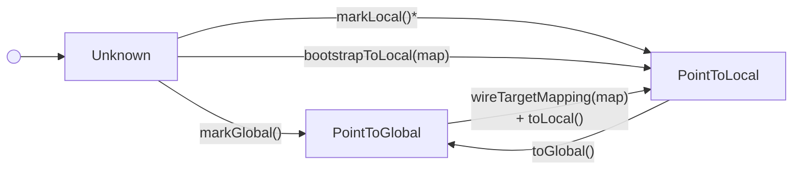

<!-- _footer: "docs/guides/project_structure.md:5-17 · docs/index.md:10-17" -->

## 六大模块 — 职责划分

| 模块       | 目录          | 职责                                                                | 代码量 |
|------------|--------------|---------------------------------------------------------------------|--------|
| **DNDS**   | `src/DNDS`   | MPI 数组，序列化（JSON + HDF5），性能分析，CUDA，Configuration                | 大     |
| **Geom**   | `src/Geom`   | 非结构化网格，CGNS I/O，Metis/ParMetis 分区                         | 大     |
| **CFV**    | `src/CFV`    | Compact Finite Volume，变分重构，限制器                             | 中     |
| **Euler**  | `src/Euler`  | 可压缩 N-S，SA，k-ω，双时间步编排                                   | 大     |
| **EulerP** | `src/EulerP` | 替代方案 CUDA 优化Evaluator                                            | 中     |
| **Solver** | `src/Solver` | ODE 积分器 + Krylov — **纯头文件**                                  | 小     |

<br>

<div class="callout">

**为什么要分层。** 每一层只依赖其上层。`Solver` 仅依赖 DNDS 的数据类型——Krylov 和 ODE 代码对 CFD 一无所知；这就是为什么同一个 `GMRES_LeftPreconditioned` 可以在 Euler、VR 的 `uRec` 系统和 k-ω 方程之间通用。`EulerP` 与 `Euler` 并列，复用全部 `CFV`，但将通量核替换为可在设备上调用的标量循环。

</div>

---
<!-- _footer: "docs/architecture/Paradigm.md:119-161" -->
<!-- _class:  -->

## 延迟抽象 ⇒ 独立的通信模式

不同类型的场需要不同的通信模式。**将它们封装在一个类中会强制产生一个单体序列化器。**

<div class="cols">
<div>

**脆弱方案：合并结构体**

```cpp
class Solution {
    real rho, ru, rv, rw, E;   // comm phase A
    real u, v, w, p, T;        // derived, no comm
    real rho_1, ru_1, rv_1,
         rw_1, E_1;             // comm phase B
public:
    void WriteStream(ByteStream &);
    void ReadStream (ByteStream &);
};
std::vector<Solution> sols;
```

单个 `WriteStream` 无法表达*哪些*场参与*哪个* MPI 阶段——任何新场都需要同时修改两个方法。

</div>
<div>

**DNDSR：按类型分离**

```cpp
ArrayDof<5, 1>          u;       // conservative now
ArrayDof<5, 1>          u_prev;  // previous snapshot
ArrayDof<2, 5>          grad_u;  // gradients, 2D × 5 vars
ArrayDof<DynamicSize,5> uRec;    // variable-order reconstruction
```

每个数组拥有自己的 `ArrayTransformer`。Ghost覆盖范围和通信阶段**独立且可组合**：

- `u` 和 `u_prev` 共享相同的Ghost映射 → `BorrowGGIndexing`。
- `uRec` 可能有不同的行大小——新的 MPI 类型，相同的映射。
- `grad_u` 位于更大的Halo区中，用于梯度模板。

</div>
</div>

---
<!-- _footer: "src/DNDS/ArrayBasic.hpp:17-25 · array_infrastructure.md:50-95" -->
<!-- _class: denser -->

## `Array<T, rs, rm>` — 一个模板五种布局

```cpp
template <class T,
          rowsize _row_size = 1,             // fixed | DynamicSize | NonUniformSize
          rowsize _row_max  = _row_size,     // controls padding vs CSR
          rowsize _align    = NoAlign>
class Array;

enum DataLayout {
    ErrorLayout,        // invalid template combination (compile error)
    TABLE_StaticFixed,  // fixed width, compile-time
    TABLE_Fixed,        // fixed width, runtime (uniform across rows)
    TABLE_Max,          // padded variable rows, runtime max
    TABLE_StaticMax,    // padded variable rows, compile-time max
    CSR,                // flat buffer + pRowStart[n+1]
};
```

**`ComputeDataLayout()` 将 `(rs, rm)` 映射为布局标签：**

| `_row_size`      | `_row_max`       | 布局               | 用例                                                  |
|------------------|------------------|---------------------|-------------------------------------------------------|
| `>= 0`           | —                | `TABLE_StaticFixed` | 单元体积（1 个实数），Euler 状态（5 个实数）          |
| `DynamicSize`    | —                | `TABLE_Fixed`       | VR 系数（阶数在运行时决定）                            |
| `NonUniformSize` | `>= 0`           | `TABLE_StaticMax`   | 单个单元类型的每面节点数                               |
| `NonUniformSize` | `DynamicSize`    | `TABLE_Max`         | 可变行填充，运行时最大值                               |
| `NonUniformSize` | `NonUniformSize` | `CSR`               | `cell2node`、`cell2cell`、宽模板邻接                   |

<div class="tiny">`rowsize = int32_t`。哨兵值：`DynamicSize = -1`，`NonUniformSize = -2`。
对齐flag存在但目前只实现了 `NoAlign`。</div>

---
<!-- _footer: "src/DNDS/Array.hpp · array_infrastructure.md:82-95" -->
<!-- _class: dense -->

## CSR 有两种内部模式

<div class="cols">
<div>

### 未压缩模式

`std::vector<std::vector<T>>`——每行一个内层 vector。

```cpp
ArrayAdjacency<NonUniformSize, NonUniformSize> c2n;
c2n.Decompress();           // → vector<vector<index>>
for (index iCell = 0; iCell < nCell; ++iCell) {
    c2n.ResizeRow(iCell, /*width*/ vertexCount[iCell]);
    for (int k = 0; k < vertexCount[iCell]; ++k)
        c2n(iCell, k) = globalNodeId[iCell][k];
}
c2n.Compress();             // required before MPI
```

**在网格构建期间使用**——行增量增长。

</div>
<div>

### 压缩模式

平坦的 `std::vector<T>` + `pRowStart[n+1]` 索引。

- 通过 `pRowStart[i]` 实现 O(1) 行访问。
- 构建后零开销。
- 任何 MPI 调用或序列化之前**必须使用**。
- 仅通过 `Decompress()` → 编辑 → `Compress()` 保留行调整功能。

### ArrayView

一个可在设备上调用的非拥有视图（`ArrayView<T, rs, rm>`）为每种布局实现 `operator[]` 和 `at()`——这是发送到 GPU 的内容。

</div>
</div>

<div class="callout callout-warn">

⚠ **元素类型约束：** `array_comp_acceptable<T>()` 要求 `std::is_trivially_copyable_v<T>` **或** `is_fixed_data_real_eigen_matrix_v<T>`。不允许 `std::string` 行、`std::vector` 行——这会破坏 MPI。

</div>

---
<!-- _footer: "src/DNDS/ArrayTransformer.hpp:429-1496" -->
<!-- _class: denser -->

## `ArrayTransformer` — 解剖

<div class="cols-40-60">
<div>

**成员**

- `MPIInfo mpi;`
- `t_pArray father, son;`
- `pLGlobalMapping`   — 局部行 → 全局索引
- `pLGhostMapping`    — 全局索引 → 局部 father+son
- `pPushTypeVec / pPullTypeVec` — 缓存的 `(rank, MPI_Datatype)`
- `PushReqVec / PullReqVec` — 持久请求句柄
- `pushDevice / pullDevice` — Host 或 CUDA

**两种策略**

- `HIndexed` — `MPI_Type_create_hindexed` scatter/gather（默认）。
- `InSituPack` — 连续打包缓冲区，对打包内存执行 `MPI_Isend/Irecv`。

通过 `MPI::CommStrategy::Instance().GetArrayStrategy()` 逐进程选择。

</div>
<div>

**生命周期**

```cpp
// Setup — all collective
trans.setFatherSon(father, son);
trans.createFatherGlobalMapping();
trans.createGhostMapping(pullIdxGlobal);   // pull-based
// or:
trans.createGhostMapping(pushIdxLocal, pushStarts); // push-based
trans.createMPITypes();                    // hindexed datatypes

// Persistent init
trans.initPersistentPull();                // MPI_Recv_init + Send_init
trans.initPersistentPush();                // reverse direction

// Hot loop — any number of times
for (step = 0; step < N; ++step) {
    trans.startPersistentPull();           // MPI_Startall
    computeFluxes(/* reads ghosts */);
    trans.waitPersistentPull();            // MPI_Waitall
}

// Cleanup
trans.clearPersistentPull();
trans.clearMPITypes();
```

</div>
</div>

---
<!-- _footer: "src/DNDS/ArrayTransformer.hpp · array_infrastructure.md:115-184" -->

## Father / son 寻址

```
 索引:   0 .......... fatherSize-1  | fatherSize ...... fatherSize+sonSize-1
           └──── 自有 (father) ─────┘ └─ Ghost (son, 从其他 rank 复制) ─┘

   • father 拥有数据——写入合法
   • son  镜像远程数据——下次 pull 后写入被忽略
   • operator[](i) 按索引范围路由到 father 或 son
```

<div class="cols">
<div>

**Pull = father → son（读取Ghost数据）**

```cpp
trans.initPersistentPull();
trans.startPersistentPull();      // non-blocking
// ... overlap computation ...
trans.waitPersistentPull();
```

典型用于通量计算循环：读取相邻单元值。

</div>
<div>

**Push = son → father（累加归约）**

```cpp
trans.initPersistentPush();
trans.startPersistentPush();
trans.waitPersistentPush();
```

典型用于基于节点的 FEM 风格装配：将Ghost副本的部分累加归约回 father。

</div>
</div>

> **跨数组共享Ghost结构。** `BorrowGGIndexing(primary)` 跳过昂贵的集合 `createFatherGlobalMapping` + `createGhostMapping` 阶段；仅重建 `createMPITypes()`，因为 MPI 数据类型取决于元素大小。

---
<!-- _footer: "src/DNDS/ArrayPair.hpp · src/DNDS/ArrayDerived/*.hpp" -->

## 类型化包装器：`ArrayDerived`

每个派生类继承 `ParArray<T, rs, rm>` 并重写 `operator[]` 以返回**类型化行视图**而非裸指针。

| 类型                               | `operator[](i)` 返回               | 用途                              |
|------------------------------------|-------------------------------------|-----------------------------------|
| `ArrayAdjacency<rs, rm>`           | `AdjacencyRow` — 轻量级跨度         | 网格拓扑（`cell2node` 等）        |
| `ArrayEigenVector<N>`              | `Eigen::Map<Vector<real, N>>`       | 节点坐标（`coords`）              |
| `ArrayEigenMatrix<M, N>`           | `Eigen::Map<Matrix<real, M, N>>`    | 每单元 Jacobian、梯度             |
| `ArrayEigenUniMatrixBatch<M, N>`   | 每行批次的第 `j` 个矩阵             | 积分点数据                        |

<div class="cols">
<div>

### `ArrayPair<TArray>` — 便捷封装

```cpp
template <class TArray = ParArray<real, 1>>
struct ArrayPair {
    ssp<TArray>   father;
    ssp<TArray>   son;
    TTrans        trans;
    auto operator[](index i);       // → father or son by range
};
```

</div>
<div>

### 常用类型别名

| 别名                                | 用途                             |
|-------------------------------------|----------------------------------|
| `ArrayAdjacencyPair<rs, rm>`        | 网格连通性                       |
| `ArrayEigenVectorPair<N>`           | coords                           |
| `ArrayEigenMatrixPair<M, N>`        | 每实体矩阵                       |
| `ArrayEigenUniMatrixBatchPair<M,N>` | 积分数据                         |

</div>
</div>

---
<!-- _footer: "src/DNDS/ArrayDOF.hpp:174-395 · CFV/VRDefines.hpp:27" -->
<!-- _class: dense -->

## `ArrayDof` — 求解器的向量空间

```cpp
template <int n_m, int n_n>
class ArrayDof : public ArrayEigenMatrixPair<n_m, n_n>;
```

包装了 `father + son + transformer` 并添加了 **MPI 集合向量空间操作**——可直接被 `src/Solver` 中的 Krylov 求解器使用。

<div class="cols">
<div>

### 操作（CPU + CUDA 特化）

```cpp
void setConstant(real R);
void setConstant(const Eigen::Ref<...> &M);

void operator+=(const ArrayDof &R);
void operator-=(const ArrayDof &R);
void operator*=(real R);
void operator*=(const ArrayDof &R);    // Hadamard
void operator/=(const ArrayDof &R);

void addTo(const ArrayDof &R, real r); // AXPY

// MPI-collective reductions
real norm2();                  real norm2(const ArrayDof &R);
real dot(const ArrayDof &R);
real min();                    real max();    real sum();
```

</div>
<div>

### CFV 别名

```cpp
// src/CFV/VRDefines.hpp
template <int N>  using tUDof    = ArrayDof<N, 1>;
template <int N>  using tURec    = ArrayDof<DynamicSize, N>;
template <int N,
          int d>  using tUGrad   = ArrayDof<d, N>;
```

- `tUDof<N>` — 单元平均守恒变量（ρ, ρu, ρv, ρw, ρE）。
- `tURec<N>` — 重构系数（nDOF 按阶数在运行时选择）。
- `tUGrad<N, d>` — 每单元 dim × N 梯度矩阵。

显式实例化覆盖 `(n_m ∈ {1..8, Dynamic, NonUniform}, n_n ∈ {1..5})`。

</div>
</div>

---
<!-- _footer: "src/DNDS/ArrayDOF_op.hxx · ArrayDOF_op_CUDA.cuh" -->
<!-- _class: dense -->

## DOF 操作的 Host / CUDA 分发

```cpp
template <DeviceBackend B, int n_m, int n_n>
class ArrayDofOp;

template <int n_m, int n_n>
class ArrayDofOp<DeviceBackend::Host, n_m, n_n> {  /* OpenMP-parallel impl  */ };

#ifdef DNDS_USE_CUDA
template <int n_m, int n_n>
class ArrayDofOp<DeviceBackend::CUDA, n_m, n_n> { /* thrust / raw kernels */ };
#endif
```

**运行时分发：**

```cpp
#define DNDS_ARRAY_OP_SWITCHER(backend, expr)  \
    switch (backend) {                          \
        case DeviceBackend::Host: { using Op = ArrayDofOp<DeviceBackend::Host, n_m, n_n>; expr; break; } \
        case DeviceBackend::CUDA: { using Op = ArrayDofOp<DeviceBackend::CUDA, n_m, n_n>; expr; break; } \
        default: DNDS_assert_info(false, "Unknown device");                 \
    }
```

<div class="callout callout-ok">

**效果：** 无论数据位于何处，求解器的 `norm2()` / `dot()` / `addTo()` 调用在 C++ 中都相同——主机代码只需检查 `father->device()` 并路由。Euler 或 Solver 中没有 `#ifdef CUDA`。

</div>

---
<!-- _footer: "docs/architecture/MeshConnectivity.md:179-336 · Mesh_DeviceView.hpp:89-94" -->
<!-- _class: tight -->

## 状态跟踪的网格邻接（1 / 2）

12 个以上的邻接数组（`cell2node`、`face2cell`、`cell2cell`、`node2bnd` 等）在任何时刻都必须处于**全局或局部索引**状态——这是一个经典的 bug 高发区。

```cpp
enum MeshAdjState {
    Adj_Unknown      = 0,
    Adj_PointToLocal,
    Adj_PointToGlobal,
};
```



<small>\* `markLocal()` 要求目标映射已经wired。
`markGlobal()` 在已处于 `PointToGlobal` 时是幂等的空操作。</small>

---
<!-- _footer: "src/Geom/Mesh/AdjIndexInfo.hpp:27-341" -->
<!-- _class: dense -->

## 状态跟踪的网格邻接（2 / 2）

<div class="cols">
<div>

### `AdjIndexInfo` — 私有状态 + 目标映射

```cpp
struct AdjIndexInfo {
private:
    MeshAdjState     _state{Adj_Unknown};
    t_pLGhostMapping _targetMapping;     // map of the TARGET kind
public:
    // queries
    MeshAdjState state() const;
    bool isLocal(), isGlobal(), isBuilt(), isWired();
    // transitions
    void markGlobal();                   // Unknown|Global → Global
    void markLocal();                    // Unknown → Local (wired only)
    void wireTargetMapping(map);         // not when Local
    // conversions
    void toLocal (adj, nRows);           // & toLocalOMP
    void toGlobal(adj, nRows);           // & toGlobalOMP
    // bootstrap (one-shot)
    void bootstrapToLocal(map, adj, nRows);
};
```

`toLocal` 后未找到的条目编码为 `(-1 - globalIdx)`，使其能经受往返转换并保持与有效局部索引的可区分性。

</div>
<div>

### `AdjPairTracked<TPair>`

```cpp
template <class TPair>
struct AdjPairTracked : public TPair {
    AdjIndexInfo idx;

    void toLocal();  void toGlobal();
    void toLocalOMP(); void toGlobalOMP();
    void bootstrapToLocal(map);
    MeshAdjState state() const;
    bool isLocal(), isGlobal(), isWired();

    template <DeviceBackend B>
    auto deviceView();
};
```

**三层 DSL**

| 层 | 文件 | 状态感知？ |
|---|---|---|
| DSL | `MeshConnectivity.hpp` | ❌ |
| 检查包装器 | `MeshConnectivity_StateChecked.hpp` | ✅ 断言 `idx.state()` |
| `UnstructuredMesh` | `Mesh.cpp` | ✅ 拥有 `AdjPairTracked` 成员 |

</div>
</div>
