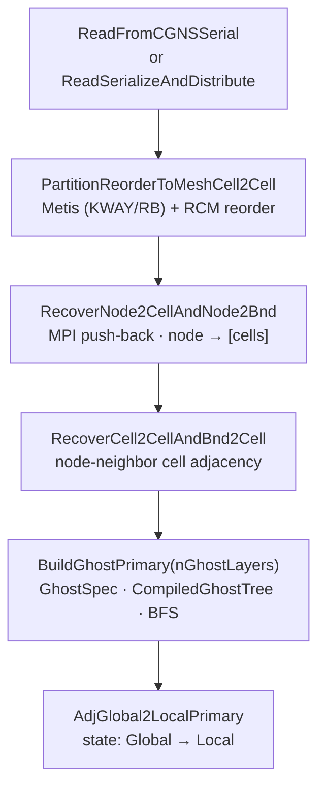
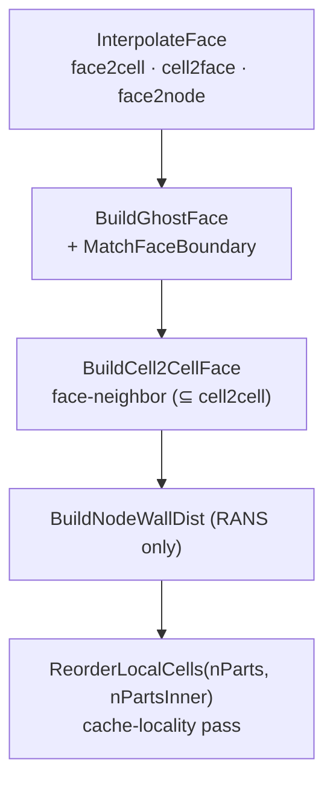

<!-- _footer: "docs/elements/ · src/Geom/Elements/" -->

## 支持的元素 — O1 / O2 对

<div class="elem-grid">
<figure><figcaption>Tri3</figcaption></figure>
<figure><figcaption>Quad4</figcaption></figure>
<figure><figcaption>Tet4</figcaption></figure>
<figure><figcaption>Hex8</figcaption></figure>
<figure><figcaption>Prism6</figcaption></figure>
<figure><figcaption>Pyramid5</figcaption></figure>

<figure><figcaption>Tri6</figcaption></figure>
<figure><figcaption>Quad9</figcaption></figure>
<figure><figcaption>Tet10</figcaption></figure>
<figure><figcaption>Hex27</figcaption></figure>
<figure><figcaption>Prism18</figcaption></figure>
<figure><figcaption>Pyramid14</figcaption></figure>
</div>

<div class="cols">
<div>

- **2D 单元：** Tri3、Tri6、Quad4、Quad9。
- **3D 单元：** Tet4、Tet10、Hex8、Hex27、Prism6、Prism18、Pyramid5、Pyramid14。
- **1D（BC / 边界网格）：** Line2、Line3。

</div>
<div>

- **升阶：** `BuildO2FromO1Elevation()` — Tri3→Tri6、Quad4→Quad9、Tet4→Tet10、Hex8→Hex27、Prism6→Prism18、Pyramid5→Pyramid14。
- **h-细化：** `BuildBisectO1FormO2()` — 从 O2 网格进行一步二分。

</div>
</div>

---
<!-- _footer: "src/Geom/Mesh/Mesh.hpp:57-127" -->
<!-- _class: denser -->

## `UnstructuredMesh` — 它拥有什么

```cpp
class UnstructuredMesh : public DeviceTransferable<UnstructuredMesh> {
    // === State flags (five groups) ==========================================
    MeshAdjState adjPrimaryState   {Adj_Unknown};  // cell2node, cell2cell, bnd2node, bnd2cell
    MeshAdjState adjFacialState    {Adj_Unknown};  // face2cell, face2node, face2bnd
    MeshAdjState adjC2FState       {Adj_Unknown};  // cell2face, bnd2face
    MeshAdjState adjN2CBState      {Adj_Unknown};  // node2cell, node2bnd
    MeshAdjState adjC2CFaceState   {Adj_Unknown};  // cell2cellFace

    // === Source-of-truth arrays (read / written to HDF5) ====================
    tCoordPair                coords;                     // node positions
    AdjPairTracked<tAdjPair>  cell2node, bnd2node;        // topology
    tElemInfoArrayPair        cellElemInfo, bndElemInfo;  // element type + zone
    tPbiPair                  cell2nodePbi, bnd2nodePbi;  // periodic bits

    // === Derived arrays (rebuilt each load) =================================
    AdjPairTracked<tAdjPair>  cell2cell, node2cell, node2bnd;
    AdjPairTracked<tAdj2Pair> bnd2cell, face2cell;
    AdjPairTracked<tAdjPair>  cell2face, face2node;
    AdjPairTracked<tAdj1Pair> bnd2face, face2bnd;
    AdjPairTracked<tAdjPair>  cell2cellFace;
    tElemInfoArrayPair        faceElemInfo;

    // === Reorder tracking (restart lineage) =================================
    tAdj1Pair cell2cellOrig, node2nodeOrig, bnd2bndOrig;
};
```

<div class="callout">

每个 `AdjPairTracked` 成员都携带自己的 `AdjIndexInfo idx`——因此每个邻接关系都知道自己是全局的还是局部的，**独立于 5 个组标志**。组标志保留作为粗粒度的断言工具。

</div>

---
<!-- _footer: "docs/architecture/MeshConnectivity.md:46-90 · src/Geom/Mesh/Mesh.hpp:442-1011" -->
<!-- _class: denser -->

## 网格构建流水线 — 端到端

<div class="cols">
<div>

**设置与邻接关系**



</div>
<div>

**面与最终化**



</div>
</div>

<div class="callout callout-warn">

⚠ **`cell2cell` 审计** — 对 CFV / Euler / EulerP 中的每个运行时调用进行了调查；`cell2cell` 在热循环中被查询了**零次**。它专门用于确定Ghost集合，之后基于面的遍历接管。这推动了展望中的 DMPlex 风格演进。

</div>

---
<!-- _footer: "src/Geom/Mesh/Mesh.hpp:1083-1105" -->
<!-- _class:  -->

## 分区 — `PartitionOptions`

```cpp
struct PartitionOptions {
    std::string metisType        = "KWAY";  // or "RB" (recursive-bisection)
    int         metisUfactor     = 20;      // load imbalance factor
    int         metisSeed        = 0;       // 42 in tests → deterministic
    int         edgeWeightMethod = 0;       // 0: none, 1: face size
    int         metisNcuts       = 3;       // multiple cuts, keep best
};
```

<div class="cols">
<div>

### 两种分区器

- **Metis（串行）** — 串行 CGNS 读取后的初始单元分区。由 `MeshPartitionCell2Cell(options)` 驱动，然后 `PartitionReorderToMeshCell2Cell` 使用分区对单元进行重新排序。
- **ParMetis（分布式）** — 用于 `ReadSerializeAndDistribute` 内部，在 H5 重启或跨 np 读取后**细化**均匀分割的负载。

</div>
<div>

### 确定性

测试固定 `metisSeed = 42`。结合 VR 中的 `Jacobi` 迭代（而非 SOR）以及确定性的 LU-SGS 替代，这能在任意 `np` 下产生跨重新运行的**字节稳定黄金值**。

### 排序

`ReorderLocalCells(nParts, nPartsInner)` 运行两级缓存局部性遍历（内部 + 外部）；`ObtainLocalFactFillOrdering` 为 ILU 运行 AMD / MMD。

</div>
</div>

---
<!-- _footer: "src/Geom/Mesh/MeshConnectivity.hpp:43-237" -->
<!-- _class: dense -->

## Ghost规范 DSL — 类型

```cpp
enum class EntityKind : int8_t {
    Cell = 0, Face = 1, Edge = 2, Node = 3, Bnd = 4, NUM_KINDS = 5,
};
```

```cpp
struct AdjKind {
    EntityKind from, to;
    EntityKind via;                 // for intra-level (from == to)
    constexpr AdjKind(EntityKind from, EntityKind to);               // direct cone/support
    constexpr AdjKind(EntityKind from, EntityKind to, EntityKind via); // intra-level
};

namespace Adj {
    // Direct cones (downward)
    constexpr AdjKind Cell2Node, Cell2Face, Cell2Edge, Face2Node, Face2Edge, Edge2Node, Bnd2Node;
    // Direct supports (upward)
    constexpr AdjKind Node2Cell, Node2Face, Node2Edge, Node2Bnd,
                      Face2Cell, Edge2Face, Edge2Cell,
                      Bnd2Cell,  Bnd2Face,  Face2Bnd;
    // Intra-level (via Node)
    constexpr AdjKind Cell2Cell, Bnd2Bnd, Face2Face;
    // Intra-level (via Face)
    constexpr AdjKind Cell2CellFace;
}

struct GhostChain  { EntityKind anchor; std::vector<AdjKind> hops; EntityKind target; };
struct GhostSpec   { std::vector<GhostChain> chains;
                     static GhostSpec defaultPrimary(int nLayers = 1); };
```

---
<!-- _footer: "src/Geom/Mesh/MeshConnectivity.hpp:244-335,1241" -->
<!-- _class:  -->

## Ghost DSL — 编译与计算

```cpp
GhostSpec spec = GhostSpec::defaultPrimary(nLayers);
// Or customize:
spec.chains = {
    { EntityKind::Cell, {Adj::Cell2Cell, Adj::Cell2Cell},              EntityKind::Cell }, // 2 layers
    { EntityKind::Cell, {Adj::Cell2Cell, Adj::Cell2Cell, Adj::Cell2Node}, EntityKind::Node },
    { EntityKind::Bnd,  {Adj::Bnd2Node,  Adj::Node2Bnd},               EntityKind::Bnd  },
};

CompiledGhostTree tree   = CompiledGhostTree::compile(spec);   // merges prefixes → trie
GhostResult       result = dag.evaluateGhostTree(tree, mpi);
```

<div class="cols">
<div>

### 求值器伪代码（每层 BFS）

```text
for level in 0..tree.maxLevel:
    for entry in tree.levels[level]:
        collect owned-side non-owned indices
    Allreduce: did any adjacency set grow?
    if yes → scratch-pull that adjacency
    traverse hop, populate next level
```

</div>
<div>

### `GhostResult`

```cpp
struct GhostResult {
    std::unordered_map<EntityKind,
        std::vector<index>> ghostIndices;  // sorted, deduped, global
    std::unordered_set<EntityKind>
        activeKinds;                       // collective (Allreduce)
    bool  hasGhosts(EntityKind) const;
    index totalGhosts() const;
};
```

</div>
</div>

---
<!-- _footer: "src/Geom/Mesh/MeshConnectivity.hpp:858-1220" -->
<!-- _class: dense -->

## `MeshConnectivity` 上的 DSL 原语

除了Ghost求值器之外，`MeshConnectivity` 还是一个用于分布式邻接操作的可复用 DSL——在许多网格构建步骤中使用。

| 原语 | 签名 | 功能 |
|---|---|---|
| `Inverse<cone_rs>` | `(cone, nToLocal, mpi, fromL2G, toL2G, toGlobalMap) → tAdjPair` | A→B Cone 到 B→A Support，MPI 推送回传 |
| `Compose<rs_AB, rs_BC, out_rs>` | `(AB, BC, ...) → tAdjPair` | A→B ∘ B→C → A→C |
| `ComposeFiltered` | `... pred, matchExtra=nullptr` | 使用 `SharedCountPredicate` 过滤器进行组合 |
| `Interpolate<p2n_rs>` | `(parent2node, SubEntityQuery, nParent, nNode, mpi)` | 仅局部的子实体提取 |
| `InterpolateGlobal<p2n_rs, e2p_rs>` | | N-父分布式插值，具备 pbi 感知去重 |
| `evaluateGhostTree` | `(tree, mpi) → GhostResult` | BFS Ghost求值 |

<div class="cols">
<div>

### `SharedCountPredicate`

```cpp
struct SharedCountPredicate {
    int  minShared  = 1;
    bool removeSelf = false;
};
```

用于实现类似 Jacobian 的模板，例如"共享 ≥ 2 个节点的单元"，用于从节点邻居中过滤出面邻居。

</div>
<div>

### 邻接注册表

```cpp
void registerAdj(AdjKind, ssp<AdjVariant>);
void registerGlobalMapping(EntityKind, ssp<GlobalOffsetsMapping>);

ssp<AdjVariant> resolveAdj(AdjKind) const;
bool            hasAdj(AdjKind) const;
```

网格构建方法填充此注册表，以便 `evaluateGhostTree` 可以在运行时按类型查找每跳的邻接关系。

</div>
</div>

---
<!-- _footer: "src/Geom/Mesh/Mesh.hpp:699-709 · RELEASE_NOTES.md:45" -->

## 升阶与二分

<div class="cols">
<div>

### O1 → O2 升阶

```cpp
void BuildO2FromO1Elevation(UnstructuredMesh &meshO1);
void ElevatedNodesGetBoundarySmooth();
void ElevatedNodesSolveInternalSmooth();
void ElevatedNodesSolveInternalSmoothV1();
void ElevatedNodesSolveInternalSmoothV1Old();
void ElevatedNodesSolveInternalSmoothV2();
```

- **边界平滑** — 基于 RBF 的弯曲表面上新增节点的放置。
- **内部平滑** — V1/V1Old/V2 变体的类拉普拉斯求解，用于插值内部新增节点的位置。

</div>
<div>

### O2 → O1 二分

```cpp
void BuildBisectO1FormO2(UnstructuredMesh &meshO2);
bool IsO1() const;
bool IsO2() const;
```

**每种元素类型**（参见 `docs/elements/*_nodes.png`）：

- Tri3 **→**（升阶） **→** Tri6 **→**（二分） **→** 4× Tri3。
- Quad4 **→**（升阶） **→** Quad9 **→**（二分） **→** 4× Quad4。
- Hex8 **→**（升阶） **→** Hex27 **→**（二分） **→** 8× Hex8。
- Prism6 / Pyramid5 — 类似地升阶和二分。

</div>
</div>

实际用于：

- 通过升阶进行 **p-自适应研究**，以及
- 通过二分进行 **h-细化基准测试**，同时保持相同的拓扑文件。

---
<!-- _footer: "src/Geom/Mesh/Mesh.hpp:986-1011" -->

## 壁面距离计算

`BuildNodeWallDist(fBndIsWall, WallDistOptions = {})`（`Mesh.hpp:1011`）。用于 SA / k-ω / DDES / IDDES 模型。

<div class="cols-40-60">
<div>

### 选项

```cpp
struct WallDistOptions {
    int  subdivide_quad    = 1;   // refine quads for brute-force
    int  method            = 0;   // 0 = brute, 1 = tree (CGAL AABB)
    int  wallDistExecution = 0;   // 0 = all parallel,
                                  // 1 = serial rank 0,
                                  // N = N-batch ranks
    real minWallDist       = 1e-10;
    int  verbose           = 0;
};
```

</div>
<div>

### 策略

- **暴力法** — O(N · M) 对循环；易于向量化；用于小型案例。
- **CGAL AABB 树** — 每个 rank 在壁面上的树；每次查询 O(log M)。
- **批量法** — 通过在 rank 的子集上构建树（`wallDistExecution > 1`）来缓解单 rank 内存上限。
- **Poisson** — EulerEvaluator 中的 `GetWallDist_Poisson()`；在网格上求解 p-Poisson，梯度取反 → 距离。

距离也按*每个面*计算，用于 SST 混合函数。

</div>
</div>

---
<!-- _footer: "docs/architecture/Serialization.md:107-172 · src/Geom/Mesh/Mesh.hpp:912-949" -->

## 跨 `np` 重启

<div class="cols-40-60">
<div>

### 偏移哨兵

```cpp
static const index Offset_Parts     = -1;
static const index Offset_One       = -2;
static const index Offset_EvenSplit = -3;
static const index Offset_Unknown   = UnInitIndex;
```

| 模式               | 含义                           |
|-------------------|-----------------------------------|
| `Unknown`         | 从 `rank_offsets` 自动检测                    |
| `Parts`           | 对局部大小进行 `MPI_Scan`                        |
| `One`             | Rank 0 拥有整个数据集                      |
| `EvenSplit`       | 读取时分割为 `~N/np`                       |
| (explicit)        | `isDist()` → `true`；`{localSize, globalStart}`    |

</div>
<div>

### `ReadSerializeRedistributed` — 三种情况

1. **无 `origIndex`，相同 `np`** → 回退到 `ReadSerialize`。
2. **存在 `origIndex`，相同 `np`** → 正常读取 + 局部重映射。
3. **存在 `origIndex`，不同 `np`** → `EvenSplit` 读取，然后进行**3 轮 `MPI_Alltoallv` 集合**以构建目录 `origIdx → globalReadIdx`，随后进行一次 `ArrayTransformer` 拉取。

```text
SerializerBase            (abstract)
├── SerializerH5          (collective HDF5)
└── SerializerJSON        (per-rank)
Array → ParArray → ArrayPair → ArrayRedistributor
```

</div>
</div>

> 从 4 个 rank 写入，在 8 个 rank 上重启 — `EulerSolver::ReadRestart` 透明地处理所有三种情况。
