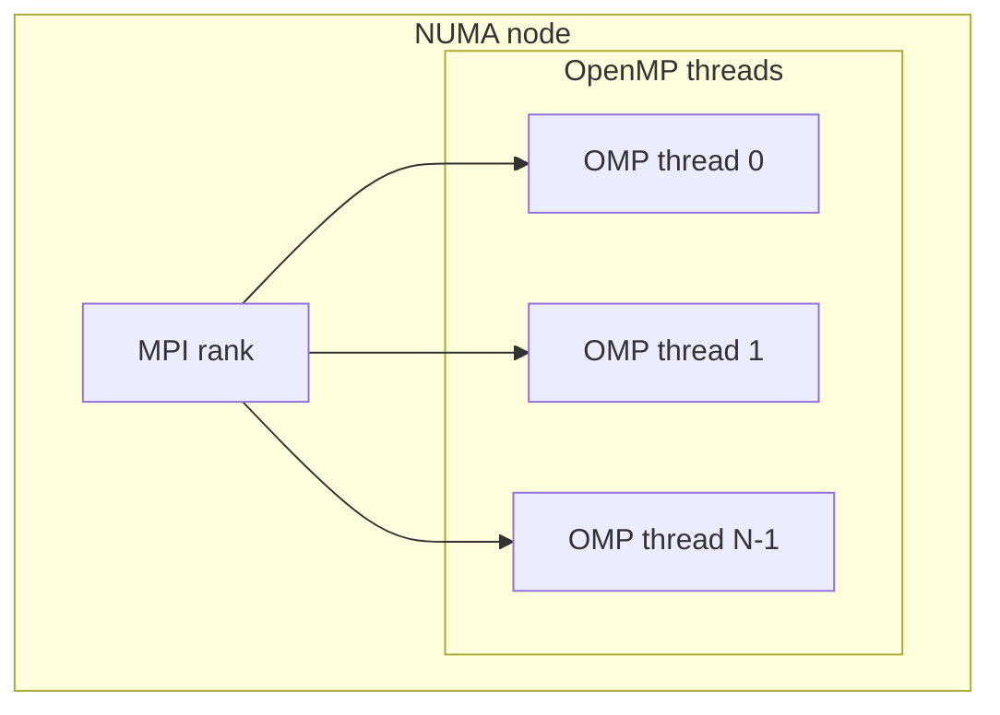

<!-- _footer: "src/DNDS/ArrayTransformer.hpp · array_infrastructure.md" -->
<!-- _class: dense -->

## MPI — "一次Configuration"规范

> *Configuration是集体且昂贵的。通信是本地且廉价的。*

<div class="cols">
<div>

**一次性构建阶段 — 集体操作**

```cpp
trans.setFatherSon(father, son);

trans.createFatherGlobalMapping();
  // collective: MPI_Allgather over local sizes

trans.createGhostMapping(pullGlobal);
  // collective: sorts + dedups pullGlobal IN PLACE
  // — saves a copy if you need the original

trans.createMPITypes();
  // local: MPI_Type_create_hindexed describes
  // the scattered rows to send/recv
  // — ALSO resizes the son array to hold them

trans.initPersistentPull();
  // local: MPI_Recv_init + MPI_Send_init
```

派生的MPI数据类型随着transformer持久存在——销毁前的拆卸成本为零。

</div>
<div>

**热循环阶段 — 仅本地操作**

```cpp
for (int step = 0; step < N; ++step) {
    trans.startPersistentPull();    // MPI_Startall
    computeFluxes(/* reads ghosts */);
    trans.waitPersistentPull();     // MPI_Waitall
}

trans.clearPersistentPull();
```

<div class="callout callout-bug">

🐛 **v0.2.0 错误修复：** `globalSize()` 曾经是集体操作，当某些进程走捷径时可能死锁。现在在 `createFatherGlobalMapping` 时缓存——完全本地化。

</div>

</div>
</div>

---
<!-- _footer: "src/DNDS/ArrayTransformer.hpp · HIndexed vs InSituPack" -->

## 两种通信策略

`MPI::CommStrategy::Instance().GetArrayStrategy()` 选择：

<div class="cols">
<div>

### `HIndexed` — 默认

```cpp
MPI_Type_create_hindexed(count, blocklengths, displacements,
                         base_type, &new_type);
```

- 直接在MPI的数据类型系统中描述**分散的行**。
- MPI库和驱动可以自由地进行流水线和向量化打包。
- 应用端零拷贝。
- 在InfiniBand / Slingshot上调优良好的MPI栈上表现最佳。

</div>
<div>

### `InSituPack`

```cpp
inSituBuffer[rank].clear();
for (index i : pushingIndexLocal[rank])
    inSituBuffer[rank].append(row(i));
MPI_Isend(inSituBuffer[rank].data(), ...);
```

- 显式打包到连续缓冲区。
- 在某些**较旧的MPI栈**和使用GPU-Direct的**CUDA感知MPI**上优于 `HIndexed`，驱动更倾向于平坦缓冲区。
- 每次阶段额外一次内存遍历——这是权衡。

</div>
</div>

> 两种策略共用同一个公共API。选择是一个调优开关——不需要应用层更改。

---
<!-- _footer: "src/DNDS/ArrayTransformer.hpp:606" -->

## `BorrowGGIndexing` — 避免重复集体Configuration

```cpp
// Primary array: does the full collective setup
ArrayTransformer<real, 5> cellUTrans;
cellUTrans.setFatherSon(uFather, uSon);
cellUTrans.createFatherGlobalMapping();
cellUTrans.createGhostMapping(pullGlobal);
cellUTrans.createMPITypes();

// Secondary array: reuses the *global + ghost* mapping.
// Only the MPI datatypes (which depend on the row size) are rebuilt.
ArrayTransformer<real, DynamicSize> recTrans;
recTrans.setFatherSon(uRecFather, uRecSon);
recTrans.BorrowGGIndexing(cellUTrans);   // <-- key line
recTrans.createMPITypes();
recTrans.initPersistentPull();
```

<div class="callout callout-ok">

**效果：** 在Euler流水线中，每个DOF数组（`u`、`uPrev`、`uInc`、`uRec`、`uRecInc`、`uRecB`……）共享一个从 `cell2cell` 邻接关系建立的Ghost映射。只有MPI数据类型不同，取决于各数组的行大小。

</div>

---
<!-- _footer: "AGENTS.md · src/Geom/Mesh/AdjIndexInfo.hpp:218-223" -->
<!-- _class: tight -->

## 栈中的OpenMP

`-DDNDS_DIST_MT_USE_OMP=ON` 在整个调用链中激活线程化路径：

<div class="cols">
<div>

### OpenMP已应用的场景

- **ILU-OMP预条件子** — 并行前向/后向扫描（v0.2.0新增）。
- **Eigen归约** — `EigenVecMin`、`EigenVecSum` 按线程折叠，然后合并。
- **状态转换** — `toLocalOMP` / `toGlobalOMP` / `bootstrapToLocalOMP` 在邻接数组的行上并行化。
- **FV度量构建** — `FiniteVolume` 中的许多 `ConstructX()` 方法通过 `#pragma omp parallel for` 在单元/面上循环。
- **VR迭代** — `DoReconstructionIter` 有OpenMP变体。

</div>
<div>

### 混合模型



**CI默认值** `OMP_NUM_THREADS=2`（可通过 `DNDS_TEST_OMP_THREADS` 在Configuration时覆盖）。每个测试的MPI进程数可通过 `DNDS_TEST_NP_LIST` Configuration。

典型生产部署：**每个NUMA节点1个MPI进程 × 内部OpenMP线程。** MPI处理跨socket/跨节点；OpenMP处理节点内部。

</div>
</div>

---
<!-- _footer: "src/DNDS/Device/ · CMakePresets.json:37-44" -->
<!-- _class: denser -->

## CUDA路径 — `DeviceTransferable` CRTP

```cpp
template <class TDerived>
class DeviceTransferable {
public:
    // Derived implements: device_array_list() returning a tuple of host-device arrays
    void to_device(DeviceBackend B = DeviceBackend::CUDA);
    void to_host();
    DeviceBackend device() const;
    template <DeviceBackend B> auto deviceView();
};

// Example user
class FiniteVolume : public DeviceTransferable<FiniteVolume> {
    auto device_array_list() {
        return std::tie(volumeLocal, faceArea, faceUnitNorm, cellBary,
                        cellInertia, cellIntJacobiDet, /* ... */);
    }
};
```

<div class="cols">
<div>

### 用法

```cpp
fv.to_device();
auto dv = fv.deviceView<CUDA>();
launchKernel<<<blocks, threads>>>(dv);
fv.to_host();
```

</div>
<div>

### 已支持的类型

- `UnstructuredMesh`（连通性）
- `FiniteVolume`（度量）
- `VariationalReconstruction`（通过基类）
- `VRDefines` DOF数组
- 逐单元形函数表

</div>
</div>

构建：`cmake --preset cuda` → `-DDNDS_USE_CUDA=ON` · Thrust修复通过 `CMAKE_CUDA_ARCHITECTURE=native`。

---
<!-- _footer: "src/EulerP/EulerP_Evaluator.hpp · EulerP_Evaluator_impl.{hpp,cpp,cu}" -->
<!-- _class:  -->

## EulerP — 专用的GPU求值器

**问题：** 标准的 `Euler` 求值器使用带编译时 `nVars` 的Eigen；Eigen矩阵运算无法清晰地降级为设备可调用的标量循环。在微小矩阵上启动CUDA内核的开销比数学运算本身还大。

**解决方案：** 在 `src/EulerP/` 中实现的并行路径求值器：

1. 在内核中放弃Eigen矩阵抽象——对 `nVars` 进行标量循环。
2. 拆分为 `EvaluatorDeviceView<B>`，其中 `B ∈ {Host, CUDA}`——相同接口，两个实现分别在独立的翻译单元中编译（`.cpp` 和 `.cu`）。
3. 将每次调用的参数打包进 `*_Arg` 结构体（如 `RecGradient_Arg`、`Flux2nd_Arg`），使启动代码无需知道参数顺序。

```cpp
template <DeviceBackend B>
struct EvaluatorDeviceView {
    FiniteVolume::t_deviceView<B>   fv;
    BCHandlerDeviceView<B>          bc;
    PhysicsDeviceView<B>            physics;
};
```

Python驱动：`python/DNDSR/EulerP/EulerP_Solver.py` 从Python编排完整的EulerP流水线，通过运行时标志选择CUDA。

---
<!-- _footer: "src/EulerP/EulerP_Evaluator.hpp:149-918" -->
<!-- _class: dense -->

## EulerP — 内核流水线

```cpp
class Evaluator {
    ssp<CFV::FiniteVolume>  fv;
    ssp<BCHandler>           bcHandler;
    ssp<Physics>             physics;
    // face buffers (dense packed from ghost father+son)
    tUFaceBuffer u_face_bufferL, u_face_bufferR;
    tUScalarFaceBuffer uScalar_face_bufferL, uScalar_face_bufferR;

public:
    // Setup
    void BuildFaceBufferDof(TUDof &u);
    void BuildFaceBufferDofScalar(TUScalar &u);
    void PrepareFaceBuffer(int nVarsScalar);

    // Pipeline kernels (each host-or-device via Evaluator_impl<B>)
    void RecGradient   (RecGradient_Arg &arg);    // Green-Gauss + Barth-Jespersen
    void Cons2PrimMu   (Cons2PrimMu_Arg &arg);
    void Cons2Prim     (Cons2Prim_Arg   &arg);
    void RecFace2nd    (RecFace2nd_Arg  &arg);    // 2nd-order face reconstruction
    void Flux2nd       (Flux2nd_Arg     &arg);    // inviscid + viscous face flux
};
```

### 为什么需要参数包结构体

- 所有数组引用集中在一处 → 便于序列化为设备内核。
- Host/CUDA分发在单一调用点发生（`Evaluator_impl<B>`）。
- 启动代码无论后端如何都看到相同的标识符 `EvaluateRHS`。

---
<!-- _footer: "docs/dev/cudaNotes.md · RELEASE_NOTES.md:50-52" -->

## GPU工程笔记

<div class="cols">
<div>

### 已交付的基准测试

- **块稀疏MatVec** — `src/Geom/Mesh/BenchmarkFiniteVolume.cu` 在设备上使用不同的块大小对度量数组进行测试。
- **SoA vs AoS** — 针对逐单元DOF块对多种布局变体进行了基准测试。

### 内存模型

- `host_device_vector<T>` — 可在设备上镜像自身的向量；广泛应用于 `FiniteVolume` / `UnstructuredMesh`。
- 传输是显式的（`to_device` / `to_host`）——无隐藏同步。

</div>
<div>

### 已避免的陷阱

- **Thrust + CMake：** `CMAKE_CUDA_ARCHITECTURE=native` 修复了Thrust内部机制中的一类编译错误。
- **意外的 `to_device`：** 面缓冲区创建路径中的一个错误曾不必要地将主机缓冲区复制到设备；在v0.2.0中修复。
- **`py::classh` 持有者：** 确保CUDA指针在跨Python GC边界存活时Python↔C++所有权安全。

### 进行中的工作

- 将完整的 `Euler` 求值器扩展到CUDA（不仅仅是 `EulerP`）。
- 通过 `MPI_Type_create_hindexed` 在固定设备内存上实现GPU可知MPI。

</div>
</div>
