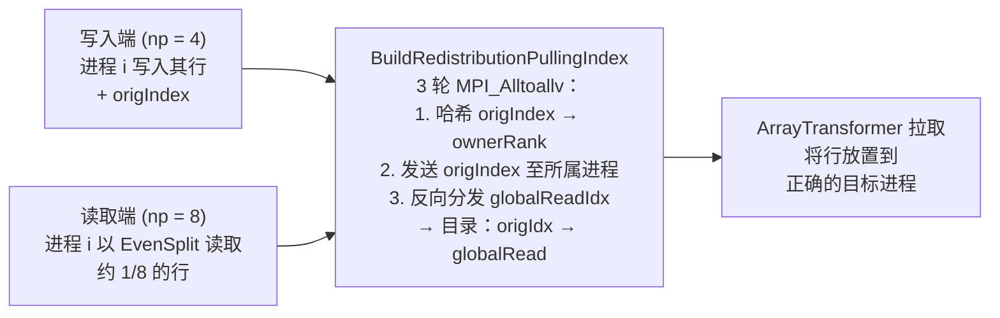
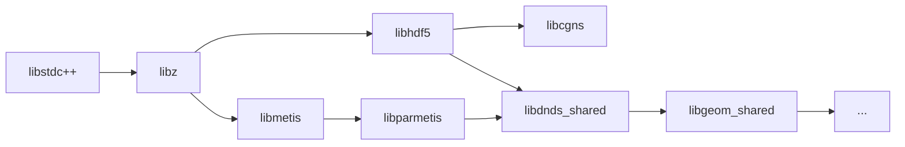

<!-- _footer: "docs/architecture/Serialization.md:11-172" -->

## 序列化层栈

| 层                      | 职责                                                         |
|------------------------|--------------------------------------------------------------|
| `SerializerBase`       | 抽象标量 / 向量 / 字节数组接口                                   |
| `SerializerH5`         | MPI 并行 HDF5（Collective I/O）                                      |
| `SerializerJSON`       | 每进程 JSON（`IsPerRank() == true`），无 MPI 协调              |
| `Array`                | 每数组元数据、结构标记、平铺数据缓冲区                              |
| `ParArray`             | 全局偏移、`EvenSplit`、CSR 全局行起始                            |
| `ArrayPair`            | 父子捆绑 · `ReadSerializeRedistributed`                      |
| `ArrayRedistributor`   | 通过 `ArrayTransformer` 的 rendezvous 再分配                    |

<div class="callout">

**关键特性。** `SerializerH5` 中的每个方法都是 **MPI-Collective** 的 — 每个进程必须依相同顺序调用它们，即使该进程的 `size == 0`。未参与会导致挂起，而非崩溃。

</div>

---
<!-- _footer: "src/DNDS/Serializer/SerializerBase.hpp:153-303" -->
<!-- _class: dense -->

## `SerializerBase` — 公共接口

```cpp
// File lifecycle
virtual void OpenFile(const std::string &fName, bool read) = 0;
virtual void CloseFile() = 0;

// Path navigation (think HDF5 group structure)
virtual void CreatePath(const std::string &p) = 0;
virtual void GoToPath(const std::string &p)  = 0;
virtual std::string              GetCurrentPath() = 0;
virtual std::set<std::string>    ListCurrentPath() = 0;
virtual bool                     IsPerRank() = 0;   // true for JSON
virtual int   GetMPIRank() = 0;   int GetMPISize() = 0;
virtual const MPIInfo &getMPI() = 0;

// Scalars (per-rank)
virtual void WriteInt(const std::string &name, int64_t v) = 0;
virtual void WriteIndex/WriteReal/WriteString(...) = 0;
virtual void ReadInt /ReadIndex / ReadReal / ReadString(...) = 0;

// Vectors (COLLECTIVE under H5)
virtual void WriteIndexVector(const std::string &name, const std::vector<index> &v,
                              ArrayGlobalOffset offset) = 0;
virtual void ReadIndexVector (const std::string &name,       std::vector<index> &v,
                              ArrayGlobalOffset &offset) = 0;   // offset is in/out
// ... Rowsize, Real, SharedIndex, SharedRowsize
virtual void WriteUint8Array(const std::string &name, const uint8_t *data,
                             index size, ArrayGlobalOffset offset) = 0;
virtual void ReadUint8Array (const std::string &name, uint8_t *data,
                             index &size, ArrayGlobalOffset &offset) = 0;
```

---
<!-- _footer: "src/DNDS/Serializer/SerializerBase.hpp:14-124" -->
<!-- _class: dense -->

## `ArrayGlobalOffset` — 五种偏移模式

```cpp
static const index Offset_Parts     = -1;
static const index Offset_One       = -2;
static const index Offset_EvenSplit = -3;
static const index Offset_Unknown   = UnInitIndex;

class ArrayGlobalOffset {
    index _size{0};
    index _offset{0};
public:
    ArrayGlobalOffset(index sz, index ofs);
    index size()   const;
    index offset() const;
    ArrayGlobalOffset operator*(index R) const;   // scales size (and offset if real)
    ArrayGlobalOffset operator/(index R) const;
    void CheckMultipleOf(index R) const;
    bool operator==(const ArrayGlobalOffset &other) const;
    bool isDist() const;                           // _offset >= 0
};

extern ArrayGlobalOffset ArrayGlobalOffset_Unknown, _One, _Parts, _EvenSplit;
```

| 哨兵                  | 含义                                                     |
|----------------------|----------------------------------------------------------|
| `Unknown`            | 从关联的 `rank_offsets` 数据集自动检测                      |
| `Parts`              | 通过对本地大小的 `MPI_Scan` 计算偏移                        |
| `One`                | 进程 0 写入 / 读取整个数据集                                |
| `EvenSplit`          | 读：每个进程获取 `~nGlobal / nRanks` 行                    |
| `isDist()`           | 显式 `{localSize, globalStart}`                           |

---
<!-- _footer: "docs/architecture/Serialization.md:60-83" -->

## 零大小分区安全性

<div class="cols">
<div>

### 陷阱

当 `nGlobal < nRanks`（5 条记录分布在 8 个进程上）时，`EvenSplitRange` 会为某些进程分配 0 行。Collective的 HDF5 调用仍然要求每个进程都参与 — 而对空向量调用 `std::vector<>::data()` 可能返回 `nullptr`。

```cpp
std::vector<index> v(size);        // size may be 0
ReadDataVector<index>(name, v.data(), ...);  // may pass nullptr → hang
```

调用侧的辅助函数如 `__ReadSerializerData` 和 `ReadUint8Array` 在 `buf == nullptr` 时会跳过 `H5Dread`，导致Collective操作挂起。

</div>
<div>

### 修复方案

`SerializerBase.cpp` 中的每个调用者当 `size == 0` 时传递一个**栈分配的虚拟指针**：

```cpp
index dummy;
ReadDataVector<index>(name,
    size == 0 ? &dummy : v.data(),
    ...);
```

`ReadUint8Array` 暴露了两阶段模式：

1. 第一次调用：`data = nullptr`，返回大小。
2. 第二次调用：分配 + 用真实（或虚拟）指针再次调用。

所有Collective操作在空进程上以 0 计数的 hyperslab 继续 — 无需应用级分支。

</div>
</div>

---
<!-- _footer: "docs/architecture/Serialization.md:87-172" -->

## 写入 N 读取 M — rendezvous 模式



<div class="callout callout-ok">

**效果：** `EulerSolver::ReadRestart` 只需一次调用。用户在登录节点用 4 个进程写入，在计算分区用 1024 个进程重启，同一份 JSON Configuration即可运行。`localRows == 0` 的进程用空缓冲区参与每次Collective操作。

</div>

---
<!-- _footer: "src/DNDS/Config/ConfigParam.hpp:47-176 · ConfigRegistry.hpp:228-465" -->
<!-- _class: dense -->

## 类型化 JSON Configuration — `DNDS_DECLARE_CONFIG`

```cpp
struct ImplicitCFLControl {
    real CFL                   = 10.0;
    int  nForceLocalStartStep  = INT_MAX;
    bool useLocalDt            = true;
    real RANSRelax             = 1.0;

    DNDS_DECLARE_CONFIG(ImplicitCFLControl) {
        DNDS_FIELD(CFL,                  "CFL for implicit local dt");
        DNDS_FIELD(nForceLocalStartStep, "Step to force local dt",
                   DNDS::Config::range(0));
        DNDS_FIELD(useLocalDt,           "Use local (vs uniform) dTau");
        DNDS_FIELD(RANSRelax,            "RANS under-relaxation factor",
                   DNDS::Config::range(0.0, 1.0));

        config.check([](const T &s) -> DNDS::CheckResult {
            if (s.RANSRelax <= 0) return {false, "RANSRelax must be positive"};
            return {true, ""};
        });
    }
};
```

<div class="callout">

**宏提供的内容。** 无基类、无虚成员、无逐实例数据 — 结构体保持 POD 形态，对 CUDA 安全。底层生成静态 `_dnds_do_register()` 方法，将 `FieldMeta` 记录填充到 `ConfigRegistry<T>` 单例中。

</div>

---
<!-- _footer: "src/DNDS/Config/ConfigParam.hpp:71-81" -->
<!-- _class: dense -->

## Configuration — 字段种类与跨字段校验

```cpp
// Simple scalars & bounded scalars
DNDS_FIELD(CFL,         "CFL number");
DNDS_FIELD(nInternalIt, "Inner iterations",  DNDS::Config::range(0));
DNDS_FIELD(relax,       "Relaxation factor", DNDS::Config::range(0.0, 1.0));

// Enum with value names (appears in schema as enum constraint)
DNDS_FIELD(rsType,      "Riemann solver type",
           DNDS::Config::enum_values({"Roe","HLLC","HLLEP","HLLEP_V1",
                                      "Roe_M1","Roe_M2","Roe_M3","Roe_M4",
                                      "Roe_M5","Roe_M6","Roe_M7","Roe_M8","Roe_M9"}));

// Documentation kwargs — emitted as "x-..." extensions in schema
DNDS_FIELD(CFL, "CFL number", DNDS::Config::info("units", "nondim"),
                              DNDS::Config::info("ref",   "Jameson 1985"));

// Nested sub-section
config.field_section(&T::frameRotation, "frameConstRotation", "Rotating frame");

// Arrays / maps of sub-objects
config.field_array_of<BoxInit>   (&T::boxInits,   "boxInitializers", "Box initializers");
config.field_map_of<CoarseCtrl>  (&T::coarseList, "coarseGridList",  "Per-level controls");

// Opaque JSON (for scheme-specific extras)
config.field_json  (&T::extra,    "odeSettingsExtra", "Opaque ODE scheme settings");

// Renaming / aliases (backward compatibility)
config.field_alias (&T::rsType,   "riemannSolverType", "Riemann solver type");
```

---
<!-- _footer: "src/DNDS/Config/ConfigRegistry.hpp:379-441" -->
<!-- _class: dense -->

## Configuration — 自动生成的 JSON Schema 与验证

```cpp
// Emit the schema (run-time or ahead-of-time)
nlohmann::ordered_json schema = ConfigRegistry<EulerConfig>::Instance().emitSchema("Euler solver config");
```

```json
{
  "$schema": "http://json-schema.org/draft-07/schema#",
  "type": "object",
  "description": "Euler solver config",
  "properties": {
    "CFL":     { "type": "number", "default": 10.0, "description": "..." },
    "rsType":  { "type": "string", "default": "Roe",
                 "enum": ["Roe","HLLC",...,"Roe_M9"] }
  }
}
```

<div class="cols">
<div>

### CLI + 工具

```bash
./build/app/euler.exe --emit-schema > euler_schema.json
# 每个求解器输出约 107 KB 的模式
```

VS Code 及任何支持 JSON Schema 的编辑器可提供自动补全和内联验证。预计算的模式文件位于 `cases/euler_schema.json`、`eulerSA3D_schema.json` 等。

</div>
<div>

### 运行时验证

```cpp
auto &reg = ConfigRegistry<EulerConfig>::Instance();
reg.readFromJson(j, cfg);            // 反序列化 + 范围检查
reg.validate(cfg);                   // 跨字段
reg.validateWithContext(cfg, ctx);   // 使用 nVars、dim、modelCode
reg.validateKeys(userJson);          // 对未知键抛出异常
```

**`validateKeys`** 是自动的 — 无需手动维护允许字段列表。

</div>
</div>

---
<!-- _footer: "python/DNDSR/ · docs/guides/project_structure.md:116-145" -->

## Python 绑定 — 导入链

```text
from DNDSR import DNDS
  ↓
python/DNDSR/__init__.py
  ↓
python/DNDSR/DNDS/__init__.py
  ├── _loader.preload("dnds")                    # ctypes.CDLL · RTLD_GLOBAL
  ├── from ._ext.dnds_pybind11 import *          # pybind11 扩展
  └── _init_mpi()                                # 导入时执行 MPI_Init_thread
```

<div class="cols">
<div>

### 预加载顺序至关重要

`_loader.py` 在 pybind11 扩展打开**之前**以 `RTLD_GLOBAL` 加载外部依赖。如果之后以默认的 `RTLD_LOCAL` 加载，扩展将找不到其依赖的符号。



</div>
<div>

### 四个模块，一个包

- `DNDSR.DNDS` — 数组、MPI、serializer
- `DNDSR.Geom` — 网格读取与操作
- `DNDSR.CFV`  — 有限体积 / VR / Fourier 分析
- `DNDSR.EulerP` — GPU 友好的 Euler 求值器

顶层 `__init__.py` 导入全部四个模块，使得单个 `from DNDSR import *` 即可工作。

</div>
</div>

---
<!-- _footer: "docs/guides/python_geom_guide.md" -->
<!-- _class: dense -->

## Python 网格读取 — 演示用例

```python
from DNDSR import DNDS
from DNDSR.Geom.utils import read_mesh, prepare_mesh, build_bnd_mesh

# 1. MPI bootstrap (implicit MPI_Init_thread already ran at import)
mpi = DNDS.MPIInfo(); mpi.setWorld()

# 2. Read a CGNS mesh with elevation and bisection
result = read_mesh(
    "data/mesh/UniformSquare_10.cgns",
    mpi       = mpi,
    dim       = 2,
    elevation = "O2",      # Quad4 → Quad9
    bisect    = 1,         # one round of h-refinement
)

# 3. Finish the mesh (build ghosts, interpolate faces, reorder cells)
prepare_mesh(result.mesh, result.reader)

# 4. Extract surface mesh and dump VTK
bnd = build_bnd_mesh(result.mesh)
result.mesh.BuildVTKConnectivity()
```

<div class="callout callout-ok">

**PEP 561 兼容。** 包中附带 `py.typed` 标记；`.pyi` 存根在 `cmake --install` 期间由 `pybind11-stubgen` 自动生成。Pyright、mypy 和 Pylance 可看到完整的 C++ 类型签名。

</div>

---
<!-- _footer: "src/CFV/ModelEvaluator.hpp · RELEASE_NOTES.md:25" -->
<!-- _class: dense -->

## CFV Python — Fourier 耗散-色散分析

```python
from DNDSR.CFV import ModelEvaluator  # pure-Python wrapper over pybind11 class

me = ModelEvaluator(mesh, fv, vr)
me.set_order(3)

# Fourier analysis: plug in a plane wave, read back the complex amplification
kx_range = np.linspace(-pi, pi, 200)
for kx in kx_range:
    lam = me.fourier_amplification_factor(kx)
    print(kx, lam.real, lam.imag)
```

<div class="callout">

**这对研究框架的意义。** VR 的色散/耗散特性取决于阶数、限制器和内积选择。用 Python 框架在离散 Fourier 谱上扫描这些参数，意味着参数研究（限制器组合、内积选择、导数权重）可在数小时内完成，而非数周。

</div>

其他 Python 暴露的功能：

- `ArrayPair`、`ArrayEigenMatrix/Vector/Batch`
- `BuildUDof / BuildURec / BuildUGrad`（类型化构造函数）
- VTK 输出、壁面距离、`to_device / to_host`
- 完整的 `MeshAdjState` 枚举和 `AdjPairTracked::idx` 查询（仅查询，不从 Python 变更 — 有意为之）
