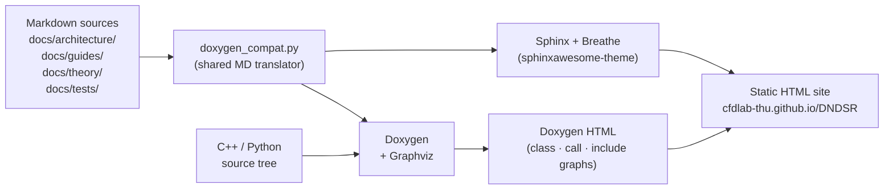

<!-- _footer: "docs/tests/overview.md:11-40" -->

## 测试套件概览

| 模块   | C++ 可执行文件 | 测试用例 | Python 测试 | np 值             |
|--------|---------------|----------|-------------|-------------------|
| DNDS   | 8             | 249      | 9           | 1, 2, 4, 8        |
| Geom   | 9             | 193      | 2           | 1, 2, 4, 8        |
| CFV    | 4             | 67       | 43          | 1, 2, 4, 8        |
| Euler  | 4             | 62       | 4           | 1, 2, 4, 8        |
| Solver | 4             | 29       | —           | 1                  |

<div class="callout">

**总计：** 29 个 C++ 可执行文件，600 个测试用例，58 个 Python 测试，涵盖 82 个 CTest 注册项。所有支持 MPI 的测试均按各 np 值在 CTest 中注册。串行测试超时 60–120 秒；并行测试超时 120–600 秒，视模块而定。

</div>

```bash
# Build + run everything
cmake -B build -DDNDS_BUILD_TESTS=ON
cmake --build build -t all_unit_tests -j8
ctest --test-dir build --output-on-failure
```

---
<!-- _footer: "test/cpp/DNDS/ · test/cpp/Geom/" -->
<!-- _class: tight -->

## C++ 测试目录 (1/2)

<div class="cols">
<div>

### DNDS

- `test_array` — 布局、行视图、迭代器
- `test_mpi` — MPI 封装、集合操作
- `test_array_transformer` — 父/子 ghost 交换
- `test_array_derived` — AdjacencyRow、EigenMap 行
- `test_array_dof` — 向量空间操作、范数、AXPY
- `test_index_mapping` — 全局 ↔ 局部、EvenSplit
- `test_serializer` — H5 + JSON、重分布
- `test_permutation_transfer` — MPL 重编号压缩/解压

### Geom

- `test_elements` — 形函数、雅可比矩阵
- `test_quadrature` — 阶数、权重
- `test_mesh_index_conversion` — 状态转换
- `test_mesh_pipeline` — 完整构建链
- `test_mesh_distributed_read` — ParMetis 重分区
- `test_mesh_connectivity` — Inverse/Compose DSL
- `test_mesh_connectivity_ghost` — GhostSpec BFS
- `test_mesh_connectivity_interpolate` — 面插值
- `test_mesh_reorder` — 逆 Cuthill-McKee/Hilbert 排序

</div>
<div>

### 典型测试结构

```cpp
TEST_CASE("ArrayTransformer: round-trip ghost pull" *
          doctest::description("np=1,2,4") *
          doctest::timeout(120.0)) {
    MPIInfo mpi; mpi.setWorld();
    auto father = make_ssp<ParArray<real, 5>>();
    auto son    = make_ssp<ParArray<real, 5>>();
    father->Resize(localN);  father->createGlobalMapping();
    // ... populate father ...

    ArrayTransformer<real, 5> trans;
    trans.setFatherSon(father, son);
    trans.createFatherGlobalMapping();
    trans.createGhostMapping(pullGlobal);
    trans.createMPITypes();
    trans.initPersistentPull();
    trans.pullOnce();

    CHECK(son->operator[](0).isApprox(expected, 1e-14));
}
```

</div>
</div>

---
<!-- _footer: "test/cpp/CFV/ · test/cpp/Euler/ · test/cpp/Solver/" -->

## C++ 测试目录 (2/2)

<div class="cols-3">
<div>

### CFV

- `test_reconstruction` · 解析场上的 VR 收敛性测试。
- `test_reconstruction3d` · 3D 变体；Jacobi/SOR 对比。
- `test_limiters` · WBAP/CWBAP 在构造数据上的测试；覆盖全部限制器选项。
- `test_device_transferable` *（仅 CUDA）* · `FiniteVolume` 到 GPU 的往返传输。

</div>
<div>

### Euler

- `test_gas_thermo` · 理想气体 Cv/Cp、T/p 关系、Mach→状态。
- `test_riemann_solvers` · 13 种变体，一维 Riemann 问题的精确解一致性。
- `test_rans` · SA + k-ω 源项、壁面距离积分、转捩位置。
- `test_evaluator_pipeline` · 在固定网格上的完整 `EvaluateRHS` — **golden values**。

</div>
<div>

### Solver

- `test_ode` · ODE 基准测试上的 BDF/SDIRK/HM3（Van der Pol、刚性标量）。
- `test_linear` · 标准矩阵上的 GMRES + PCG 收敛性。
- `test_direct` · 小块 LU/LDLT 正确性。
- `test_scalar` · 标量输运对流-扩散回归测试。

</div>
</div>

---
<!-- _footer: "docs/tests/overview.md:87-111" -->

## 确定性 — golden values 如何保持稳定

许多测试将计算结果与预先捕获的 **golden values** 进行比较，相对容差为 `1e-6` 到 `1e-8`。为了使这一点有意义，每次运行的结果必须字节级一致。

<div class="cols">
<div>

### 非确定性来源 — 已消除

- **分区顺序** → `metisSeed = 42`（固定值）。
- **SOR 更新顺序**（依赖分区）→ VR 测试中改用 Jacobi 迭代。
- **LU-SGS 扫描方向**（分区有序）→ Euler 管线测试中使用 Jacobi 风格的更新。
- **OMP 归约顺序**（线程数）→ 在固定线程数下标量归约是确定性的。

</div>
<div>

### 哨兵值模式

当 golden value **尚未捕获**时，测试存储哨兵值 `1e300`：

```cpp
const real gold_kinetic = 1e300;           // TODO: capture
const real computed     = evaluate();
if (gold_kinetic < 1e299)
    CHECK(computed == doctest::Approx(gold_kinetic).epsilon(1e-8));
else
    CHECK(std::isfinite(computed) && computed >= 0);
```

因此，新测试的首次运行是一个有限/非负的合理性检查，开发者随后在跟进提交中更新 golden value。

</div>
</div>

---
<!-- _footer: "docs/tests/overview.md:104-124" -->
<!-- _class: tight -->

## Python 测试 — pytest + pytest-mpi

<div class="cols">
<div>

### 覆盖内容

- `test/DNDS/test_basic.py`（9 个测试）— import 链、MPIInfo、小数组往返。
- `test/Geom/test_basic_geom.py`（2 个测试）— CGNS 读取、升阶、对分。
- `test/CFV/test_fv_correctness.py`（16 个测试）— 壁面网格上的单元体积/面面积/雅可比正确性。
- `test/CFV/test_vr_correctness.py`（16 个测试）— sin(x)sin(y) 上的 VR 阶收敛。
- `test/CFV/test_basic_fv.py` + `test_basic_cfv.py` + `test_cfv_dissdisp.py`（11 个测试）— FV/CFV 冒烟测试与耗散-色散分析。
- `test/EulerP/test_basic_eulerP.py`（1 个测试）— 主机 + CUDA 往返。
- `test/Euler/test_restart_redistribute.py`（3 个测试）— 含 MPI 重分区的求解器重启。

### 运行

```bash
# Serial
pytest test/DNDS/test_basic.py -v

# MPI
mpirun -np 4 python -m pytest test/DNDS/test_basic.py

# Some tests support standalone
python           test/DNDS/test_basic.py
mpirun -np 2 python test/DNDS/test_basic.py
```

</div>
<div>

### 关键的重建步骤

```bash
# 1. Rebuild pybind11 shared libs
cmake --build build -t dnds_pybind11 geom_pybind11 \
                       cfv_pybind11 eulerP_pybind11 -j32

# 2. Reinstall into python/DNDSR/ (MANDATORY)
cmake --install build --component py

# 3. Only now, run tests
source venv/bin/activate
PYTHONPATH=<root>/python pytest test/ -v
```

<div class="callout callout-warn">

⚠ 在修改 C++ 源码后跳过安装步骤会导致残留的 `.so` 文件，并产生误导性的段错误，看起来像代码 bug。`git checkout` 会变更源码，但**不会**重新构建二进制文件。

</div>

</div>
</div>

---
<!-- _footer: "CMakePresets.json" -->
<!-- _class: dense -->

## 构建系统 — 预设

```jsonc
{
  "configurePresets": [
    {
      "name": "release-test",
      "generator": "Ninja",
      "binaryDir": "${sourceDir}/build",
      "cacheVariables": {
        "CMAKE_BUILD_TYPE":    "Release",
        "DNDS_BUILD_TESTS":    "ON",
        "DNDS_USE_OMP":        "ON"
      }
    },
    { "name": "debug",  "inherits": "release-test",
      "cacheVariables": { "CMAKE_BUILD_TYPE": "Debug" } },
    { "name": "cuda",   "inherits": "release-test",
      "cacheVariables": { "DNDS_USE_CUDA": "ON",
                          "CMAKE_CUDA_ARCHITECTURES": "native" } },
    { "name": "ci",     "inherits": "release-test",
      "cacheVariables": { "DNDS_TEST_NP_LIST":     "1;2;4",
                          "DNDS_TEST_OMP_THREADS": "2" } }
  ]
}
```

Collective目标：`dnds_unit_tests`、`geom_unit_tests`、`cfv_unit_tests`、`euler_unit_tests`、`solver_unit_tests`、`all_unit_tests` — 均设置为 `EXCLUDE_FROM_ALL`，因此普通的 `cmake --build` 仍能快速完成。

---
<!-- _footer: "pyproject.toml · RELEASE_NOTES.md:32-40" -->
<!-- _class: dense -->

## Python 打包 — `scikit-build-core`

```toml
# pyproject.toml
[build-system]
requires = ["scikit-build-core>=0.8", "pybind11", "pybind11-stubgen"]
build-backend = "scikit_build_core.build"

[project]
name = "DNDSR"
version = "0.2.0"              # synchronized with VERSION file + git describe

[tool.scikit-build]
cmake.args = ["-DDNDS_BUILD_PYTHON=ON", "-DDNDS_PYBIND11_NO_LTO=ON"]
install.components = ["py"]     # only install the py component
```

<div class="cols">
<div>

### 构建与安装

```bash
CC=mpicc CXX=mpicxx \
    CMAKE_BUILD_PARALLEL_LEVEL=32 \
    pip install -e .
```

- 构建全部 `*_pybind11` 目标。
- 将其复制到 `python/DNDSR/*/_ext/`。
- 运行 `pybind11-stubgen` 生成 `.pyi` 文件。
- 将外部共享库复制到 `python/DNDSR/_lib/`。

</div>
<div>

### 为什么使用系统 Python（而非 conda）

> Conda/Anaconda Python 在二进制中嵌入了指向 conda 自带 libstdc++ 的 RPATH，其版本可能低于 MPI 编译器产生的版本。系统 Python 使用系统 libstdc++，避免了这种冲突。
> — `README.md`

macOS 有专门的 fmtlib 变通方案，也已包含。

</div>
</div>

---
<!-- _footer: "docs/dev/clang_tidy_plan.md · RELEASE_NOTES.md:32-40" -->
<!-- _class: dense -->

## Clang-tidy 清理

<div class="cols">
<div>

### DNDS 核心 — 清理成果

- **24,597 个诊断**在清理开始时存在。
- **26 轮**按仔细划分的顺序进行修复。
- **剩余 1 个** — 一个不相关的 Eigen PCH `omp.h` 包含问题。
- 完整的逐轮记录和 `.clang-tidy` Configuration理由保存在 `docs/dev/clang_tidy_plan.md` 中。

### `.clang-tidy` 禁用项（代表性）

- `cppcoreguidelines-pro-bounds-pointer-arithmetic` — 在 CSR/行扁平数组中不可避免。
- `fuchsia-default-arguments-declarations` — MPI 默认值。
- `llvm-header-guard` — 我们使用 `#pragma once`。
- `modernize-use-trailing-return-type` — 风格偏好。

</div>
<div>

### 自行运行

```bash
# Per-module histogram
python scripts/run_clang_tidy.py DNDS
python scripts/run_clang_tidy.py Geom
python scripts/run_clang_tidy.py CFV
python scripts/run_clang_tidy.py Euler
python scripts/run_clang_tidy.py Solver
```

### 下一步

Solver/Geom/CFV/Euler/EulerP **尚未清理** — 可应用相同的流程。`.clang-tidy` 的禁用Configuration可直接沿用。

</div>
</div>

---
<!-- _footer: "docs/sphinx/conf.py · docs/doxygen/ · RELEASE_NOTES.md:61-70" -->
<!-- _class: dense -->

## 文档系统 — 架构



<div class="cols">
<div>

### 关键特性

- **单一 Markdown 源**通过 `doxygen_compat.py` 同时在 Sphinx 和 Doxygen 中渲染。
- **Doxygen HTML** 嵌入在 Sphinx 站点的 `/doxygen/` 路径下。
- **Graphviz** 类继承图、调用图、包含图。
- **sphinxawesome-theme** 主题，具有丰富的代码高亮。

</div>
<div>

### 构建速度

| 触发条件             | 耗时     |
|---------------------|---------|
| 无变动重建            | **< 1 s**  |
| 仅修改 Markdown       | ~10 s   |
| 完整（Doxygen + Sphinx）| ~2.5 min |

```bash
cmake --build build -t serve-docs
# → http://localhost:8000 with hot reload
```

</div>
</div>

---
<!-- _footer: ".github/workflows/ · RELEASE_NOTES.md:68-70" -->
<!-- _class: dense -->

## CI 与发布自动化

<div class="cols">
<div>

### GitHub Actions — Pages 部署

- **手动触发**工作流（避免每次推送都花费几分钟时间）。
- **三层缓存：**
  1. Ubuntu apt 包（doxygen, graphviz, libmpich-dev）。
  2. 外部 `cfd_externals` 二进制库（HDF5, CGNS, Metis, ParMetis）。
  3. Python venv + Sphinx 构建缓存。
- 缓存命中 → 完整文档构建约 3 分钟；缓存未命中 → 约 20 分钟。

### 风格与卫生

- `.clang-format` 随仓库根目录发布；CI 在单独作业中检查差异。
- POSIX `index()` 歧义防护 — 当 `using namespace DNDS;` 处于活动状态时，代码风格要求使用 `DNDS::index`（文档见 `docs/tests/overview.md`）。

</div>
<div>

### 版本字符串

- `VERSION` 文件位于仓库根目录（`0.2.0`）。
- CMake 将其与 `git describe --tags --long` 组合。
- 暴露方式：
  - C++ 宏 `DNDS_VERSION_STRING`。
  - Python `DNDSR.__version__`（符合 PEP 440）。
  - JSON Schema `x-version` 字段。

### 发布流程

```bash
# Bump VERSION file
echo 0.2.0 > VERSION
git tag v0.2.0
git push --tags
# Pages workflow + release notes kick off.
```

</div>
</div>
