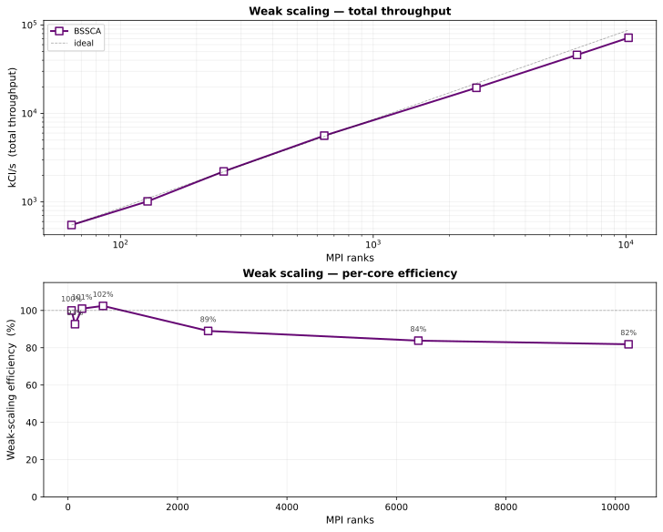

<!--
  DNDSR 全面概述演示文稿 (中文版)。

  此文件为自动生成。源文件位于：
      docs/presentations/DNDSR_overview/
          00_frontmatter_zh.md
          parts/zh/00_title.md
          parts/zh/01_opening.md
          ...
          parts/zh/10_roadmap.md

  重新构建：
      bash docs/presentations/DNDSR_overview/build.sh --lang zh

  直接渲染为 PDF：
      bash docs/presentations/DNDSR_overview/build.sh --lang zh --pdf

  推荐查看器："Marp for VS Code" 扩展 (内建 Mermaid + MathJax 支持)。

  图片路径相对于最终 DNDSR_overview_zh.md 位置：
      ../elements/... 和 ../theory/...

  溢出控制类 (按幻灯片追加为 Marp 指令)：
      _class: dense     -- 18px 基准字重 (紧凑表格 / 大量列表)
      _class: denser    -- 16px 基准字重 (高密度参考幻灯片)
      _class: tight     -- 14px 基准字重 (最大密度；谨慎使用)

  注意：请保持 <style> 部分与 00_frontmatter.md 同步。
-->

<style>
  /* --- Light-GitHub palette overrides ------------------------------------ */
  :root {
    --gh-fg:        #1f2328;
    --gh-fg-muted:  #656d76;
    --gh-accent:    #660874;
    --gh-accent-2:  #8b1a9e;
    --gh-bg:        #ffffff;
    --gh-code-bg:   #f6f8fa;
    --gh-border:    #d0d7de;
    --gh-success:   #1a7f37;
    --gh-danger:    #cf222e;
    --gh-warning:   #9a6700;
    --gh-mono:      ui-monospace, "SF Mono", Menlo, Consolas, "Liberation Mono", monospace;
    --gh-sans:      -apple-system, BlinkMacSystemFont, "Segoe UI", "Noto Sans", Helvetica, Arial, sans-serif;
  }

  section {
    background: var(--gh-bg);
    color:      var(--gh-fg);
    font-family: var(--gh-sans);
    font-size:  21px;
    padding:    44px 56px 52px 56px;
    border-top: 3px solid var(--gh-accent);
  }

  section.lead {
    text-align: center;
    justify-content: center;
  }
  section.lead h1 { font-size: 72px; letter-spacing: -1px; margin-bottom: 8px; }
  section.lead h2 { font-weight: 400; color: var(--gh-fg-muted); border: none; margin-top: 0; }

  section.chapter {
    background: linear-gradient(135deg, #f6f8fa 0%, #ffffff 100%);
    justify-content: center;
    text-align: left;
    padding-left: 120px;
  }
  section.chapter h1 {
    font-size: 56px;
    color: var(--gh-accent);
    border: none;
  }
  section.chapter h2 {
    font-weight: 400;
    color: var(--gh-fg-muted);
    border: none;
    margin-top: 8px;
  }
  section.chapter .ch-num {
    font-family: var(--gh-mono);
    color: var(--gh-fg-muted);
    font-size: 22px;
    letter-spacing: 2px;
  }

  h1, h2, h3 { color: var(--gh-fg); font-weight: 600; }
  h1 { font-size: 36px; }
  h2 {
    font-size: 28px;
    border-bottom: 1px solid var(--gh-border);
    padding-bottom: 6px;
    margin-top: 0;
  }
  h3 {
    font-size: 20px;
    color: var(--gh-accent);
    margin-top: 14px;
    margin-bottom: 4px;
  }

  a { color: var(--gh-accent); text-decoration: none; }

  code {
    font-family: var(--gh-mono);
    background: var(--gh-code-bg);
    padding: 1px 6px;
    border-radius: 4px;
    font-size: 0.92em;
  }
  pre {
    background: var(--gh-code-bg);
    border: 1px solid var(--gh-border);
    border-radius: 6px;
    padding: 8px 12px;
    font-size: 15px;
    line-height: 1.35;
    overflow: auto;
  }
  pre code { background: transparent; padding: 0; }

  blockquote {
    border-left: 4px solid var(--gh-accent);
    color: var(--gh-fg-muted);
    background: var(--gh-code-bg);
    margin: 6px 0;
    padding: 6px 12px;
    border-radius: 0 6px 6px 0;
    font-size: 0.95em;
  }

  table {
    border-collapse: collapse;
    margin: 6px 0;
    font-size: 17px;
  }
  th, td { border: 1px solid var(--gh-border); padding: 4px 10px; }
  th { background: var(--gh-code-bg); font-weight: 600; text-align: left; }

  header, footer { color: var(--gh-fg-muted); font-size: 13px; }
  section::after { color: var(--gh-fg-muted); font-size: 13px; }

  .cols       { display: grid; grid-template-columns: 1fr 1fr; gap: 24px; }
  .cols-60-40 { display: grid; grid-template-columns: 3fr 2fr; gap: 24px; }
  .cols-40-60 { display: grid; grid-template-columns: 2fr 3fr; gap: 24px; }
  .cols-3     { display: grid; grid-template-columns: 1fr 1fr 1fr; gap: 20px; }

  .elem-grid {
    display: grid;
    grid-template-columns: repeat(6, 1fr);
    gap: 8px;
    align-items: end;
  }
  .elem-grid figure { margin: 0; text-align: center; }
  .elem-grid img { max-width: 100%; }
  .elem-grid figcaption {
    font-family: var(--gh-mono);
    font-size: 13px;
    color: var(--gh-fg-muted);
  }

  .callout {
    border: 1px solid var(--gh-border);
    border-left: 4px solid var(--gh-accent);
    background: var(--gh-code-bg);
    border-radius: 0 6px 6px 0;
    padding: 8px 12px;
    margin: 6px 0;
    font-size: 0.94em;
  }
  .callout-warn  { border-left-color: var(--gh-warning); }
  .callout-ok    { border-left-color: var(--gh-success); }
  .callout-bug   { border-left-color: var(--gh-danger); }

  .kbd {
    font-family: var(--gh-mono);
    background: var(--gh-code-bg);
    border: 1px solid var(--gh-border);
    border-bottom-width: 2px;
    border-radius: 4px;
    padding: 1px 6px;
    font-size: 0.9em;
  }

  .small { font-size: 17px; }
  .tiny  { font-size: 14px; color: var(--gh-fg-muted); }

  /* --- Overflow control -------------------------------------------------- */
  section.dense          { font-size: 18px; padding: 38px 50px 46px 50px; }
  section.dense h2       { font-size: 25px; }
  section.dense h3       { font-size: 18px; }
  section.dense pre      { font-size: 13px; padding: 6px 10px; }
  section.dense table    { font-size: 15px; }
  section.dense td, section.dense th { padding: 3px 8px; }

  section.denser         { font-size: 16px; padding: 34px 46px 42px 46px; }
  section.denser h2      { font-size: 22px; padding-bottom: 4px; }
  section.denser h3      { font-size: 16px; }
  section.denser pre     { font-size: 12px; padding: 5px 8px; line-height: 1.3; }
  section.denser table   { font-size: 14px; }
  section.denser td, section.denser th { padding: 2px 6px; }
  section.denser .cols, section.denser .cols-60-40,
  section.denser .cols-40-60, section.denser .cols-3 { gap: 16px; }

  section.tight          { font-size: 14px; padding: 28px 40px 36px 40px; }
  section.tight h2       { font-size: 20px; padding-bottom: 3px; }
  section.tight h3       { font-size: 14px; margin-top: 8px; }
  section.tight pre      { font-size: 11px; padding: 4px 8px; line-height: 1.25; }
  section.tight table    { font-size: 13px; }
  section.tight td, section.tight th { padding: 2px 6px; }
  section.tight .cols, section.tight .cols-60-40,
  section.tight .cols-40-60, section.tight .cols-3 { gap: 12px; }
  section.tight ul, section.tight ol { margin: 4px 0; padding-left: 20px; }
  section.tight li       { margin: 1px 0; }
  section.tight p        { margin: 4px 0; }

  /* -----------------------------------------------------------------
     Mermaid-rendered SVG diagrams.
  */
  img[src*="mermaid_"] {
    max-width: 100%;
    max-height: 460px;
    height: auto;
    width: auto;
    object-fit: contain;
    display: block;
    margin: 0 auto;
  }
  section.denser img[src*="mermaid_"] { max-height: 420px; }
  section.tight  img[src*="mermaid_"] { max-height: 380px; }

  img[src*="raw.githubusercontent.com"] {
    max-width: 100%;
    max-height: 480px;
    width: auto;
    height: auto;
    object-fit: contain;
  }
</style>

<!-- _class: lead -->
<!-- _paginate: false -->
<!-- _footer: "<repo/DNDSR> · cfdlab-thu.github.io/DNDSR" -->

# DNDSR

## C++17 / Python CFD 研究框架

**紧致有限体积 · 变分重构**

**MPI · OpenMP · CUDA · pybind11**

<br>

`v0.2.0`

---
<!-- _class: chapter -->
<!-- _paginate: false -->

<div class="ch-num">CHAPTER 1</div>

# 引言

## 动机 · 特性集 · 定位

---
<!-- _footer: "docs/architecture/Paradigm.md:4,119,161" -->

## 为何又写一个CFD框架？

<div class="cols-60-40">
<div>

**非结构CFD的设计空间处境：**

- **CG/CAD** — 复杂的多态拓扑，每单元计算量小（Blender、FreeCAD、Gmsh）。
- **深度学习框架** — 大规模同构数组，简单的定宽张量（PyTorch、JAX）。
- **非结构CFD两者都需要** — 异构拓扑 + 密集数值内核。

**两大主流范式存在抽象泄漏：**

- **OpenFOAM风格** — `primitiveMesh` 在单一类层级中同时拥有拓扑与几何；通信逻辑内嵌在类层面。
- **SU2风格** — 多态 `CDualGrid` / `CVertex` 对象承载每个实体的几何和求解状态。

每增加一个需通信的场，就要修改对象模型。

</div>
<div>

**DNDS: Distributed Numerical Data Structure**

> *"DNDS致力于提供类C的随机访问数组，无需关心MPI通信。更高层的抽象留给调用者处理。"*
> — `docs/architecture/Paradigm.md:161`

```cpp
// NOT this:
struct Face {
    real area;
    vec  cent;
    // …more fields…
};
std::vector<Face> faces;

// THIS:
std::vector<real> faceArea;
std::vector<vec>  faceCent;
// each manages its
// own MPI pattern.
```

</div>
</div>

---
<!-- _footer: "README.md:11-26 · app/Euler/*.cpp" -->

## DNDSR概览

<div class="cols">
<div>

### 功能特性

- **求解器** — Euler / N-S (2D/3D), SA-IDDES, k-ω RANS (Wilcox & SST), 反应流 `NS_EX`, realizable k-ε。
- **数值方法** — CFV + 变分重构（1—3阶）, 13种Riemann变体, ESDIRK / HM3 / BDF2, p-多重网格, WBAP / CWBAP 限制器。
- **并行计算** — 全流程持久化 MPI + OpenMP；CUDA 通过 `DeviceTransferable` CRTP 实现；EulerP 专用GPU求解器。
- **Python绑定** — pybind11 封装 DNDS · Geom · CFV · EulerP；PEP-561 类型标注（`.pyi` 自动生成）。
- **Configuration系统** — 带类型的 JSON + 自动生成 JSON Schema（`--emit-schema`）；内建未知键检测。

</div>
<div>

### 求解器可执行文件

| 可执行文件                   | 模型                                |
|------------------------------|------------------------------------|
| `euler` / `euler3D`          | 可压缩 Navier–Stokes               |
| `eulerSA` / `eulerSA3D`      | Spalart–Allmaras RANS (IDDES)      |
| `euler2EQ` / `euler2EQ3D`    | k-ω 二方程 RANS                     |
| `eulerEX` / `eulerEX3D`      | 反应流 / 多组分                     |

每个 `app/Euler/euler*.cpp` 都是一行式的 `main` 函数，实例化 `DNDS::Euler::RunSingleBlockConsoleApp<Model>` — 对 `EulerModel` 枚举的模板分发。

共享代码路径，八个二进制文件。

</div>
</div>

---
<!-- _footer: "RELEASE_NOTES.md · docs/architecture/ · docs/dev/" -->

## 项目数据概览

<div class="cols-3">
<div>

### 代码

- **~72k** 行 C++（346 个文件）
- **~1.9k** 行 Python（17 个文件）
- **6** 个 C++ 模块 + header-only Solver
- **4** 个 pybind11 扩展模块
- **8** 个求解器可执行文件

</div>
<div>

### 测试

- **82** 项 CTest 注册（29 个可执行文件）
- 所有 MPI 测试 **np ∈ {1, 2, 4, 8}**
- 总计 **~600** 个 doctest 测试用例
  - 249 DNDS · 193 Geom · 62 CFV
  - 62 Euler · 29 Solver
- **58** 个 Python pytest 函数（DNDS, CFV）
- **Metis seed = 42** → 确定性参考值

</div>
<div>

### 文档

- **Sphinx + Breathe + Doxygen**
- 完整的类/调用/包含关系图（Graphviz）
- 增量构建 < 1 s（无变更），完整构建 ~2.5 min
- 在线地址 `cfdlab-thu.github.io/DNDSR`
- 通过 `doxygen_compat.py` 实现双引擎同源 Markdown

</div>
</div>

<br>

> 🧹 Clang-tidy 里程碑：DNDS 核心模块经过 26 轮清理，诊断数从 **24 597 → 1**。

---
<!-- _footer: "docs/guides/project_structure.md:101-114" -->
<!-- _class: denser -->

## 模块架构


<div class="callout">

**如何解读此图。** 每个模块仅依赖于其上层模块。`Solver` 是 header-only 的，仅依赖 `DNDS` 数据类型 — Krylov 和 ODE 代码对 CFD 一无所知。`EulerP` 是与 `Euler` 平行的 CUDA 求解器轨道，复用 `CFV` 但将通量/限制器管线替换为可在设备上调用的标量循环。

</div>

---
<!-- _footer: "README.md:28-68 · docs/guides/building.md" -->

## 从零运行求解器

```bash
# 1. Fetch code and submodules
git clone --recursive https://<repo/DNDSR>.git && cd DNDSR

# 2. Build binary external libraries (HDF5, CGNS, Metis, ParMetis, zlib, ...)
cd external/cfd_externals && CC=mpicc CXX=mpicxx python cfd_externals_build.py && cd ../..

# 3. Fetch header-only libraries (Eigen, Boost, CGAL, fmt, pybind11, nanoflann, ...)
curl -L -o external/external_headeronlys.tar.gz \
  https://github.com/harryzhou2000/cfd_externals_headeronlys/releases/latest/download/external_headeronlys.tar.gz
cd external && tar -xzf external_headeronlys.tar.gz && cd ..

# 4. Configure with a preset
cmake --preset release-test        # Release + DNDS_BUILD_TESTS=ON

# 5. Build a specific solver
cmake --build build -t euler -j32

# 6. Run
mpirun -np 4 ./build/app/euler.exe cases/euler_config_IV.json
```

可用预设：`release-test`、`debug`、`cuda`、`ci`。Python 路径：`pip install -e .` 底层使用 `scikit-build-core`。

---
<!-- _class: chapter -->
<!-- _paginate: false -->

<div class="ch-num">第二章</div>

# 架构

## 数组、MPI、Ghost、状态机

---
<!-- _footer: "docs/guides/project_structure.md:5-17 · docs/index.md:10-17" -->

## 六大模块 — 职责划分

| 模块       | 目录          | 职责                                                                | 代码量 |
|------------|--------------|---------------------------------------------------------------------|--------|
| **DNDS**   | `src/DNDS`   | MPI 数组，序列化（JSON + HDF5），性能分析，CUDA，Configuration                | 大     |
| **Geom**   | `src/Geom`   | 非结构化网格，CGNS I/O，Metis/ParMetis 分区                         | 大     |
| **CFV**    | `src/CFV`    | Compact Finite Volume，变分重构，限制器                             | 中     |
| **Euler**  | `src/Euler`  | 可压缩 N-S，SA，k-ω，双时间步编排                                   | 大     |
| **EulerP** | `src/EulerP` | 替代方案 CUDA 优化Evaluator                                            | 中     |
| **Solver** | `src/Solver` | ODE 积分器 + Krylov — **纯头文件**                                  | 小     |

<br>

<div class="callout">

**为什么要分层。** 每一层只依赖其上层。`Solver` 仅依赖 DNDS 的数据类型——Krylov 和 ODE 代码对 CFD 一无所知；这就是为什么同一个 `GMRES_LeftPreconditioned` 可以在 Euler、VR 的 `uRec` 系统和 k-ω 方程之间通用。`EulerP` 与 `Euler` 并列，复用全部 `CFV`，但将通量核替换为可在设备上调用的标量循环。

</div>

---
<!-- _footer: "docs/architecture/Paradigm.md:119-161" -->
<!-- _class:  -->

## 延迟抽象 ⇒ 独立的通信模式

不同类型的场需要不同的通信模式。**将它们封装在一个类中会强制产生一个单体序列化器。**

<div class="cols">
<div>

**脆弱方案：合并结构体**

```cpp
class Solution {
    real rho, ru, rv, rw, E;   // comm phase A
    real u, v, w, p, T;        // derived, no comm
    real rho_1, ru_1, rv_1,
         rw_1, E_1;             // comm phase B
public:
    void WriteStream(ByteStream &);
    void ReadStream (ByteStream &);
};
std::vector<Solution> sols;
```

单个 `WriteStream` 无法表达*哪些*场参与*哪个* MPI 阶段——任何新场都需要同时修改两个方法。

</div>
<div>

**DNDSR：按类型分离**

```cpp
ArrayDof<5, 1>          u;       // conservative now
ArrayDof<5, 1>          u_prev;  // previous snapshot
ArrayDof<2, 5>          grad_u;  // gradients, 2D × 5 vars
ArrayDof<DynamicSize,5> uRec;    // variable-order reconstruction
```

每个数组拥有自己的 `ArrayTransformer`。Ghost覆盖范围和通信阶段**独立且可组合**：

- `u` 和 `u_prev` 共享相同的Ghost映射 → `BorrowGGIndexing`。
- `uRec` 可能有不同的行大小——新的 MPI 类型，相同的映射。
- `grad_u` 位于更大的Halo区中，用于梯度模板。

</div>
</div>

---
<!-- _footer: "src/DNDS/ArrayBasic.hpp:17-25 · array_infrastructure.md:50-95" -->
<!-- _class: denser -->

## `Array<T, rs, rm>` — 一个模板五种布局

```cpp
template <class T,
          rowsize _row_size = 1,             // fixed | DynamicSize | NonUniformSize
          rowsize _row_max  = _row_size,     // controls padding vs CSR
          rowsize _align    = NoAlign>
class Array;

enum DataLayout {
    ErrorLayout,        // invalid template combination (compile error)
    TABLE_StaticFixed,  // fixed width, compile-time
    TABLE_Fixed,        // fixed width, runtime (uniform across rows)
    TABLE_Max,          // padded variable rows, runtime max
    TABLE_StaticMax,    // padded variable rows, compile-time max
    CSR,                // flat buffer + pRowStart[n+1]
};
```

**`ComputeDataLayout()` 将 `(rs, rm)` 映射为布局标签：**

| `_row_size`      | `_row_max`       | 布局               | 用例                                                  |
|------------------|------------------|---------------------|-------------------------------------------------------|
| `>= 0`           | —                | `TABLE_StaticFixed` | 单元体积（1 个实数），Euler 状态（5 个实数）          |
| `DynamicSize`    | —                | `TABLE_Fixed`       | VR 系数（阶数在运行时决定）                            |
| `NonUniformSize` | `>= 0`           | `TABLE_StaticMax`   | 单个单元类型的每面节点数                               |
| `NonUniformSize` | `DynamicSize`    | `TABLE_Max`         | 可变行填充，运行时最大值                               |
| `NonUniformSize` | `NonUniformSize` | `CSR`               | `cell2node`、`cell2cell`、宽模板邻接                   |

<div class="tiny">`rowsize = int32_t`。哨兵值：`DynamicSize = -1`，`NonUniformSize = -2`。
对齐flag存在但目前只实现了 `NoAlign`。</div>

---
<!-- _footer: "src/DNDS/Array.hpp · array_infrastructure.md:82-95" -->
<!-- _class: dense -->

## CSR 有两种内部模式

<div class="cols">
<div>

### 未压缩模式

`std::vector<std::vector<T>>`——每行一个内层 vector。

```cpp
ArrayAdjacency<NonUniformSize, NonUniformSize> c2n;
c2n.Decompress();           // → vector<vector<index>>
for (index iCell = 0; iCell < nCell; ++iCell) {
    c2n.ResizeRow(iCell, /*width*/ vertexCount[iCell]);
    for (int k = 0; k < vertexCount[iCell]; ++k)
        c2n(iCell, k) = globalNodeId[iCell][k];
}
c2n.Compress();             // required before MPI
```

**在网格构建期间使用**——行增量增长。

</div>
<div>

### 压缩模式

平坦的 `std::vector<T>` + `pRowStart[n+1]` 索引。

- 通过 `pRowStart[i]` 实现 O(1) 行访问。
- 构建后零开销。
- 任何 MPI 调用或序列化之前**必须使用**。
- 仅通过 `Decompress()` → 编辑 → `Compress()` 保留行调整功能。

### ArrayView

一个可在设备上调用的非拥有视图（`ArrayView<T, rs, rm>`）为每种布局实现 `operator[]` 和 `at()`——这是发送到 GPU 的内容。

</div>
</div>

<div class="callout callout-warn">

⚠ **元素类型约束：** `array_comp_acceptable<T>()` 要求 `std::is_trivially_copyable_v<T>` **或** `is_fixed_data_real_eigen_matrix_v<T>`。不允许 `std::string` 行、`std::vector` 行——这会破坏 MPI。

</div>

---
<!-- _footer: "src/DNDS/ArrayTransformer.hpp:429-1496" -->
<!-- _class: denser -->

## `ArrayTransformer` — 解剖

<div class="cols-40-60">
<div>

**成员**

- `MPIInfo mpi;`
- `t_pArray father, son;`
- `pLGlobalMapping`   — 局部行 → 全局索引
- `pLGhostMapping`    — 全局索引 → 局部 father+son
- `pPushTypeVec / pPullTypeVec` — 缓存的 `(rank, MPI_Datatype)`
- `PushReqVec / PullReqVec` — 持久请求句柄
- `pushDevice / pullDevice` — Host 或 CUDA

**两种策略**

- `HIndexed` — `MPI_Type_create_hindexed` scatter/gather（默认）。
- `InSituPack` — 连续打包缓冲区，对打包内存执行 `MPI_Isend/Irecv`。

通过 `MPI::CommStrategy::Instance().GetArrayStrategy()` 逐进程选择。

</div>
<div>

**生命周期**

```cpp
// Setup — all collective
trans.setFatherSon(father, son);
trans.createFatherGlobalMapping();
trans.createGhostMapping(pullIdxGlobal);   // pull-based
// or:
trans.createGhostMapping(pushIdxLocal, pushStarts); // push-based
trans.createMPITypes();                    // hindexed datatypes

// Persistent init
trans.initPersistentPull();                // MPI_Recv_init + Send_init
trans.initPersistentPush();                // reverse direction

// Hot loop — any number of times
for (step = 0; step < N; ++step) {
    trans.startPersistentPull();           // MPI_Startall
    computeFluxes(/* reads ghosts */);
    trans.waitPersistentPull();            // MPI_Waitall
}

// Cleanup
trans.clearPersistentPull();
trans.clearMPITypes();
```

</div>
</div>

---
<!-- _footer: "src/DNDS/ArrayTransformer.hpp · array_infrastructure.md:115-184" -->

## Father / son 寻址

```
 索引:   0 .......... fatherSize-1  | fatherSize ...... fatherSize+sonSize-1
           └──── 自有 (father) ─────┘ └─ Ghost (son, 从其他 rank 复制) ─┘

   • father 拥有数据——写入合法
   • son  镜像远程数据——下次 pull 后写入被忽略
   • operator[](i) 按索引范围路由到 father 或 son
```

<div class="cols">
<div>

**Pull = father → son（读取Ghost数据）**

```cpp
trans.initPersistentPull();
trans.startPersistentPull();      // non-blocking
// ... overlap computation ...
trans.waitPersistentPull();
```

典型用于通量计算循环：读取相邻单元值。

</div>
<div>

**Push = son → father（累加归约）**

```cpp
trans.initPersistentPush();
trans.startPersistentPush();
trans.waitPersistentPush();
```

典型用于基于节点的 FEM 风格装配：将Ghost副本的部分累加归约回 father。

</div>
</div>

> **跨数组共享Ghost结构。** `BorrowGGIndexing(primary)` 跳过昂贵的集合 `createFatherGlobalMapping` + `createGhostMapping` 阶段；仅重建 `createMPITypes()`，因为 MPI 数据类型取决于元素大小。

---
<!-- _footer: "src/DNDS/ArrayPair.hpp · src/DNDS/ArrayDerived/*.hpp" -->

## 类型化包装器：`ArrayDerived`

每个派生类继承 `ParArray<T, rs, rm>` 并重写 `operator[]` 以返回**类型化行视图**而非裸指针。

| 类型                               | `operator[](i)` 返回               | 用途                              |
|------------------------------------|-------------------------------------|-----------------------------------|
| `ArrayAdjacency<rs, rm>`           | `AdjacencyRow` — 轻量级跨度         | 网格拓扑（`cell2node` 等）        |
| `ArrayEigenVector<N>`              | `Eigen::Map<Vector<real, N>>`       | 节点坐标（`coords`）              |
| `ArrayEigenMatrix<M, N>`           | `Eigen::Map<Matrix<real, M, N>>`    | 每单元 Jacobian、梯度             |
| `ArrayEigenUniMatrixBatch<M, N>`   | 每行批次的第 `j` 个矩阵             | 积分点数据                        |

<div class="cols">
<div>

### `ArrayPair<TArray>` — 便捷封装

```cpp
template <class TArray = ParArray<real, 1>>
struct ArrayPair {
    ssp<TArray>   father;
    ssp<TArray>   son;
    TTrans        trans;
    auto operator[](index i);       // → father or son by range
};
```

</div>
<div>

### 常用类型别名

| 别名                                | 用途                             |
|-------------------------------------|----------------------------------|
| `ArrayAdjacencyPair<rs, rm>`        | 网格连通性                       |
| `ArrayEigenVectorPair<N>`           | coords                           |
| `ArrayEigenMatrixPair<M, N>`        | 每实体矩阵                       |
| `ArrayEigenUniMatrixBatchPair<M,N>` | 积分数据                         |

</div>
</div>

---
<!-- _footer: "src/DNDS/ArrayDOF.hpp:174-395 · CFV/VRDefines.hpp:27" -->
<!-- _class: dense -->

## `ArrayDof` — 求解器的向量空间

```cpp
template <int n_m, int n_n>
class ArrayDof : public ArrayEigenMatrixPair<n_m, n_n>;
```

包装了 `father + son + transformer` 并添加了 **MPI 集合向量空间操作**——可直接被 `src/Solver` 中的 Krylov 求解器使用。

<div class="cols">
<div>

### 操作（CPU + CUDA 特化）

```cpp
void setConstant(real R);
void setConstant(const Eigen::Ref<...> &M);

void operator+=(const ArrayDof &R);
void operator-=(const ArrayDof &R);
void operator*=(real R);
void operator*=(const ArrayDof &R);    // Hadamard
void operator/=(const ArrayDof &R);

void addTo(const ArrayDof &R, real r); // AXPY

// MPI-collective reductions
real norm2();                  real norm2(const ArrayDof &R);
real dot(const ArrayDof &R);
real min();                    real max();    real sum();
```

</div>
<div>

### CFV 别名

```cpp
// src/CFV/VRDefines.hpp
template <int N>  using tUDof    = ArrayDof<N, 1>;
template <int N>  using tURec    = ArrayDof<DynamicSize, N>;
template <int N,
          int d>  using tUGrad   = ArrayDof<d, N>;
```

- `tUDof<N>` — 单元平均守恒变量（ρ, ρu, ρv, ρw, ρE）。
- `tURec<N>` — 重构系数（nDOF 按阶数在运行时选择）。
- `tUGrad<N, d>` — 每单元 dim × N 梯度矩阵。

显式实例化覆盖 `(n_m ∈ {1..8, Dynamic, NonUniform}, n_n ∈ {1..5})`。

</div>
</div>

---
<!-- _footer: "src/DNDS/ArrayDOF_op.hxx · ArrayDOF_op_CUDA.cuh" -->
<!-- _class: dense -->

## DOF 操作的 Host / CUDA 分发

```cpp
template <DeviceBackend B, int n_m, int n_n>
class ArrayDofOp;

template <int n_m, int n_n>
class ArrayDofOp<DeviceBackend::Host, n_m, n_n> {  /* OpenMP-parallel impl  */ };

#ifdef DNDS_USE_CUDA
template <int n_m, int n_n>
class ArrayDofOp<DeviceBackend::CUDA, n_m, n_n> { /* thrust / raw kernels */ };
#endif
```

**运行时分发：**

```cpp
#define DNDS_ARRAY_OP_SWITCHER(backend, expr)  \
    switch (backend) {                          \
        case DeviceBackend::Host: { using Op = ArrayDofOp<DeviceBackend::Host, n_m, n_n>; expr; break; } \
        case DeviceBackend::CUDA: { using Op = ArrayDofOp<DeviceBackend::CUDA, n_m, n_n>; expr; break; } \
        default: DNDS_assert_info(false, "Unknown device");                 \
    }
```

<div class="callout callout-ok">

**效果：** 无论数据位于何处，求解器的 `norm2()` / `dot()` / `addTo()` 调用在 C++ 中都相同——主机代码只需检查 `father->device()` 并路由。Euler 或 Solver 中没有 `#ifdef CUDA`。

</div>

---
<!-- _footer: "docs/architecture/MeshConnectivity.md:179-336 · Mesh_DeviceView.hpp:89-94" -->
<!-- _class: tight -->

## 状态跟踪的网格邻接（1 / 2）

12 个以上的邻接数组（`cell2node`、`face2cell`、`cell2cell`、`node2bnd` 等）在任何时刻都必须处于**全局或局部索引**状态——这是一个经典的 bug 高发区。

```cpp
enum MeshAdjState {
    Adj_Unknown      = 0,
    Adj_PointToLocal,
    Adj_PointToGlobal,
};
```


<small>\* `markLocal()` 要求目标映射已经wired。
`markGlobal()` 在已处于 `PointToGlobal` 时是幂等的空操作。</small>

---
<!-- _footer: "src/Geom/Mesh/AdjIndexInfo.hpp:27-341" -->
<!-- _class: dense -->

## 状态跟踪的网格邻接（2 / 2）

<div class="cols">
<div>

### `AdjIndexInfo` — 私有状态 + 目标映射

```cpp
struct AdjIndexInfo {
private:
    MeshAdjState     _state{Adj_Unknown};
    t_pLGhostMapping _targetMapping;     // map of the TARGET kind
public:
    // queries
    MeshAdjState state() const;
    bool isLocal(), isGlobal(), isBuilt(), isWired();
    // transitions
    void markGlobal();                   // Unknown|Global → Global
    void markLocal();                    // Unknown → Local (wired only)
    void wireTargetMapping(map);         // not when Local
    // conversions
    void toLocal (adj, nRows);           // & toLocalOMP
    void toGlobal(adj, nRows);           // & toGlobalOMP
    // bootstrap (one-shot)
    void bootstrapToLocal(map, adj, nRows);
};
```

`toLocal` 后未找到的条目编码为 `(-1 - globalIdx)`，使其能经受往返转换并保持与有效局部索引的可区分性。

</div>
<div>

### `AdjPairTracked<TPair>`

```cpp
template <class TPair>
struct AdjPairTracked : public TPair {
    AdjIndexInfo idx;

    void toLocal();  void toGlobal();
    void toLocalOMP(); void toGlobalOMP();
    void bootstrapToLocal(map);
    MeshAdjState state() const;
    bool isLocal(), isGlobal(), isWired();

    template <DeviceBackend B>
    auto deviceView();
};
```

**三层 DSL**

| 层 | 文件 | 状态感知？ |
|---|---|---|
| DSL | `MeshConnectivity.hpp` | ❌ |
| 检查包装器 | `MeshConnectivity_StateChecked.hpp` | ✅ 断言 `idx.state()` |
| `UnstructuredMesh` | `Mesh.cpp` | ✅ 拥有 `AdjPairTracked` 成员 |

</div>
</div>

---
<!-- _class: chapter -->
<!-- _paginate: false -->

<div class="ch-num">第3章</div>

# 几何流水线

## 元素 · 网格构建 · Ghost · DSL

---
<!-- _footer: "docs/elements/ · src/Geom/Elements/" -->

## 支持的元素 — O1 / O2 对

<div class="elem-grid">
<figure><figcaption>Tri3</figcaption></figure>
<figure><figcaption>Quad4</figcaption></figure>
<figure><figcaption>Tet4</figcaption></figure>
<figure><figcaption>Hex8</figcaption></figure>
<figure><figcaption>Prism6</figcaption></figure>
<figure><figcaption>Pyramid5</figcaption></figure>

<figure><figcaption>Tri6</figcaption></figure>
<figure><figcaption>Quad9</figcaption></figure>
<figure><figcaption>Tet10</figcaption></figure>
<figure><figcaption>Hex27</figcaption></figure>
<figure><figcaption>Prism18</figcaption></figure>
<figure><figcaption>Pyramid14</figcaption></figure>
</div>

<div class="cols">
<div>

- **2D 单元：** Tri3、Tri6、Quad4、Quad9。
- **3D 单元：** Tet4、Tet10、Hex8、Hex27、Prism6、Prism18、Pyramid5、Pyramid14。
- **1D（BC / 边界网格）：** Line2、Line3。

</div>
<div>

- **升阶：** `BuildO2FromO1Elevation()` — Tri3→Tri6、Quad4→Quad9、Tet4→Tet10、Hex8→Hex27、Prism6→Prism18、Pyramid5→Pyramid14。
- **h-细化：** `BuildBisectO1FormO2()` — 从 O2 网格进行一步二分。

</div>
</div>

---
<!-- _footer: "src/Geom/Mesh/Mesh.hpp:57-127" -->
<!-- _class: denser -->

## `UnstructuredMesh` — 它拥有什么

```cpp
class UnstructuredMesh : public DeviceTransferable<UnstructuredMesh> {
    // === State flags (five groups) ==========================================
    MeshAdjState adjPrimaryState   {Adj_Unknown};  // cell2node, cell2cell, bnd2node, bnd2cell
    MeshAdjState adjFacialState    {Adj_Unknown};  // face2cell, face2node, face2bnd
    MeshAdjState adjC2FState       {Adj_Unknown};  // cell2face, bnd2face
    MeshAdjState adjN2CBState      {Adj_Unknown};  // node2cell, node2bnd
    MeshAdjState adjC2CFaceState   {Adj_Unknown};  // cell2cellFace

    // === Source-of-truth arrays (read / written to HDF5) ====================
    tCoordPair                coords;                     // node positions
    AdjPairTracked<tAdjPair>  cell2node, bnd2node;        // topology
    tElemInfoArrayPair        cellElemInfo, bndElemInfo;  // element type + zone
    tPbiPair                  cell2nodePbi, bnd2nodePbi;  // periodic bits

    // === Derived arrays (rebuilt each load) =================================
    AdjPairTracked<tAdjPair>  cell2cell, node2cell, node2bnd;
    AdjPairTracked<tAdj2Pair> bnd2cell, face2cell;
    AdjPairTracked<tAdjPair>  cell2face, face2node;
    AdjPairTracked<tAdj1Pair> bnd2face, face2bnd;
    AdjPairTracked<tAdjPair>  cell2cellFace;
    tElemInfoArrayPair        faceElemInfo;

    // === Reorder tracking (restart lineage) =================================
    tAdj1Pair cell2cellOrig, node2nodeOrig, bnd2bndOrig;
};
```

<div class="callout">

每个 `AdjPairTracked` 成员都携带自己的 `AdjIndexInfo idx`——因此每个邻接关系都知道自己是全局的还是局部的，**独立于 5 个组标志**。组标志保留作为粗粒度的断言工具。

</div>

---
<!-- _footer: "docs/architecture/MeshConnectivity.md:46-90 · src/Geom/Mesh/Mesh.hpp:442-1011" -->
<!-- _class: denser -->

## 网格构建流水线 — 端到端

<div class="cols">
<div>

**设置与邻接关系**


</div>
<div>

**面与最终化**


</div>
</div>

<div class="callout callout-warn">

⚠ **`cell2cell` 审计** — 对 CFV / Euler / EulerP 中的每个运行时调用进行了调查；`cell2cell` 在热循环中被查询了**零次**。它专门用于确定Ghost集合，之后基于面的遍历接管。这推动了展望中的 DMPlex 风格演进。

</div>

---
<!-- _footer: "src/Geom/Mesh/Mesh.hpp:1083-1105" -->
<!-- _class:  -->

## 分区 — `PartitionOptions`

```cpp
struct PartitionOptions {
    std::string metisType        = "KWAY";  // or "RB" (recursive-bisection)
    int         metisUfactor     = 20;      // load imbalance factor
    int         metisSeed        = 0;       // 42 in tests → deterministic
    int         edgeWeightMethod = 0;       // 0: none, 1: face size
    int         metisNcuts       = 3;       // multiple cuts, keep best
};
```

<div class="cols">
<div>

### 两种分区器

- **Metis（串行）** — 串行 CGNS 读取后的初始单元分区。由 `MeshPartitionCell2Cell(options)` 驱动，然后 `PartitionReorderToMeshCell2Cell` 使用分区对单元进行重新排序。
- **ParMetis（分布式）** — 用于 `ReadSerializeAndDistribute` 内部，在 H5 重启或跨 np 读取后**细化**均匀分割的负载。

</div>
<div>

### 确定性

测试固定 `metisSeed = 42`。结合 VR 中的 `Jacobi` 迭代（而非 SOR）以及确定性的 LU-SGS 替代，这能在任意 `np` 下产生跨重新运行的**字节稳定黄金值**。

### 排序

`ReorderLocalCells(nParts, nPartsInner)` 运行两级缓存局部性遍历（内部 + 外部）；`ObtainLocalFactFillOrdering` 为 ILU 运行 AMD / MMD。

</div>
</div>

---
<!-- _footer: "src/Geom/Mesh/MeshConnectivity.hpp:43-237" -->
<!-- _class: dense -->

## Ghost规范 DSL — 类型

```cpp
enum class EntityKind : int8_t {
    Cell = 0, Face = 1, Edge = 2, Node = 3, Bnd = 4, NUM_KINDS = 5,
};
```

```cpp
struct AdjKind {
    EntityKind from, to;
    EntityKind via;                 // for intra-level (from == to)
    constexpr AdjKind(EntityKind from, EntityKind to);               // direct cone/support
    constexpr AdjKind(EntityKind from, EntityKind to, EntityKind via); // intra-level
};

namespace Adj {
    // Direct cones (downward)
    constexpr AdjKind Cell2Node, Cell2Face, Cell2Edge, Face2Node, Face2Edge, Edge2Node, Bnd2Node;
    // Direct supports (upward)
    constexpr AdjKind Node2Cell, Node2Face, Node2Edge, Node2Bnd,
                      Face2Cell, Edge2Face, Edge2Cell,
                      Bnd2Cell,  Bnd2Face,  Face2Bnd;
    // Intra-level (via Node)
    constexpr AdjKind Cell2Cell, Bnd2Bnd, Face2Face;
    // Intra-level (via Face)
    constexpr AdjKind Cell2CellFace;
}

struct GhostChain  { EntityKind anchor; std::vector<AdjKind> hops; EntityKind target; };
struct GhostSpec   { std::vector<GhostChain> chains;
                     static GhostSpec defaultPrimary(int nLayers = 1); };
```

---
<!-- _footer: "src/Geom/Mesh/MeshConnectivity.hpp:244-335,1241" -->
<!-- _class:  -->

## Ghost DSL — 编译与计算

```cpp
GhostSpec spec = GhostSpec::defaultPrimary(nLayers);
// Or customize:
spec.chains = {
    { EntityKind::Cell, {Adj::Cell2Cell, Adj::Cell2Cell},              EntityKind::Cell }, // 2 layers
    { EntityKind::Cell, {Adj::Cell2Cell, Adj::Cell2Cell, Adj::Cell2Node}, EntityKind::Node },
    { EntityKind::Bnd,  {Adj::Bnd2Node,  Adj::Node2Bnd},               EntityKind::Bnd  },
};

CompiledGhostTree tree   = CompiledGhostTree::compile(spec);   // merges prefixes → trie
GhostResult       result = dag.evaluateGhostTree(tree, mpi);
```

<div class="cols">
<div>

### 求值器伪代码（每层 BFS）

```text
for level in 0..tree.maxLevel:
    for entry in tree.levels[level]:
        collect owned-side non-owned indices
    Allreduce: did any adjacency set grow?
    if yes → scratch-pull that adjacency
    traverse hop, populate next level
```

</div>
<div>

### `GhostResult`

```cpp
struct GhostResult {
    std::unordered_map<EntityKind,
        std::vector<index>> ghostIndices;  // sorted, deduped, global
    std::unordered_set<EntityKind>
        activeKinds;                       // collective (Allreduce)
    bool  hasGhosts(EntityKind) const;
    index totalGhosts() const;
};
```

</div>
</div>

---
<!-- _footer: "src/Geom/Mesh/MeshConnectivity.hpp:858-1220" -->
<!-- _class: dense -->

## `MeshConnectivity` 上的 DSL 原语

除了Ghost求值器之外，`MeshConnectivity` 还是一个用于分布式邻接操作的可复用 DSL——在许多网格构建步骤中使用。

| 原语 | 签名 | 功能 |
|---|---|---|
| `Inverse<cone_rs>` | `(cone, nToLocal, mpi, fromL2G, toL2G, toGlobalMap) → tAdjPair` | A→B Cone 到 B→A Support，MPI 推送回传 |
| `Compose<rs_AB, rs_BC, out_rs>` | `(AB, BC, ...) → tAdjPair` | A→B ∘ B→C → A→C |
| `ComposeFiltered` | `... pred, matchExtra=nullptr` | 使用 `SharedCountPredicate` 过滤器进行组合 |
| `Interpolate<p2n_rs>` | `(parent2node, SubEntityQuery, nParent, nNode, mpi)` | 仅局部的子实体提取 |
| `InterpolateGlobal<p2n_rs, e2p_rs>` | | N-父分布式插值，具备 pbi 感知去重 |
| `evaluateGhostTree` | `(tree, mpi) → GhostResult` | BFS Ghost求值 |

<div class="cols">
<div>

### `SharedCountPredicate`

```cpp
struct SharedCountPredicate {
    int  minShared  = 1;
    bool removeSelf = false;
};
```

用于实现类似 Jacobian 的模板，例如"共享 ≥ 2 个节点的单元"，用于从节点邻居中过滤出面邻居。

</div>
<div>

### 邻接注册表

```cpp
void registerAdj(AdjKind, ssp<AdjVariant>);
void registerGlobalMapping(EntityKind, ssp<GlobalOffsetsMapping>);

ssp<AdjVariant> resolveAdj(AdjKind) const;
bool            hasAdj(AdjKind) const;
```

网格构建方法填充此注册表，以便 `evaluateGhostTree` 可以在运行时按类型查找每跳的邻接关系。

</div>
</div>

---
<!-- _footer: "src/Geom/Mesh/Mesh.hpp:699-709 · RELEASE_NOTES.md:45" -->

## 升阶与二分

<div class="cols">
<div>

### O1 → O2 升阶

```cpp
void BuildO2FromO1Elevation(UnstructuredMesh &meshO1);
void ElevatedNodesGetBoundarySmooth();
void ElevatedNodesSolveInternalSmooth();
void ElevatedNodesSolveInternalSmoothV1();
void ElevatedNodesSolveInternalSmoothV1Old();
void ElevatedNodesSolveInternalSmoothV2();
```

- **边界平滑** — 基于 RBF 的弯曲表面上新增节点的放置。
- **内部平滑** — V1/V1Old/V2 变体的类拉普拉斯求解，用于插值内部新增节点的位置。

</div>
<div>

### O2 → O1 二分

```cpp
void BuildBisectO1FormO2(UnstructuredMesh &meshO2);
bool IsO1() const;
bool IsO2() const;
```

**每种元素类型**（参见 `docs/elements/*_nodes.png`）：

- Tri3 **→**（升阶） **→** Tri6 **→**（二分） **→** 4× Tri3。
- Quad4 **→**（升阶） **→** Quad9 **→**（二分） **→** 4× Quad4。
- Hex8 **→**（升阶） **→** Hex27 **→**（二分） **→** 8× Hex8。
- Prism6 / Pyramid5 — 类似地升阶和二分。

</div>
</div>

实际用于：

- 通过升阶进行 **p-自适应研究**，以及
- 通过二分进行 **h-细化基准测试**，同时保持相同的拓扑文件。

---
<!-- _footer: "src/Geom/Mesh/Mesh.hpp:986-1011" -->

## 壁面距离计算

`BuildNodeWallDist(fBndIsWall, WallDistOptions = {})`（`Mesh.hpp:1011`）。用于 SA / k-ω / DDES / IDDES 模型。

<div class="cols-40-60">
<div>

### 选项

```cpp
struct WallDistOptions {
    int  subdivide_quad    = 1;   // refine quads for brute-force
    int  method            = 0;   // 0 = brute, 1 = tree (CGAL AABB)
    int  wallDistExecution = 0;   // 0 = all parallel,
                                  // 1 = serial rank 0,
                                  // N = N-batch ranks
    real minWallDist       = 1e-10;
    int  verbose           = 0;
};
```

</div>
<div>

### 策略

- **暴力法** — O(N · M) 对循环；易于向量化；用于小型案例。
- **CGAL AABB 树** — 每个 rank 在壁面上的树；每次查询 O(log M)。
- **批量法** — 通过在 rank 的子集上构建树（`wallDistExecution > 1`）来缓解单 rank 内存上限。
- **Poisson** — EulerEvaluator 中的 `GetWallDist_Poisson()`；在网格上求解 p-Poisson，梯度取反 → 距离。

距离也按*每个面*计算，用于 SST 混合函数。

</div>
</div>

---
<!-- _footer: "docs/architecture/Serialization.md:107-172 · src/Geom/Mesh/Mesh.hpp:912-949" -->

## 跨 `np` 重启

<div class="cols-40-60">
<div>

### 偏移哨兵

```cpp
static const index Offset_Parts     = -1;
static const index Offset_One       = -2;
static const index Offset_EvenSplit = -3;
static const index Offset_Unknown   = UnInitIndex;
```

| 模式               | 含义                           |
|-------------------|-----------------------------------|
| `Unknown`         | 从 `rank_offsets` 自动检测                    |
| `Parts`           | 对局部大小进行 `MPI_Scan`                        |
| `One`             | Rank 0 拥有整个数据集                      |
| `EvenSplit`       | 读取时分割为 `~N/np`                       |
| (explicit)        | `isDist()` → `true`；`{localSize, globalStart}`    |

</div>
<div>

### `ReadSerializeRedistributed` — 三种情况

1. **无 `origIndex`，相同 `np`** → 回退到 `ReadSerialize`。
2. **存在 `origIndex`，相同 `np`** → 正常读取 + 局部重映射。
3. **存在 `origIndex`，不同 `np`** → `EvenSplit` 读取，然后进行**3 轮 `MPI_Alltoallv` 集合**以构建目录 `origIdx → globalReadIdx`，随后进行一次 `ArrayTransformer` 拉取。

```text
SerializerBase            (abstract)
├── SerializerH5          (collective HDF5)
└── SerializerJSON        (per-rank)
Array → ParArray → ArrayPair → ArrayRedistributor
```

</div>
</div>

> 从 4 个 rank 写入，在 8 个 rank 上重启 — `EulerSolver::ReadRestart` 透明地处理所有三种情况。

---
<!-- _class: chapter -->
<!-- _paginate: false -->

<div class="ch-num">第4章</div>

# 数值方法

## CFV · VR · Flux · 限制器 · ODE · Krylov

---
<!-- _footer: "src/CFV/VRDefines.hpp:27 · docs/theory/Variational_Reconstruction.md:21-30" -->

## Compact Finite Volume — 重构

从单元均值出发，在每个单元上以**零均值基**重构分段多项式：

$$
u_i(\mathbf{x})
= \overline{u}_i
+ \sum_{l=1}^{N_{\text{base}}} u^l_i\, \varphi^l_i(\mathbf{x})
$$

- $\overline{u}_i$ — 单元均值，存储在 `tUDof<N> = ArrayDof<N,1>` 中。
- $u^l_i$ — 重构系数，存储在 `tURec<N> = ArrayDof<Dyn,N>` 中。
- 基 $\varphi^l_i$ 局部正交化，按单元尺度归一化；每个单元的多项式阶数在运行时选择。

**支持的多项式阶数：1 – 3**（线性、二次、三次）。

```cpp
// Static capacities (src/CFV/VariationalReconstruction.hpp:1051-1054)
maxRecDOFBatch = (dim == 2) ?  4 : 10;
maxRecDOF      = (dim == 2) ?  9 : 19;
maxNDiff       = (dim == 2) ? 10 : 20;
maxNeighbour   = 7;
```

模板为**一圈节点邻居**——这正是 `BuildGhostPrimary(1)` 默认提供的内容。更宽的模板（`nGhostLayers ≥ 2`）可用于高阶变体。

---
<!-- _footer: "docs/theory/Variational_Reconstruction.md:33-106" -->
<!-- _class: dense -->

## Variational Reconstruction — 泛函

最小化每个面上**所有至 k 阶导数**的跳跃：

$$
I_f
= w_g(f)\int_f \sum_{p=0}^{k}
  w_d(p)^2\,
  \bigl\|\mathcal{D}_p u_L - \mathcal{D}_p u_R\bigr\|_{\langle\,,\,\rangle_{f,p}}^{2}\, d\Gamma
$$

<div class="cols">
<div>

**权重**

- $w_g(f)$ — 几何权重；默认 $w_g = S_f^{-1}$（面积倒数）。
- $w_d(p)$ — 无量纲导数权重；控制各阶导数的贡献强度。
- $\mathcal{D}_p u$ — 第 $p$ 阶导数张量（仅在坐标线性变化下保持协变）。

**局部系统**

$$
A^{i}_{mn} u^{n}_{i}
= \sum_{j \in S_i}
  \bigl(B^{i{\leftarrow}j}_{mn} u^{n}_{j}
        + b^{i{\leftarrow}j}_{m}(\overline{u}_j-\overline{u}_i)\bigr)
$$

迭代求解——方案见下文。

</div>
<div>

**三种内积选择**

- **Wang（法向）：** $\langle\mathcal{D}_3 u,\mathcal{D}_3 v\rangle = d_f^6\,\partial_{nnn}u\,\partial_{nnn}v$
- **Pan（X-Y 对齐）：** $\sum (\Delta_x^a\Delta_y^b\partial^{\cdot}_{xy} u)\, (\Delta_x^a\Delta_y^b\partial^{\cdot}_{xy} v)$
- **Huang（预各向同性）：** $d_f^{2p}$ 加权，方向各向同性。

**重构迭代方案**（`VariationalReconstruction.hpp:938-1031`）

- `DoReconstructionIter` — Jacobi / SOR 扫描（测试使用 Jacobi）。
- `DoReconstructionIterDiff` — Jacobian-向量乘积（GMRES 内层）。
- `DoReconstructionIterSOR` — SOR，可选反向扫描。
- 回退方案：`DoReconstruction2nd`、`DoReconstruction2ndGrad`。

</div>
</div>

---
<!-- _footer: "src/CFV/VariationalReconstruction.hpp:282-289" -->
<!-- _class: denser -->

## VR 设置 — 三个 `Construct*` 调用

```cpp
template <int dim = 2>
class VariationalReconstruction : public FiniteVolume {
public:
    void ConstructMetrics();                                                      // 通过 FiniteVolume
    void ConstructBaseAndWeight(tFGetBoundaryWeight id2faceDircWeight = …);      // 基 + 缓存的导数值
    void ConstructRecCoeff();                                                    // A, B, A^{-1} B, 辅助矩阵
    // …
};
```

<div class="cols">
<div>

### `ConstructMetrics` 构建的内容

- 单元体积、面面积、单位法向量、求积 Jacobian。
- 惯性张量、主轴坐标系、包围盒尺度。
- 每个求积点的物理坐标。
- 每个单元的光滑性尺度。

### `ConstructBaseAndWeight` 构建的内容

- `cellBaseMoment` — 每个单元的基矩。
- `faceAlignedScales`、`faceMajorCoordScale`。
- `cellDiffBaseCache`、`faceDiffBaseCache` — 所有求积点上、模板中每个邻居的缓存导数值。
- `bndVRCaches` — 用于 BC 加权 VR 的边界面缓存。

</div>
<div>

### `ConstructRecCoeff` 构建的内容

- `matrixAB`、`vectorB` — 每个邻居的右端项块。
- `matrixAAInvB`、`vectorAInvB` — 预计算的 $A^{-1}B$，用于加速 Jacobi / SOR 迭代。
- `matrixSecondary`、`matrixAHalf_GG` — 辅助重构系统。
- `matrixA`、`matrixACholeskyL`、`volIntCholeskyL` — 完整系统 + 稠密局部求解的 Cholesky 分解。

所有数组均为 `ArrayEigenMatrix*` 或 `ArrayEigenUniMatrixBatch*`——即在支持 MPI 的分布式内存块上的 Eigen 映射。

</div>
</div>

---
<!-- _footer: "src/CFV/FiniteVolume.hpp:38-86" -->
<!-- _class: dense -->

## `FiniteVolume` — 度量缓存

```cpp
class FiniteVolume : public DeviceTransferable<FiniteVolume> {
    real sumVolume, minVolume{veryLargeReal}, maxVolume, volGlobal;

    tScalarPair  volumeLocal;         // 每个单元的 volume
    tScalarPair  faceArea;            // 每个面的 area
    tRecAtrPair  cellAtr,  faceAtr;   // (NDOF, NDIFF, Order, intOrder)
    tCoeffPair   cellIntJacobiDet, faceIntJacobiDet;
    t3VecsPair   faceUnitNorm;        // 每个面求积点处的 normal
    t3VecPair    faceMeanNorm;
    t3VecPair    cellBary,  faceCent,  cellCent;
    t3VecsPair   cellIntPPhysics, faceIntPPhysics;
    t3VecPair    cellAlignedHBox, cellMajorHBox;
    t3MatPair    cellMajorCoord, cellInertia;
    tScalarPair  cellSmoothScale;

    int axisSymmetric = 0;            // 楔形轴对称
    std::set<index> axisFaces;

    // CRTP: to_device(), to_host(), device(), deviceView<B>()
};
```

<div class="callout callout-ok">

**支持 CUDA 传输。** `FiniteVolume`（以及 `VariationalReconstruction`）继承自 `DeviceTransferable<FiniteVolume>`。调用一次 `fv.to_device()` 即可将整个度量缓存迁移到 GPU 作为设备端视图。

</div>

---
<!-- _footer: "src/Euler/Gas.hpp:61-95,230" -->
<!-- _class: tight -->

## 13 种 Riemann 求解器

```cpp
enum RiemannSolverType {
    UnknownRS = 0,
    Roe       = 1, HLLC     = 2, HLLEP    = 3, HLLEP_V1 = 21,
    Roe_M1    = 11, Roe_M2  = 12, Roe_M3  = 13, Roe_M4  = 14, Roe_M5 = 15,
    Roe_M6    = 16, Roe_M7  = 17, Roe_M8  = 18, Roe_M9  = 19,
};
```

| 变体 | 熵修正 / 特征值策略 |
|---------|---------------------------------|
| `Roe`    | 标准 Roe + Harten–Yee |
| `Roe_M1` | cLLF（中心 + 局部 Lax–Friedrichs） |
| `Roe_M2` | Lax–Friedrichs |
| `Roe_M3` | LD Roe（低耗散） |
| `Roe_M4` | ID Roe（中等耗散） |
| `Roe_M5` | LD cLLF |
| `Roe_M6` | 仅 H-修正 |
| `Roe_M7` | 仅 Harten–Yee，无 H-修正 |
| `Roe_M8` | H-修正 + Harten–Yee |
| `Roe_M9` | 保留（eigScheme 9，当前 assert false） |
| `HLLC`   | Harten–Lax–van Leer–Contact |
| `HLLEP`  | HLLE，带压力修正 |
| `HLLEP_V1` | HLLEP 变体 1 |

```cpp
// 共享辅助函数
template <int dim>
RoePreamble<dim> ComputeRoePreamble(ULm, URm, gamma, dumpInfo);
```

---
<!-- _footer: "src/Euler/Gas.hpp:200-230" -->
<!-- _class: dense -->

## `RoePreamble` — 共享中间层

```cpp
template <int dim>
struct RoePreamble {
    TVec veloLm, veloRm;                     // 原始速度
    real rhoLm, rhoRm, pLm, pRm, HLm, HRm;   // 原始状态
    real veloLm0, veloRm0;                   // 法向速度分量

    TVec veloRoe;                            // Roe 平均速度
    real sqrtRhoLm, sqrtRhoRm;
    real vsqrRoe, HRoe, asqrRoe, rhoRoe, aRoe;
};
```

<div class="cols">
<div>

### Flux 签名

```cpp
template <int dim, int eigScheme>
void RoeFlux(UL, UR, ULm, URm, n, vgN,
             /*out*/ flux,
             /*out*/ dLambda,
             fixScale, gamma, dumpInfo);

template <int dim, int type>
void HLLEPFlux_IdealGas(UL, UR, ULm, URm, n, vgN,
                        flux, …, gamma, dumpInfo);

template <int dim>
void HLLCFlux(UL, UR, ULm, URm, n, vgN, …);
```

</div>
<div>

### 为什么要这样分解

所有 13 种变体共享 `ComputeRoePreamble`——Roe 平均、$H_{\text{Roe}}$、$a_{\text{Roe}}$ 等。随后由 `eigScheme` 模板参数选择耗散/熵修正策略。

- **每个 (`dim`, `eigScheme`) 一次模板实例化**，保持代码体积可控。
- **编译期分发**——Flux 核函数中无间接调用。
- **统一接口**，适用于无粘及完整 Navier-Stokes Flux：`NSFluxInvis<dim>`、`NSFluxVis<dim>(U, gradU, T, mu, n, flux, adiabaticWall, useQCR)`。

</div>
</div>

---
<!-- _footer: "src/CFV/Limiters.hpp:28-577" -->
<!-- _class: dense -->

## 限制器 — FWBAP L2 系列

<div class="cols">
<div>

### 多方向（≥ 2 方向）

- `FWBAP_L2_Multiway` — 通用 Eigen 数组。
- `FWBAP_L2_Multiway_Polynomial2D` — 2D 多项式加权范数。
- `FWBAP_L2_Multiway_PolynomialOrth` — 正交变体。
- `FMEMM_Multiway_Polynomial2D` — 修正极值-单调混合器。

**幂参数：** `p = 4`；`verySmallReal_pDiP = std::pow(verySmallReal, 1.0/p)` 稳定化零点附近的值。

</div>
<div>

### 双向（成对）

- `FWBAP_L2_Biway`
- `FWBAP_L2_Cut_Biway` — 符号截断
- `FMINMOD_Biway`
- `FVanLeer_Biway`
- `FWBAP_L2_Biway_PolynomialNorm<dim, nVarsFixed>`
- `FMEMM_Biway_PolynomialNorm<dim, nVarsFixed>`
- `FWBAP_L2_Biway_PolynomialOrth`

**Configuration**

```jsonc
"limiterProcedure":  0   // WBAP (V2)
"limiterProcedure":  1   // CWBAP (V3)  ← 推荐
"usePPRecLimiter":   true
```

</div>
</div>

> **正性保持**——`LimiterUGrad`（Euler 侧）钳制梯度；`EvaluateURecBeta` 强制重构值的单元均值正性；`EvaluateCellRHSAlpha` 强制 CFL 一致的单单元右端项缩放。

---
<!-- _footer: "src/CFV/VariationalReconstruction.hpp:1071-1086" -->
<!-- _class: dense -->

## VR 内置限制器 — 带特征变换的 WBAP

```cpp
template <int nVarsFixed>
void DoLimiterWBAP_C(tUDof<nVarsFixed>  &u,
                     tURec<nVarsFixed>  &uRec,
                     tURec<nVarsFixed>  &uRecNew,
                     tURec<nVarsFixed>  &uRecBuf,
                     tSmoothIndicator   &si,
                     bool                ifAll,
                     tFM   FM,                  // 守恒 → 特征变换
                     tFMI  FMI,                 // 特征 → 守恒变换
                     bool  putIntoNew = false);

template <int nVarsFixed>
void DoLimiterWBAP_3(...);                      // 三模态变体
```

<div class="cols">
<div>

### 流程

1. 计算每个面的光滑性指示器 `si`。
2. 将重构系数变换到特征变量（`FM`）。
3. 逐特征地、跨多方向邻域应用 WBAP 限制器。
4. 变换回来（`FMI`）。
5. 可选地写入 `uRecNew`（迭代方案的双缓冲）。

</div>
<div>

### 光滑性指示器

- `DoCalculateSmoothIndicator<nVarsFixed, nVarsSee=2>(si, uRec, u, varsSee)` — 变量子集上的经典指示器。
- `DoCalculateSmoothIndicatorV1<nVarsFixed>(si, uRec, u, varsSee, FPost)` — V1，支持用户提供的后处理。

</div>
</div>

---
<!-- _footer: "src/Solver/ODE.hpp · RELEASE_NOTES.md:11,14" -->
<!-- _class: dense -->

## 时间积分 — ODE 系列

所有积分器继承自：

```cpp
template <class TDATA, class TDTAU>
class ImplicitDualTimeStep {
    using Frhs     = std::function<void(TDATA&, TDATA&, TDTAU&, int, real, int)>;
    using Fdt      = std::function<void(TDATA&, TDTAU&, real, int)>;
    using Fsolve   = std::function<void(TDATA&, TDATA&, TDATA&, TDTAU&, real, real, TDATA&, int, real, int)>;
    using Fstop    = std::function<bool(int, TDATA&, int)>;
    using Fincrement = std::function<void(TDATA&, TDATA&, real, int)>;
    virtual void Step(TDATA &x, TDATA &xinc, const Frhs&, const Fdt&, const Fsolve&,
                      int maxIter, const Fstop&, const Fincrement&, real dt) = 0;
};
```

| `odeCode` | 类                                                | 格式                   |
|-----------|---------------------------------------------------|-----------------------|
| `103`     | `ImplicitEulerDualTimeStep`                       | 后向 Euler             |
| `0`       | `ImplicitBDFDualTimeStep`                         | BDF2 / BDF-k          |
| —         | `ImplicitVBDFDualTimeStep`                        | 变步长 BDF-k           |
| `1`       | `ImplicitSDIRK4DualTimeStep` (`schemeCode` 0…4)   | SDIRK-4 · ESDIRK2/3 · 梯形 |
| `101`     | (`1` 的别名)                                       | （向后兼容 `odeCode`） |
| **`401`** | `ImplicitHermite3SimpleJacobianDualStep`          | **HM3 + p-Multigrid** |
| `2`       | `ExplicitSSPRK3TimeStepAsImplicitDualTimeStep`    | SSP-RK3               |

`SetExtraParams(json)` 暴露特定格式的参数（如 `nMG`、`incFScale`）。

---
<!-- _footer: "src/Solver/ODE.hpp:123-363,917-1438" -->
<!-- _class: denser -->
## HM3 + p-Multigrid

**HM3**（Hermite-3）是一种三阶 A-稳定隐式格式，有三种模式：

- **U2R2** — 2 个解状态 + 2 个残差状态。
- **U2R1** — 2 个解状态 + 1 个残差状态。
- **U3R1** — 3 个解状态 + 1 个残差状态。

<div class="cols">
<div>

### 时间步内的 p-MG

在 `ImplicitHermite3SimpleJacobianDualStep::Step()` 内部，**非零 `nMG`** 触发 p-Multigrid 光滑循环：

```cpp
// 内层求解中的伪代码（第1250-1251行）
fdt (xMG, dTau, 1.0, /*upos=*/2);      // 低阶伪时间步
frhs(rhsbuf[1], xMG, dTau, iter, 1.0, /*upos=*/2);
```

`upos=2` 参数告诉求值器在**较低多项式阶**上进行求值（层级过渡）。VR 提供 `DownCastURecOrder(curOrder, iCell, uRec, downCastMethod)` 在不同阶之间投影重构系数。

</div>
<div>

### 配套功能

- **`tpMG`** — 外部双时间循环中多重网格的开关。
- **`incFScale`** — 较低 MG 层级上的增量 Flux 缩放；已集成至熵修正路径（`RELEASE_NOTES.md`）。
- **`LimiterUGrad` 中的正性保持限制器**——防止低阶粗网格修正产生负密度/压力。

### 其他 `SDIRK4` 编码

- `schemeCode = 0` — Nørsett 3 级 SDIRK-4
- `schemeCode = 1` — 6 级 ARK 族 SDIRK
- `schemeCode = 2` — Kennedy–Carpenter ESDIRK3
- `schemeCode = 3` — 梯形
- `schemeCode = 4` — ESDIRK2, `γ = 1 − √2/2`

</div>
</div>

---
<!-- _footer: "src/Solver/Linear.hpp · src/Euler/EulerEvaluator.hpp:427-580" -->
<!-- _class: dense -->

## 线性求解器 — Krylov + LU-SGS 预条件子

<div class="cols">
<div>

### Krylov 方法

```cpp
template <class TDATA>
class GMRES_LeftPreconditioned {
public:
    GMRES_LeftPreconditioned(index dofSize);
    void setSpace(int kSpace);
    bool solve(const TDATA &rhs, TDATA &x,
               FMatVec Ax, FPCApply PC,
               int maxIter, real tol);
};

template <class TDATA, class TScalar>
class PCG_PreconditionedRes { … };
```

无矩阵：调用方提供 `Ax` 和 `PC` 函子。

</div>
<div>

### 无矩阵 LU-SGS 预条件子

由 `EulerEvaluator` 提供：

```cpp
void LUSGSMatrixInit(JDiag, JSource, dTau, dt, alphaDiag, u, uRec, jacCode, t);
void LUSGSMatrixVec(alphaDiag, t, u, uInc, JDiag, AuInc);
void LUSGSMatrixToJacobianLU(alphaDiag, t, u, JDiag, jacLU);
void UpdateSGS(alphaDiag, t, rhs, u, uInc, uIncNew, JDiag,
               forward, gsUpdate, sumInc, uIncIsZero = false);
void LUSGSMatrixSolveJacobianLU(alphaDiag, t, rhs, u, uInc, uIncNew,
                                bBuf, JDiag, jacLU,
                                uIncIsZero, sumInc);
void UpdateSGSWithRec(alphaDiag, t, rhs, u, uRec, uInc, uRecInc,
                      JDiag, forward, sumInc);
```

</div>
</div>

**选择器**

```jsonc
"gmresCode": 0  // 仅 LUSGS      （廉价、鲁棒）
"gmresCode": 1  // GMRES          （无矩阵 Krylov）
"gmresCode": 2  // LUSGS + GMRES  （LUSGS 作为 GMRES 预条件子）
```

小块的直接路径：`src/Solver/Direct.hpp`（LU / LDLT）。可通过 `cfd_externals` 子模块启用可选的 **SuperLU_dist**。

---
<!-- _class: chapter -->
<!-- _paginate: false -->

<div class="ch-num">第5章</div>

# 并行

## MPI · OpenMP · CUDA

---
<!-- _footer: "src/DNDS/ArrayTransformer.hpp · array_infrastructure.md" -->
<!-- _class: dense -->

## MPI — "一次Configuration"规范

> *Configuration是集体且昂贵的。通信是本地且廉价的。*

<div class="cols">
<div>

**一次性构建阶段 — 集体操作**

```cpp
trans.setFatherSon(father, son);

trans.createFatherGlobalMapping();
  // collective: MPI_Allgather over local sizes

trans.createGhostMapping(pullGlobal);
  // collective: sorts + dedups pullGlobal IN PLACE
  // — saves a copy if you need the original

trans.createMPITypes();
  // local: MPI_Type_create_hindexed describes
  // the scattered rows to send/recv
  // — ALSO resizes the son array to hold them

trans.initPersistentPull();
  // local: MPI_Recv_init + MPI_Send_init
```

派生的MPI数据类型随着transformer持久存在——销毁前的拆卸成本为零。

</div>
<div>

**热循环阶段 — 仅本地操作**

```cpp
for (int step = 0; step < N; ++step) {
    trans.startPersistentPull();    // MPI_Startall
    computeFluxes(/* reads ghosts */);
    trans.waitPersistentPull();     // MPI_Waitall
}

trans.clearPersistentPull();
```

<div class="callout callout-bug">

🐛 **v0.2.0 错误修复：** `globalSize()` 曾经是集体操作，当某些进程走捷径时可能死锁。现在在 `createFatherGlobalMapping` 时缓存——完全本地化。

</div>

</div>
</div>

---
<!-- _footer: "src/DNDS/ArrayTransformer.hpp · HIndexed vs InSituPack" -->

## 两种通信策略

`MPI::CommStrategy::Instance().GetArrayStrategy()` 选择：

<div class="cols">
<div>

### `HIndexed` — 默认

```cpp
MPI_Type_create_hindexed(count, blocklengths, displacements,
                         base_type, &new_type);
```

- 直接在MPI的数据类型系统中描述**分散的行**。
- MPI库和驱动可以自由地进行流水线和向量化打包。
- 应用端零拷贝。
- 在InfiniBand / Slingshot上调优良好的MPI栈上表现最佳。

</div>
<div>

### `InSituPack`

```cpp
inSituBuffer[rank].clear();
for (index i : pushingIndexLocal[rank])
    inSituBuffer[rank].append(row(i));
MPI_Isend(inSituBuffer[rank].data(), ...);
```

- 显式打包到连续缓冲区。
- 在某些**较旧的MPI栈**和使用GPU-Direct的**CUDA感知MPI**上优于 `HIndexed`，驱动更倾向于平坦缓冲区。
- 每次阶段额外一次内存遍历——这是权衡。

</div>
</div>

> 两种策略共用同一个公共API。选择是一个调优开关——不需要应用层更改。

---
<!-- _footer: "src/DNDS/ArrayTransformer.hpp:606" -->

## `BorrowGGIndexing` — 避免重复集体Configuration

```cpp
// Primary array: does the full collective setup
ArrayTransformer<real, 5> cellUTrans;
cellUTrans.setFatherSon(uFather, uSon);
cellUTrans.createFatherGlobalMapping();
cellUTrans.createGhostMapping(pullGlobal);
cellUTrans.createMPITypes();

// Secondary array: reuses the *global + ghost* mapping.
// Only the MPI datatypes (which depend on the row size) are rebuilt.
ArrayTransformer<real, DynamicSize> recTrans;
recTrans.setFatherSon(uRecFather, uRecSon);
recTrans.BorrowGGIndexing(cellUTrans);   // <-- key line
recTrans.createMPITypes();
recTrans.initPersistentPull();
```

<div class="callout callout-ok">

**效果：** 在Euler流水线中，每个DOF数组（`u`、`uPrev`、`uInc`、`uRec`、`uRecInc`、`uRecB`……）共享一个从 `cell2cell` 邻接关系建立的Ghost映射。只有MPI数据类型不同，取决于各数组的行大小。

</div>

---
<!-- _footer: "AGENTS.md · src/Geom/Mesh/AdjIndexInfo.hpp:218-223" -->
<!-- _class: tight -->

## 栈中的OpenMP

`-DDNDS_DIST_MT_USE_OMP=ON` 在整个调用链中激活线程化路径：

<div class="cols">
<div>

### OpenMP已应用的场景

- **ILU-OMP预条件子** — 并行前向/后向扫描（v0.2.0新增）。
- **Eigen归约** — `EigenVecMin`、`EigenVecSum` 按线程折叠，然后合并。
- **状态转换** — `toLocalOMP` / `toGlobalOMP` / `bootstrapToLocalOMP` 在邻接数组的行上并行化。
- **FV度量构建** — `FiniteVolume` 中的许多 `ConstructX()` 方法通过 `#pragma omp parallel for` 在单元/面上循环。
- **VR迭代** — `DoReconstructionIter` 有OpenMP变体。

</div>
<div>

### 混合模型


**CI默认值** `OMP_NUM_THREADS=2`（可通过 `DNDS_TEST_OMP_THREADS` 在Configuration时覆盖）。每个测试的MPI进程数可通过 `DNDS_TEST_NP_LIST` Configuration。

典型生产部署：**每个NUMA节点1个MPI进程 × 内部OpenMP线程。** MPI处理跨socket/跨节点；OpenMP处理节点内部。

</div>
</div>

---
<!-- _footer: "src/DNDS/Device/ · CMakePresets.json:37-44" -->
<!-- _class: denser -->

## CUDA路径 — `DeviceTransferable` CRTP

```cpp
template <class TDerived>
class DeviceTransferable {
public:
    // Derived implements: device_array_list() returning a tuple of host-device arrays
    void to_device(DeviceBackend B = DeviceBackend::CUDA);
    void to_host();
    DeviceBackend device() const;
    template <DeviceBackend B> auto deviceView();
};

// Example user
class FiniteVolume : public DeviceTransferable<FiniteVolume> {
    auto device_array_list() {
        return std::tie(volumeLocal, faceArea, faceUnitNorm, cellBary,
                        cellInertia, cellIntJacobiDet, /* ... */);
    }
};
```

<div class="cols">
<div>

### 用法

```cpp
fv.to_device();
auto dv = fv.deviceView<CUDA>();
launchKernel<<<blocks, threads>>>(dv);
fv.to_host();
```

</div>
<div>

### 已支持的类型

- `UnstructuredMesh`（连通性）
- `FiniteVolume`（度量）
- `VariationalReconstruction`（通过基类）
- `VRDefines` DOF数组
- 逐单元形函数表

</div>
</div>

构建：`cmake --preset cuda` → `-DDNDS_USE_CUDA=ON` · Thrust修复通过 `CMAKE_CUDA_ARCHITECTURE=native`。

---
<!-- _footer: "src/EulerP/EulerP_Evaluator.hpp · EulerP_Evaluator_impl.{hpp,cpp,cu}" -->
<!-- _class:  -->

## EulerP — 专用的GPU求值器

**问题：** 标准的 `Euler` 求值器使用带编译时 `nVars` 的Eigen；Eigen矩阵运算无法清晰地降级为设备可调用的标量循环。在微小矩阵上启动CUDA内核的开销比数学运算本身还大。

**解决方案：** 在 `src/EulerP/` 中实现的并行路径求值器：

1. 在内核中放弃Eigen矩阵抽象——对 `nVars` 进行标量循环。
2. 拆分为 `EvaluatorDeviceView<B>`，其中 `B ∈ {Host, CUDA}`——相同接口，两个实现分别在独立的翻译单元中编译（`.cpp` 和 `.cu`）。
3. 将每次调用的参数打包进 `*_Arg` 结构体（如 `RecGradient_Arg`、`Flux2nd_Arg`），使启动代码无需知道参数顺序。

```cpp
template <DeviceBackend B>
struct EvaluatorDeviceView {
    FiniteVolume::t_deviceView<B>   fv;
    BCHandlerDeviceView<B>          bc;
    PhysicsDeviceView<B>            physics;
};
```

Python驱动：`python/DNDSR/EulerP/EulerP_Solver.py` 从Python编排完整的EulerP流水线，通过运行时标志选择CUDA。

---
<!-- _footer: "src/EulerP/EulerP_Evaluator.hpp:149-918" -->
<!-- _class: dense -->

## EulerP — 内核流水线

```cpp
class Evaluator {
    ssp<CFV::FiniteVolume>  fv;
    ssp<BCHandler>           bcHandler;
    ssp<Physics>             physics;
    // face buffers (dense packed from ghost father+son)
    tUFaceBuffer u_face_bufferL, u_face_bufferR;
    tUScalarFaceBuffer uScalar_face_bufferL, uScalar_face_bufferR;

public:
    // Setup
    void BuildFaceBufferDof(TUDof &u);
    void BuildFaceBufferDofScalar(TUScalar &u);
    void PrepareFaceBuffer(int nVarsScalar);

    // Pipeline kernels (each host-or-device via Evaluator_impl<B>)
    void RecGradient   (RecGradient_Arg &arg);    // Green-Gauss + Barth-Jespersen
    void Cons2PrimMu   (Cons2PrimMu_Arg &arg);
    void Cons2Prim     (Cons2Prim_Arg   &arg);
    void RecFace2nd    (RecFace2nd_Arg  &arg);    // 2nd-order face reconstruction
    void Flux2nd       (Flux2nd_Arg     &arg);    // inviscid + viscous face flux
};
```

### 为什么需要参数包结构体

- 所有数组引用集中在一处 → 便于序列化为设备内核。
- Host/CUDA分发在单一调用点发生（`Evaluator_impl<B>`）。
- 启动代码无论后端如何都看到相同的标识符 `EvaluateRHS`。

---
<!-- _footer: "docs/dev/cudaNotes.md · RELEASE_NOTES.md:50-52" -->

## GPU工程笔记

<div class="cols">
<div>

### 已交付的基准测试

- **块稀疏MatVec** — `src/Geom/Mesh/BenchmarkFiniteVolume.cu` 在设备上使用不同的块大小对度量数组进行测试。
- **SoA vs AoS** — 针对逐单元DOF块对多种布局变体进行了基准测试。

### 内存模型

- `host_device_vector<T>` — 可在设备上镜像自身的向量；广泛应用于 `FiniteVolume` / `UnstructuredMesh`。
- 传输是显式的（`to_device` / `to_host`）——无隐藏同步。

</div>
<div>

### 已避免的陷阱

- **Thrust + CMake：** `CMAKE_CUDA_ARCHITECTURE=native` 修复了Thrust内部机制中的一类编译错误。
- **意外的 `to_device`：** 面缓冲区创建路径中的一个错误曾不必要地将主机缓冲区复制到设备；在v0.2.0中修复。
- **`py::classh` 持有者：** 确保CUDA指针在跨Python GC边界存活时Python↔C++所有权安全。

### 进行中的工作

- 将完整的 `Euler` 求值器扩展到CUDA（不仅仅是 `EulerP`）。
- 通过 `MPI_Type_create_hindexed` 在固定设备内存上实现GPU可知MPI。

</div>
</div>

---
<!-- _class: chapter -->
<!-- _paginate: false -->

<div class="ch-num">第六章</div>

# I/O 与互操作性

## Serializer · JSON Configuration · Python · VTK · CGNS

---
<!-- _footer: "docs/architecture/Serialization.md:11-172" -->

## 序列化层栈

| 层                      | 职责                                                         |
|------------------------|--------------------------------------------------------------|
| `SerializerBase`       | 抽象标量 / 向量 / 字节数组接口                                   |
| `SerializerH5`         | MPI 并行 HDF5（Collective I/O）                                      |
| `SerializerJSON`       | 每进程 JSON（`IsPerRank() == true`），无 MPI 协调              |
| `Array`                | 每数组元数据、结构标记、平铺数据缓冲区                              |
| `ParArray`             | 全局偏移、`EvenSplit`、CSR 全局行起始                            |
| `ArrayPair`            | 父子捆绑 · `ReadSerializeRedistributed`                      |
| `ArrayRedistributor`   | 通过 `ArrayTransformer` 的 rendezvous 再分配                    |

<div class="callout">

**关键特性。** `SerializerH5` 中的每个方法都是 **MPI-Collective** 的 — 每个进程必须依相同顺序调用它们，即使该进程的 `size == 0`。未参与会导致挂起，而非崩溃。

</div>

---
<!-- _footer: "src/DNDS/Serializer/SerializerBase.hpp:153-303" -->
<!-- _class: dense -->

## `SerializerBase` — 公共接口

```cpp
// File lifecycle
virtual void OpenFile(const std::string &fName, bool read) = 0;
virtual void CloseFile() = 0;

// Path navigation (think HDF5 group structure)
virtual void CreatePath(const std::string &p) = 0;
virtual void GoToPath(const std::string &p)  = 0;
virtual std::string              GetCurrentPath() = 0;
virtual std::set<std::string>    ListCurrentPath() = 0;
virtual bool                     IsPerRank() = 0;   // true for JSON
virtual int   GetMPIRank() = 0;   int GetMPISize() = 0;
virtual const MPIInfo &getMPI() = 0;

// Scalars (per-rank)
virtual void WriteInt(const std::string &name, int64_t v) = 0;
virtual void WriteIndex/WriteReal/WriteString(...) = 0;
virtual void ReadInt /ReadIndex / ReadReal / ReadString(...) = 0;

// Vectors (COLLECTIVE under H5)
virtual void WriteIndexVector(const std::string &name, const std::vector<index> &v,
                              ArrayGlobalOffset offset) = 0;
virtual void ReadIndexVector (const std::string &name,       std::vector<index> &v,
                              ArrayGlobalOffset &offset) = 0;   // offset is in/out
// ... Rowsize, Real, SharedIndex, SharedRowsize
virtual void WriteUint8Array(const std::string &name, const uint8_t *data,
                             index size, ArrayGlobalOffset offset) = 0;
virtual void ReadUint8Array (const std::string &name, uint8_t *data,
                             index &size, ArrayGlobalOffset &offset) = 0;
```

---
<!-- _footer: "src/DNDS/Serializer/SerializerBase.hpp:14-124" -->
<!-- _class: dense -->

## `ArrayGlobalOffset` — 五种偏移模式

```cpp
static const index Offset_Parts     = -1;
static const index Offset_One       = -2;
static const index Offset_EvenSplit = -3;
static const index Offset_Unknown   = UnInitIndex;

class ArrayGlobalOffset {
    index _size{0};
    index _offset{0};
public:
    ArrayGlobalOffset(index sz, index ofs);
    index size()   const;
    index offset() const;
    ArrayGlobalOffset operator*(index R) const;   // scales size (and offset if real)
    ArrayGlobalOffset operator/(index R) const;
    void CheckMultipleOf(index R) const;
    bool operator==(const ArrayGlobalOffset &other) const;
    bool isDist() const;                           // _offset >= 0
};

extern ArrayGlobalOffset ArrayGlobalOffset_Unknown, _One, _Parts, _EvenSplit;
```

| 哨兵                  | 含义                                                     |
|----------------------|----------------------------------------------------------|
| `Unknown`            | 从关联的 `rank_offsets` 数据集自动检测                      |
| `Parts`              | 通过对本地大小的 `MPI_Scan` 计算偏移                        |
| `One`                | 进程 0 写入 / 读取整个数据集                                |
| `EvenSplit`          | 读：每个进程获取 `~nGlobal / nRanks` 行                    |
| `isDist()`           | 显式 `{localSize, globalStart}`                           |

---
<!-- _footer: "docs/architecture/Serialization.md:60-83" -->

## 零大小分区安全性

<div class="cols">
<div>

### 陷阱

当 `nGlobal < nRanks`（5 条记录分布在 8 个进程上）时，`EvenSplitRange` 会为某些进程分配 0 行。Collective的 HDF5 调用仍然要求每个进程都参与 — 而对空向量调用 `std::vector<>::data()` 可能返回 `nullptr`。

```cpp
std::vector<index> v(size);        // size may be 0
ReadDataVector<index>(name, v.data(), ...);  // may pass nullptr → hang
```

调用侧的辅助函数如 `__ReadSerializerData` 和 `ReadUint8Array` 在 `buf == nullptr` 时会跳过 `H5Dread`，导致Collective操作挂起。

</div>
<div>

### 修复方案

`SerializerBase.cpp` 中的每个调用者当 `size == 0` 时传递一个**栈分配的虚拟指针**：

```cpp
index dummy;
ReadDataVector<index>(name,
    size == 0 ? &dummy : v.data(),
    ...);
```

`ReadUint8Array` 暴露了两阶段模式：

1. 第一次调用：`data = nullptr`，返回大小。
2. 第二次调用：分配 + 用真实（或虚拟）指针再次调用。

所有Collective操作在空进程上以 0 计数的 hyperslab 继续 — 无需应用级分支。

</div>
</div>

---
<!-- _footer: "docs/architecture/Serialization.md:87-172" -->

## 写入 N 读取 M — rendezvous 模式


<div class="callout callout-ok">

**效果：** `EulerSolver::ReadRestart` 只需一次调用。用户在登录节点用 4 个进程写入，在计算分区用 1024 个进程重启，同一份 JSON Configuration即可运行。`localRows == 0` 的进程用空缓冲区参与每次Collective操作。

</div>

---
<!-- _footer: "src/DNDS/Config/ConfigParam.hpp:47-176 · ConfigRegistry.hpp:228-465" -->
<!-- _class: dense -->

## 类型化 JSON Configuration — `DNDS_DECLARE_CONFIG`

```cpp
struct ImplicitCFLControl {
    real CFL                   = 10.0;
    int  nForceLocalStartStep  = INT_MAX;
    bool useLocalDt            = true;
    real RANSRelax             = 1.0;

    DNDS_DECLARE_CONFIG(ImplicitCFLControl) {
        DNDS_FIELD(CFL,                  "CFL for implicit local dt");
        DNDS_FIELD(nForceLocalStartStep, "Step to force local dt",
                   DNDS::Config::range(0));
        DNDS_FIELD(useLocalDt,           "Use local (vs uniform) dTau");
        DNDS_FIELD(RANSRelax,            "RANS under-relaxation factor",
                   DNDS::Config::range(0.0, 1.0));

        config.check([](const T &s) -> DNDS::CheckResult {
            if (s.RANSRelax <= 0) return {false, "RANSRelax must be positive"};
            return {true, ""};
        });
    }
};
```

<div class="callout">

**宏提供的内容。** 无基类、无虚成员、无逐实例数据 — 结构体保持 POD 形态，对 CUDA 安全。底层生成静态 `_dnds_do_register()` 方法，将 `FieldMeta` 记录填充到 `ConfigRegistry<T>` 单例中。

</div>

---
<!-- _footer: "src/DNDS/Config/ConfigParam.hpp:71-81" -->
<!-- _class: dense -->

## Configuration — 字段种类与跨字段校验

```cpp
// Simple scalars & bounded scalars
DNDS_FIELD(CFL,         "CFL number");
DNDS_FIELD(nInternalIt, "Inner iterations",  DNDS::Config::range(0));
DNDS_FIELD(relax,       "Relaxation factor", DNDS::Config::range(0.0, 1.0));

// Enum with value names (appears in schema as enum constraint)
DNDS_FIELD(rsType,      "Riemann solver type",
           DNDS::Config::enum_values({"Roe","HLLC","HLLEP","HLLEP_V1",
                                      "Roe_M1","Roe_M2","Roe_M3","Roe_M4",
                                      "Roe_M5","Roe_M6","Roe_M7","Roe_M8","Roe_M9"}));

// Documentation kwargs — emitted as "x-..." extensions in schema
DNDS_FIELD(CFL, "CFL number", DNDS::Config::info("units", "nondim"),
                              DNDS::Config::info("ref",   "Jameson 1985"));

// Nested sub-section
config.field_section(&T::frameRotation, "frameConstRotation", "Rotating frame");

// Arrays / maps of sub-objects
config.field_array_of<BoxInit>   (&T::boxInits,   "boxInitializers", "Box initializers");
config.field_map_of<CoarseCtrl>  (&T::coarseList, "coarseGridList",  "Per-level controls");

// Opaque JSON (for scheme-specific extras)
config.field_json  (&T::extra,    "odeSettingsExtra", "Opaque ODE scheme settings");

// Renaming / aliases (backward compatibility)
config.field_alias (&T::rsType,   "riemannSolverType", "Riemann solver type");
```

---
<!-- _footer: "src/DNDS/Config/ConfigRegistry.hpp:379-441" -->
<!-- _class: dense -->

## Configuration — 自动生成的 JSON Schema 与验证

```cpp
// Emit the schema (run-time or ahead-of-time)
nlohmann::ordered_json schema = ConfigRegistry<EulerConfig>::Instance().emitSchema("Euler solver config");
```

```json
{
  "$schema": "http://json-schema.org/draft-07/schema#",
  "type": "object",
  "description": "Euler solver config",
  "properties": {
    "CFL":     { "type": "number", "default": 10.0, "description": "..." },
    "rsType":  { "type": "string", "default": "Roe",
                 "enum": ["Roe","HLLC",...,"Roe_M9"] }
  }
}
```

<div class="cols">
<div>

### CLI + 工具

```bash
./build/app/euler.exe --emit-schema > euler_schema.json
# 每个求解器输出约 107 KB 的模式
```

VS Code 及任何支持 JSON Schema 的编辑器可提供自动补全和内联验证。预计算的模式文件位于 `cases/euler_schema.json`、`eulerSA3D_schema.json` 等。

</div>
<div>

### 运行时验证

```cpp
auto &reg = ConfigRegistry<EulerConfig>::Instance();
reg.readFromJson(j, cfg);            // 反序列化 + 范围检查
reg.validate(cfg);                   // 跨字段
reg.validateWithContext(cfg, ctx);   // 使用 nVars、dim、modelCode
reg.validateKeys(userJson);          // 对未知键抛出异常
```

**`validateKeys`** 是自动的 — 无需手动维护允许字段列表。

</div>
</div>

---
<!-- _footer: "python/DNDSR/ · docs/guides/project_structure.md:116-145" -->

## Python 绑定 — 导入链

```text
from DNDSR import DNDS
  ↓
python/DNDSR/__init__.py
  ↓
python/DNDSR/DNDS/__init__.py
  ├── _loader.preload("dnds")                    # ctypes.CDLL · RTLD_GLOBAL
  ├── from ._ext.dnds_pybind11 import *          # pybind11 扩展
  └── _init_mpi()                                # 导入时执行 MPI_Init_thread
```

<div class="cols">
<div>

### 预加载顺序至关重要

`_loader.py` 在 pybind11 扩展打开**之前**以 `RTLD_GLOBAL` 加载外部依赖。如果之后以默认的 `RTLD_LOCAL` 加载，扩展将找不到其依赖的符号。


</div>
<div>

### 四个模块，一个包

- `DNDSR.DNDS` — 数组、MPI、serializer
- `DNDSR.Geom` — 网格读取与操作
- `DNDSR.CFV`  — 有限体积 / VR / Fourier 分析
- `DNDSR.EulerP` — GPU 友好的 Euler 求值器

顶层 `__init__.py` 导入全部四个模块，使得单个 `from DNDSR import *` 即可工作。

</div>
</div>

---
<!-- _footer: "docs/guides/python_geom_guide.md" -->
<!-- _class: dense -->

## Python 网格读取 — 演示用例

```python
from DNDSR import DNDS
from DNDSR.Geom.utils import read_mesh, prepare_mesh, build_bnd_mesh

# 1. MPI bootstrap (implicit MPI_Init_thread already ran at import)
mpi = DNDS.MPIInfo(); mpi.setWorld()

# 2. Read a CGNS mesh with elevation and bisection
result = read_mesh(
    "data/mesh/UniformSquare_10.cgns",
    mpi       = mpi,
    dim       = 2,
    elevation = "O2",      # Quad4 → Quad9
    bisect    = 1,         # one round of h-refinement
)

# 3. Finish the mesh (build ghosts, interpolate faces, reorder cells)
prepare_mesh(result.mesh, result.reader)

# 4. Extract surface mesh and dump VTK
bnd = build_bnd_mesh(result.mesh)
result.mesh.BuildVTKConnectivity()
```

<div class="callout callout-ok">

**PEP 561 兼容。** 包中附带 `py.typed` 标记；`.pyi` 存根在 `cmake --install` 期间由 `pybind11-stubgen` 自动生成。Pyright、mypy 和 Pylance 可看到完整的 C++ 类型签名。

</div>

---
<!-- _footer: "src/CFV/ModelEvaluator.hpp · RELEASE_NOTES.md:25" -->
<!-- _class: dense -->

## CFV Python — Fourier 耗散-色散分析

```python
from DNDSR.CFV import ModelEvaluator  # pure-Python wrapper over pybind11 class

me = ModelEvaluator(mesh, fv, vr)
me.set_order(3)

# Fourier analysis: plug in a plane wave, read back the complex amplification
kx_range = np.linspace(-pi, pi, 200)
for kx in kx_range:
    lam = me.fourier_amplification_factor(kx)
    print(kx, lam.real, lam.imag)
```

<div class="callout">

**这对研究框架的意义。** VR 的色散/耗散特性取决于阶数、限制器和内积选择。用 Python 框架在离散 Fourier 谱上扫描这些参数，意味着参数研究（限制器组合、内积选择、导数权重）可在数小时内完成，而非数周。

</div>

其他 Python 暴露的功能：

- `ArrayPair`、`ArrayEigenMatrix/Vector/Batch`
- `BuildUDof / BuildURec / BuildUGrad`（类型化构造函数）
- VTK 输出、壁面距离、`to_device / to_host`
- 完整的 `MeshAdjState` 枚举和 `AdjPairTracked::idx` 查询（仅查询，不从 Python 变更 — 有意为之）

---
<!-- _class: chapter -->
<!-- _paginate: false -->

<div class="ch-num">第7章</div>

# 求解器与验证

## Euler 系列 · EulerEvaluator · 算例

---
<!-- _footer: "src/Euler/Euler.hpp:874-905 · app/Euler/*.cpp" -->
<!-- _class: dense -->

## Euler / N-S 系列 — 每种模型一个可执行文件

```cpp
// app/Euler/euler.cpp — the entire file
#include "EulerSolver.hpp"
int main(int argc, char *argv[]) {
    return DNDS::Euler::RunSingleBlockConsoleApp<
               DNDS::Euler::NS>(argc, argv);
}
```

<div class="cols">
<div>

### 模型枚举 (`EulerModel`)

```cpp
enum EulerModel {
    NS,        // 2D Navier-Stokes
    NS_3D,
    NS_SA,     // 2D Spalart-Allmaras
    NS_SA_3D,
    NS_2D,     // alias for NS
    NS_2EQ,    // k-omega two-equation
    NS_2EQ_3D,
    NS_EX,     // reactive / multi-species
    NS_EX_3D,
};
```

通过 `EulerModel` 模板派发，每个求解器生成一个可执行文件 — 共享源码，分离目标文件。

</div>
<div>

### RANS 模型枚举

```cpp
enum RANSModel {
    RANS_None,
    RANS_SA,       // Spalart-Allmaras (IDDES capable)
    RANS_KOWilcox, // Wilcox k-omega
    RANS_KOSST,    // Menter k-omega SST
    RANS_RKE,      // Realizable k-epsilon
};
```

每种模型都有对应的 `RANSModelTraits<>` 特化，包含其壁面边界条件、源项和谱半径。

</div>
</div>

---
<!-- _footer: "src/Euler/EulerSolver.hpp:73-148" -->
<!-- _class: tight -->

## `EulerSolver` — 顶层调度器

Euler 模块扩展了 CFV 的通用 `tUDof`/`tURec` 别名，添加了
求解器专用的数组类型，提供更高级的算子（初始化、边界锚定、
保正限制器）：

- `ArrayDOFV<N>` 继承自 `CFV::tUDof<N>` (= `ArrayDof<N,1>`)。
- `ArrayRECV<N>` 继承自 `CFV::tURec<N>` (= `ArrayDof<DynamicSize,N>`)。

```cpp
template <EulerModel model>
class EulerSolver {
    typedef EulerEvaluator<model> TEval;
    static const int nVarsFixed = TEval::nVarsFixed;

    MPIInfo                              mpi;
    ssp<Geom::UnstructuredMesh>          mesh, meshBnd;
    TpVFV                                 vfv;              // VariationalReconstruction
    ssp<Geom::UnstructuredMeshSerialRW>  reader, readerBnd;
    ssp<EulerEvaluator<model>>           pEval;
    ssp<BoundaryHandler<model>>          pBCHandler;

    // Solver state (DOF arrays)
    ArrayDOFV<nVarsFixed>                u, uIncBufODE, wAveraged, uAveraged;
    ObjectPool<ArrayDOFV<nVarsFixed>>    uPool;             // rent/return buffers
    ArrayRECV<nVarsFixed>                uRec, uRecLimited, uRecNew, uRecNew1,
                                         uRecOld, uRec1, uRecInc, uRecInc1,
                                         uRecB, uRecB1;
    JacobianDiagBlock<nVarsFixed>        JD, JD1, JDTmp, JSource, JSource1, JSourceTmp;
    ssp<JacobianLocalLU<nVarsFixed>>     JLocalLU;
    ArrayDOFV<1>                         alphaPP, alphaPP1, betaPP, betaPP1,
                                         alphaPP_tmp, dTauTmp;

    // Config + output
    Configuration                        config;            // nested sub-configs
    nlohmann::ordered_json               gSetting;
    std::string                          output_stamp;
    // ... outDist* / outSerial* / outDist2SerialTrans* for VTK
};
```

---
<!-- _footer: "src/Euler/EulerSolver.hpp:160-246 · nested Configuration struct" -->
<!-- _class: dense -->

## `Configuration` — 调节运行的一切参数

每个小节都使用 `DNDS_DECLARE_CONFIG`，因此完整的 JSON Schema 会自动生成。

<div class="cols">
<div>

- **TimeMarchControl** — `dtImplicit`、`nTimeStep`、`steadyQuit`、`useRestart`、`useImplicitPP`、`odeCode`、`odeSetting1..4`、`odeSettingsExtra`（不透明 JSON）、`dtCFLLimitScale`、…
- **ImplicitReconstructionControl** — `useExplicit`、`nInternalRecStep`、`recLinearScheme`（0 = SOR, 1 = GMRES）、`nGmresSpace/Iter`、`fpcgReset*`、`recThreshold`。
- **OutputControl** — `outputIntervalStep`、`outputFormat`（VTK、PLT、VTKHDF、series）、并行与串行写入。
- **CFLControl** — 初始 / 最大 CFL、攀升计划。

</div>
<div>

- **ConvergenceControl** — 残差阈值、监控变量。
- **DataIOControl** — 读写路径、restart 检查点。
- **BoundaryDefinition** — 每面区域 BC 类型、自由来流状态。
- **LimiterControl** — `limiterProcedure`、`usePPRecLimiter`、WBAP 阶数。
- **LinearSolverControl** — `gmresCode`、Krylov 子空间、迭代次数。
- **TimeAverageControl** — 用于统计的长时间平均。
- **EvaluatorSettings** 包装 `EulerEvaluatorSettings<model>`。
- **VFVSettings** 包装 `VRSettings`。

</div>
</div>

> `--emit-schema` 将整个Configuration树导出为单个 JSON Schema 文档 — `euler_schema.json` / `eulerSA3D_schema.json` / 等，每个约 107 KB。

---
<!-- _footer: "src/Euler/EulerEvaluator.hpp:399-612" -->
<!-- _class: denser -->
## `EulerEvaluator<model>` — 空间算子

```cpp
void EvaluateRHS(ArrayDOFV<nVarsFixed>            &rhs,
                 JacobianDiagBlock<nVarsFixed>    &JSource,
                 ArrayDOFV<nVarsFixed>            &u,
                 ArrayRECV<nVarsFixed>            &uRecUnlim,
                 ArrayRECV<nVarsFixed>            &uRec,
                 ArrayDOFV<1>                     &uRecBeta,
                 ArrayDOFV<1>                     &cellRHSAlpha,
                 bool  onlyOnHalfAlpha,
                 real  t,
                 uint64_t flags = RHS_No_Flags);
```

<div class="cols">
<div>

### 标志位

- `RHS_Ignore_Viscosity`
- `RHS_Dont_Update_Integration`
- `RHS_Dont_Record_Bud_Flux`
- `RHS_Direct_2nd_Rec` — 绕过 VR，使用基于 GG 的二阶
- `RHS_Direct_2nd_Rec_1st_Conv` — 二阶重构但一阶对流
- `RHS_Direct_2nd_Rec_use_limiter`
- `RHS_Direct_2nd_Rec_already_have_uGradBufNoLim`
- `RHS_Recover_IncFScale`

标志位按位组合 — 覆盖 p-MG 和 PP 子步骤使用的回退/诊断模式。

</div>
<div>

### 其他顶层调用

- `EvaluateDt(...)` — 基于 CFL 的局部 dt，基于谱半径。
- `EvaluateURecBeta` — 每个单元的 PP 限制器 β。
- `EvaluateCellRHSAlpha` — 每个单元的 RHS 缩放，用于 PP。
- `LimiterUGrad` — 梯度限制器，可选激波检测。
- `LUSGSMatrixInit/Vec/ToJacobianLU` 和 `UpdateSGS(WithRec)`。
- 壁面距离：`GetWallDist_AABB`、`GetWallDist_BatchedAABB`、`GetWallDist_Poisson`。
- 粘性：`muEff(U, T)`，使用 Sutherland 或常数模型。

</div>
</div>

---
<!-- _footer: "src/Euler/BoundaryConditions/ · BoundaryHandler<model>" -->
<!-- _class: dense -->

## 边界条件 — 策略模式

每种 BC 都是一个实现通用接口的类；`BoundaryHandler<model>` 在运行时将面区域 ID 路由到 BC 实例。

| BC                   | 用途                                         |
|----------------------|---------------------------------------------|
| `BCWall`             | 无滑移壁面（绝热）                          |
| `BCWallIsothermal`   | 无滑移壁面，固定温度                        |
| `BCWallInvis`        | 滑移 / 对称                                 |
| `BCSym`              | 显式对称面                                  |
| `BCFarField`         | Riemann 不变量远场                          |
| `BCIn`               | 指定入口                                    |
| `BCOut` / `BCOutP`   | 指定出口 / 压力出口                         |
| `BCPeriodic`         | 标准周期                                    |
| `BCPeriodicRot`      | 旋转周期（叶轮机械）                        |
| `BCProfileIn`        | 表格化剖面（边界层, RANS）                  |
| `BCActuator`         | 致动盘源项                                  |

专用叶轮机械 BC：`BCTotalInlet`、`BCRadialEqOutlet`、`BCMixingPlane`，以及用于攻角自适应升力匹配的 **CL 驱动**（evaluator 中的 `pCLDriver`）。

---
<!-- _footer: "cases/euler/ · cases/euler3D/" -->
<!-- _class: dense -->

## 经典基准算例 — Riemann、激波、光滑流

<div class="cols">
<div>

### Riemann / 爆炸

- **Sod** `euler_config_1DRiemann.json`
- **LeBlanc** `euler_config_1DRiemann_LeBlanc.json`
- **Sedov 1D** `euler_config_1DSedov.json`
- **Sedov 2D** `euler_config_2DSedov.json`
- **Noh (3D)** `euler3D_config_Noh.json`
- **圆柱爆炸** `euler_config_blast.json`
- **M2000 天体物理射流** `euler_config_M2000Jet.json`

### 高超声速 / 激波干扰

- **双马赫反射** 2D + 3D
- **M5 激波衍射** `euler_config_M5Diffraction.json`
- **高超声速圆柱** `euler_config_cylinderHS.json`
- **双椭圆 / 双锥** 3D
- **球激波** `euler3D_config_SphereShock.json`

</div>
<div>

### 光滑 / 定常 / 非定常

- **等熵涡** `euler_config_IV.json` — 收敛性研究
- **Taylor-Green 涡 3D** `euler3D_config_TGV.json`、`euler3D_config_BenchTGV.json`
- **顶盖驱动空腔**（含高超声速变体）
- **冯·卡门涡街** 2D + 3D
- **层流平板边界层**
- **无粘圆柱 (MG 基准)** `config_cylinderInvis_mg_bench.json`

### 旋转 / 周期坐标系

- 旋转坐标系简单收敛测试
- 旋转周期等熵涡

</div>
</div>

---
<!-- _footer: "cases/eulerSA/ · cases/eulerSA3D/ · cases/euler2EQ/" -->
<!-- _class: tight -->

## 航空航天与工业基准算例

<div class="cols">
<div>

### 外部空气动力学

- **NACA 0012** — SA（`eulerSA_config_0012_AOA15.json`）和 k-ω（`euler2EQ/...`）变体，含 O2 升阶（`..._Elev.json`）和 MG 基准（`config_0012_mg_bench.json`）。
- **30p30n** 高升力 `eulerSA_config_30p30n.json`。
- **NASA CRM** — 常规和 CRM-HL 高升力。
- **DLR-F6** 运输机翼身组合体。
- **DPW-W1** 阻力预测机翼。
- **周期山** — LES 与 RANS 对比。

</div>
<div>

### 叶轮机械

- **Rotor 37** 跨音速压气机 `eulerSA3D_config_Rotor37.json`。
- **轴流风扇 A1** `eulerSA3D_config_FanA1.json`。

</div>
</div>

---
<!-- _footer: "RELEASE_NOTES.md:9-21" -->
<!-- _class: dense -->

## v0.2.0 中新增的求解器功能

<div class="cols">
<div>

### ODE 与预处理

- **HM3 重构** — U2R2 / U2R1 / U3R1 模式、`tpMG`、`incFScale`、与 `LimiterUGrad` 的保正耦合。
- 新增 **ESDIRK2 / ESDIRK3 / Trapezoidal**。
- **ILU-OMP** 预处理器。

### 湍流

- SA 上的 **DES → DDES → IDDES** 进展。
- **ψ 项修复**、旋转修正变体、ft2 开关。
- **k-ω 两方程**模型，配有专用的 `euler2EQ / euler2EQ3D` 可执行文件。
- **BCProfileIn** 用于 RANS 入口剖面。

</div>
<div>

### 通量 / 限制器 / BC

- **Roe_M8** 通量；**HLLE+**（实验性）。
- **incFScale**（增量通量缩放）集成到熵修正中。
- **等温壁面 BC** (`BCWallIsothermal`)。
- 重构中的**轴对称楔**度量。
- `LimiterUGrad` 中的**保正重构**限制器。

### 物理

- **旋转坐标系**（周期 + 简单收敛）。
- **重叠网格探索** — 挖洞、距离图、单元-单元连通性（二维演示）。

### 工作流

- `source2nd`、`mergeMultiResidual`、`normOrd`、`restartOutAtInit`、`resBaseType` 选项。

</div>
</div>

---
<!-- _footer: "src/Euler/EulerSolver.hpp:1270-1486" -->
<!-- _class: dense -->

## 主循环 — `RunImplicitEuler`

```cpp
void RunImplicitEuler() {
    InitializeRunningEnvironment(env);
    // optional restart
    if (config.restartState.useRestart)
        ReadRestart(config.dataIO.readRestart);

    for (int step = 1; step <= config.timeMarch.nTimeStep; ++step) {
        EvaluateDt(dt, u, uRec, CFL, dtMinAll, config.timeMarch.dtImplicit,
                   config.cflControl.useLocalDt, t);

        // Inner pseudo-time loop (driven by the chosen ODE integrator)
        odeIntegrator.Step(
            u, uInc,
            /*frhs*/     [&](rhs, u, dTau, iter, alpha, upos) { pEval->EvaluateRHS(...); },
            /*fdt */     [&](u,   dTau, alpha, upos)          { pEval->EvaluateDt(...); },
            /*fsolve*/   [&](x, rhs, uInc, dTau, alpha, ...)  { Krylov + LUSGS; },
            maxInnerIter, fStop, fIncrement, config.timeMarch.dtImplicit);

        UpdateCFL();
        if (step % config.outputControl.outputIntervalStep == 0)
            PrintData(fname, series, …);
        if (step % config.outputControl.restartInterval == 0)
            PrintRestart(fname);
        if (Converged() && config.timeMarch.steadyQuit) break;
    }
}
```

上述 lambda 函数是 `EulerEvaluator`、`GMRES_LeftPreconditioned` 和 `LUSGSMatrix*` 的接入点 — ODE 积分器不知道是哪个求解器在实例化它。

---
<!-- _class: chapter -->
<!-- _paginate: false -->

<div class="ch-num">第八章</div>

# 工程质量

## 测试 · 构建 · 文档 · 代码卫生

---
<!-- _footer: "docs/tests/overview.md:11-40" -->

## 测试套件概览

| 模块   | C++ 可执行文件 | 测试用例 | Python 测试 | np 值             |
|--------|---------------|----------|-------------|-------------------|
| DNDS   | 8             | 249      | 9           | 1, 2, 4, 8        |
| Geom   | 9             | 193      | 2           | 1, 2, 4, 8        |
| CFV    | 4             | 67       | 43          | 1, 2, 4, 8        |
| Euler  | 4             | 62       | 4           | 1, 2, 4, 8        |
| Solver | 4             | 29       | —           | 1                  |

<div class="callout">

**总计：** 29 个 C++ 可执行文件，600 个测试用例，58 个 Python 测试，涵盖 82 个 CTest 注册项。所有支持 MPI 的测试均按各 np 值在 CTest 中注册。串行测试超时 60–120 秒；并行测试超时 120–600 秒，视模块而定。

</div>

```bash
# Build + run everything
cmake -B build -DDNDS_BUILD_TESTS=ON
cmake --build build -t all_unit_tests -j8
ctest --test-dir build --output-on-failure
```

---
<!-- _footer: "test/cpp/DNDS/ · test/cpp/Geom/" -->
<!-- _class: tight -->

## C++ 测试目录 (1/2)

<div class="cols">
<div>

### DNDS

- `test_array` — 布局、行视图、迭代器
- `test_mpi` — MPI 封装、集合操作
- `test_array_transformer` — 父/子 ghost 交换
- `test_array_derived` — AdjacencyRow、EigenMap 行
- `test_array_dof` — 向量空间操作、范数、AXPY
- `test_index_mapping` — 全局 ↔ 局部、EvenSplit
- `test_serializer` — H5 + JSON、重分布
- `test_permutation_transfer` — MPL 重编号压缩/解压

### Geom

- `test_elements` — 形函数、雅可比矩阵
- `test_quadrature` — 阶数、权重
- `test_mesh_index_conversion` — 状态转换
- `test_mesh_pipeline` — 完整构建链
- `test_mesh_distributed_read` — ParMetis 重分区
- `test_mesh_connectivity` — Inverse/Compose DSL
- `test_mesh_connectivity_ghost` — GhostSpec BFS
- `test_mesh_connectivity_interpolate` — 面插值
- `test_mesh_reorder` — 逆 Cuthill-McKee/Hilbert 排序

</div>
<div>

### 典型测试结构

```cpp
TEST_CASE("ArrayTransformer: round-trip ghost pull" *
          doctest::description("np=1,2,4") *
          doctest::timeout(120.0)) {
    MPIInfo mpi; mpi.setWorld();
    auto father = make_ssp<ParArray<real, 5>>();
    auto son    = make_ssp<ParArray<real, 5>>();
    father->Resize(localN);  father->createGlobalMapping();
    // ... populate father ...

    ArrayTransformer<real, 5> trans;
    trans.setFatherSon(father, son);
    trans.createFatherGlobalMapping();
    trans.createGhostMapping(pullGlobal);
    trans.createMPITypes();
    trans.initPersistentPull();
    trans.pullOnce();

    CHECK(son->operator[](0).isApprox(expected, 1e-14));
}
```

</div>
</div>

---
<!-- _footer: "test/cpp/CFV/ · test/cpp/Euler/ · test/cpp/Solver/" -->

## C++ 测试目录 (2/2)

<div class="cols-3">
<div>

### CFV

- `test_reconstruction` · 解析场上的 VR 收敛性测试。
- `test_reconstruction3d` · 3D 变体；Jacobi/SOR 对比。
- `test_limiters` · WBAP/CWBAP 在构造数据上的测试；覆盖全部限制器选项。
- `test_device_transferable` *（仅 CUDA）* · `FiniteVolume` 到 GPU 的往返传输。

</div>
<div>

### Euler

- `test_gas_thermo` · 理想气体 Cv/Cp、T/p 关系、Mach→状态。
- `test_riemann_solvers` · 13 种变体，一维 Riemann 问题的精确解一致性。
- `test_rans` · SA + k-ω 源项、壁面距离积分、转捩位置。
- `test_evaluator_pipeline` · 在固定网格上的完整 `EvaluateRHS` — **golden values**。

</div>
<div>

### Solver

- `test_ode` · ODE 基准测试上的 BDF/SDIRK/HM3（Van der Pol、刚性标量）。
- `test_linear` · 标准矩阵上的 GMRES + PCG 收敛性。
- `test_direct` · 小块 LU/LDLT 正确性。
- `test_scalar` · 标量输运对流-扩散回归测试。

</div>
</div>

---
<!-- _footer: "docs/tests/overview.md:87-111" -->

## 确定性 — golden values 如何保持稳定

许多测试将计算结果与预先捕获的 **golden values** 进行比较，相对容差为 `1e-6` 到 `1e-8`。为了使这一点有意义，每次运行的结果必须字节级一致。

<div class="cols">
<div>

### 非确定性来源 — 已消除

- **分区顺序** → `metisSeed = 42`（固定值）。
- **SOR 更新顺序**（依赖分区）→ VR 测试中改用 Jacobi 迭代。
- **LU-SGS 扫描方向**（分区有序）→ Euler 管线测试中使用 Jacobi 风格的更新。
- **OMP 归约顺序**（线程数）→ 在固定线程数下标量归约是确定性的。

</div>
<div>

### 哨兵值模式

当 golden value **尚未捕获**时，测试存储哨兵值 `1e300`：

```cpp
const real gold_kinetic = 1e300;           // TODO: capture
const real computed     = evaluate();
if (gold_kinetic < 1e299)
    CHECK(computed == doctest::Approx(gold_kinetic).epsilon(1e-8));
else
    CHECK(std::isfinite(computed) && computed >= 0);
```

因此，新测试的首次运行是一个有限/非负的合理性检查，开发者随后在跟进提交中更新 golden value。

</div>
</div>

---
<!-- _footer: "docs/tests/overview.md:104-124" -->
<!-- _class: tight -->

## Python 测试 — pytest + pytest-mpi

<div class="cols">
<div>

### 覆盖内容

- `test/DNDS/test_basic.py`（9 个测试）— import 链、MPIInfo、小数组往返。
- `test/Geom/test_basic_geom.py`（2 个测试）— CGNS 读取、升阶、对分。
- `test/CFV/test_fv_correctness.py`（16 个测试）— 壁面网格上的单元体积/面面积/雅可比正确性。
- `test/CFV/test_vr_correctness.py`（16 个测试）— sin(x)sin(y) 上的 VR 阶收敛。
- `test/CFV/test_basic_fv.py` + `test_basic_cfv.py` + `test_cfv_dissdisp.py`（11 个测试）— FV/CFV 冒烟测试与耗散-色散分析。
- `test/EulerP/test_basic_eulerP.py`（1 个测试）— 主机 + CUDA 往返。
- `test/Euler/test_restart_redistribute.py`（3 个测试）— 含 MPI 重分区的求解器重启。

### 运行

```bash
# Serial
pytest test/DNDS/test_basic.py -v

# MPI
mpirun -np 4 python -m pytest test/DNDS/test_basic.py

# Some tests support standalone
python           test/DNDS/test_basic.py
mpirun -np 2 python test/DNDS/test_basic.py
```

</div>
<div>

### 关键的重建步骤

```bash
# 1. Rebuild pybind11 shared libs
cmake --build build -t dnds_pybind11 geom_pybind11 \
                       cfv_pybind11 eulerP_pybind11 -j32

# 2. Reinstall into python/DNDSR/ (MANDATORY)
cmake --install build --component py

# 3. Only now, run tests
source venv/bin/activate
PYTHONPATH=<root>/python pytest test/ -v
```

<div class="callout callout-warn">

⚠ 在修改 C++ 源码后跳过安装步骤会导致残留的 `.so` 文件，并产生误导性的段错误，看起来像代码 bug。`git checkout` 会变更源码，但**不会**重新构建二进制文件。

</div>

</div>
</div>

---
<!-- _footer: "CMakePresets.json" -->
<!-- _class: dense -->

## 构建系统 — 预设

```jsonc
{
  "configurePresets": [
    {
      "name": "release-test",
      "generator": "Ninja",
      "binaryDir": "${sourceDir}/build",
      "cacheVariables": {
        "CMAKE_BUILD_TYPE":    "Release",
        "DNDS_BUILD_TESTS":    "ON",
        "DNDS_USE_OMP":        "ON"
      }
    },
    { "name": "debug",  "inherits": "release-test",
      "cacheVariables": { "CMAKE_BUILD_TYPE": "Debug" } },
    { "name": "cuda",   "inherits": "release-test",
      "cacheVariables": { "DNDS_USE_CUDA": "ON",
                          "CMAKE_CUDA_ARCHITECTURES": "native" } },
    { "name": "ci",     "inherits": "release-test",
      "cacheVariables": { "DNDS_TEST_NP_LIST":     "1;2;4",
                          "DNDS_TEST_OMP_THREADS": "2" } }
  ]
}
```

Collective目标：`dnds_unit_tests`、`geom_unit_tests`、`cfv_unit_tests`、`euler_unit_tests`、`solver_unit_tests`、`all_unit_tests` — 均设置为 `EXCLUDE_FROM_ALL`，因此普通的 `cmake --build` 仍能快速完成。

---
<!-- _footer: "pyproject.toml · RELEASE_NOTES.md:32-40" -->
<!-- _class: dense -->

## Python 打包 — `scikit-build-core`

```toml
# pyproject.toml
[build-system]
requires = ["scikit-build-core>=0.8", "pybind11", "pybind11-stubgen"]
build-backend = "scikit_build_core.build"

[project]
name = "DNDSR"
version = "0.2.0"              # synchronized with VERSION file + git describe

[tool.scikit-build]
cmake.args = ["-DDNDS_BUILD_PYTHON=ON", "-DDNDS_PYBIND11_NO_LTO=ON"]
install.components = ["py"]     # only install the py component
```

<div class="cols">
<div>

### 构建与安装

```bash
CC=mpicc CXX=mpicxx \
    CMAKE_BUILD_PARALLEL_LEVEL=32 \
    pip install -e .
```

- 构建全部 `*_pybind11` 目标。
- 将其复制到 `python/DNDSR/*/_ext/`。
- 运行 `pybind11-stubgen` 生成 `.pyi` 文件。
- 将外部共享库复制到 `python/DNDSR/_lib/`。

</div>
<div>

### 为什么使用系统 Python（而非 conda）

> Conda/Anaconda Python 在二进制中嵌入了指向 conda 自带 libstdc++ 的 RPATH，其版本可能低于 MPI 编译器产生的版本。系统 Python 使用系统 libstdc++，避免了这种冲突。
> — `README.md`

macOS 有专门的 fmtlib 变通方案，也已包含。

</div>
</div>

---
<!-- _footer: "docs/dev/clang_tidy_plan.md · RELEASE_NOTES.md:32-40" -->
<!-- _class: dense -->

## Clang-tidy 清理

<div class="cols">
<div>

### DNDS 核心 — 清理成果

- **24,597 个诊断**在清理开始时存在。
- **26 轮**按仔细划分的顺序进行修复。
- **剩余 1 个** — 一个不相关的 Eigen PCH `omp.h` 包含问题。
- 完整的逐轮记录和 `.clang-tidy` Configuration理由保存在 `docs/dev/clang_tidy_plan.md` 中。

### `.clang-tidy` 禁用项（代表性）

- `cppcoreguidelines-pro-bounds-pointer-arithmetic` — 在 CSR/行扁平数组中不可避免。
- `fuchsia-default-arguments-declarations` — MPI 默认值。
- `llvm-header-guard` — 我们使用 `#pragma once`。
- `modernize-use-trailing-return-type` — 风格偏好。

</div>
<div>

### 自行运行

```bash
# Per-module histogram
python scripts/run_clang_tidy.py DNDS
python scripts/run_clang_tidy.py Geom
python scripts/run_clang_tidy.py CFV
python scripts/run_clang_tidy.py Euler
python scripts/run_clang_tidy.py Solver
```

### 下一步

Solver/Geom/CFV/Euler/EulerP **尚未清理** — 可应用相同的流程。`.clang-tidy` 的禁用Configuration可直接沿用。

</div>
</div>

---
<!-- _footer: "docs/sphinx/conf.py · docs/doxygen/ · RELEASE_NOTES.md:61-70" -->
<!-- _class: dense -->

## 文档系统 — 架构


<div class="cols">
<div>

### 关键特性

- **单一 Markdown 源**通过 `doxygen_compat.py` 同时在 Sphinx 和 Doxygen 中渲染。
- **Doxygen HTML** 嵌入在 Sphinx 站点的 `/doxygen/` 路径下。
- **Graphviz** 类继承图、调用图、包含图。
- **sphinxawesome-theme** 主题，具有丰富的代码高亮。

</div>
<div>

### 构建速度

| 触发条件             | 耗时     |
|---------------------|---------|
| 无变动重建            | **< 1 s**  |
| 仅修改 Markdown       | ~10 s   |
| 完整（Doxygen + Sphinx）| ~2.5 min |

```bash
cmake --build build -t serve-docs
# → http://localhost:8000 with hot reload
```

</div>
</div>

---
<!-- _class: chapter -->
<!-- _paginate: false -->

<div class="ch-num">第 9 章</div>

# 结果

## 精选 2D / 3D Euler 与 NS 算例

---

## MPI 弱扩展 — TGV 基准测试

<div class="cols-60-40">
<div>

可压缩 Taylor–Green 涡，Re = 1600，100 次迭代，单 HPC 节点上固定 **~4k 单元/rank**。

| 系列       | 求解器       |                 |
|------------|-------------|-----------------|
| **BSSCA**  | DNDSR /BSSCA| 64 → 10240 ranks |
| BSSCT      | DNDSR /BSSCA| 96 → 1920 ranks  |
| CS         | DNDSR /JS   | 32 → 256 ranks   |

- **吞吐量**从 548 kCI/s（64 ranks）扩展到 **71.8 MCI/s**（10240 ranks）。
- 单核效率在两个数量级的并行度上保持在 **82–102%**。

*kCI/s = 千单元-迭代/秒；一次单元-迭代为该单元上的一次 RHS 计算。*

</div>
<div>



</div>
</div>

---
<!-- _class:  -->

## NACA 0012 (SA RANS)

<div class="cols">

<div>


*网格*

</div>

<div>


*AOA = 5°, 马赫数*

</div>

</div>

---
<!-- _class:  -->

## NACA 0012 — AOA 15°

<div class="cols">

<div>


*AOA = 15°, 马赫数*

</div>

<div>


*AOA = 15°, $\rho\tilde{\nu}$ 场*

</div>

</div>

---
## 双马赫反射 (2D Euler)

*t* = 0.2 时的密度，马赫 10 激波在 30° 楔上。

<div class="cols">

<div>


*DITR U2R2, $c_2 = 0.55$*

</div>

<div>


*BDF2*

</div>

</div>

---
<!-- _class:  -->

## 超音速楔 (2D Euler)

马赫 3 无粘流，15° 压缩拐角。

<div class="cols">

<div>


*网格*

</div>

<div>


*密度，Re $= \infty$*

</div>

</div>

---
<!-- _class:  -->

## 楔 — 粘性 (Re = 100) + 压力

<div class="cols">

<div>


*压力，Re $= \infty$*

</div>

<div>


*密度，Re = 100*

</div>

</div>

---
<!-- _class:  -->

## 高超声速空腔 (2D Navier–Stokes)

时间平均效果：

<div class="cols">

<div>


*网格*

</div>

<div>


*时间平均 $p/(\rho_\infty U_\infty^2)$，27 条等值线*

</div>

</div>

---
<!-- _class:  -->

## 高超声速空腔 — 时间步长 + Ma = 0.1

<div class="cols">

<div>


*显式时间步长对比*

</div>

<div>


*马赫 0.1，32 条等值线（显式 2 阶 FV）*

</div>

</div>

---
<!-- _class:  -->

## 圆柱 Re = 1200 (2D NS, 非定常)

<div class="cols">

<div>


*网格*

</div>

<div>


*涡量*

</div>

</div>

---
<!-- _class:  -->

## 3D 湍流圆柱 (ILES, Re = 1.2 × 10³)

Q-criterion 等值面，按马赫数着色。

<div class="cols">

<div>


*网格*

</div>

<div>


*Q-criterion 等值面*

</div>

</div>

---
## Sedov 爆炸波 (2D Euler)

<div class="cols">

<div>


*密度*

</div>

<div>


*对角线上的密度*

</div>

</div>

---
## Noh 问题

<div class="cols">

<div>


*t = 0.6 时的密度*

</div>

<div>


*对角线上的密度*

</div>

</div>

---
<!-- _class:  -->

## M2000 射流 (2D Euler)

马赫 2000 射流

<div class="cols">

<div>


*$\log_{10}(p)$, Re = 100*

</div>

<div>


*$\log_{10}(\rho)$, Re = 100*

</div>

</div>

---
<!-- _class:  -->

## 等熵涡 (2D Euler) — 误差收敛

<div class="cols">

<div>


*$L^1$ 密度误差随网格尺寸变化*

</div>

<div>


*残差收敛*

</div>

</div>

---
## NASA CRM (3D SA RANS)

翼身组合体

<div class="cols">

<div>


*表面网格*

</div>

<div>


*表面 $C_p$*

</div>

</div>

---
<!-- _class:  -->

## NASA CRM — $C_f$ + $C_L/C_D$

<div class="cols">

<div>


*表面 $C_f$*

</div>

<div>


*力系数收敛*

</div>

---
<!-- _class: chapter -->
<!-- _paginate: false -->

<div class="ch-num">CHAPTER 10</div>

# 展望与结语

## 展望 · 指引 · 致谢

---
<!-- _footer: "docs/architecture/MeshConnectivity.md:416-458 · MeshDAGDesign.md" -->
<!-- _class: dense -->

## 展望 — 网格与拓扑

<div class="cols">
<div>

### 近期：可配置的 ghost

```cpp
struct GhostRequirement {
    int  cellRings       = 1;     // # of cell2cell rings
    bool nodeNeighbor    = true;  // cell2cell by vertex share vs face share
    bool complementNodes = true;  // ghost cells keep all their nodes
    bool complementBnds  = true;  // owned nodes keep all their bnds
};
```

- FEM 需要的 ghost 集合比 compact FV **更小**。
- 宽模板 FV（2+ 层）需要**更大**的集合。
- 当前默认 ghost 是硬编码的 — `nGhostLayers` 只调整深度，不调整邻居的*类型*。

</div>
<div>

### 中期：边实体

- 添加 `edge2node`、`cell2edge`、`node2edge`，遵循相同的 `AdjPairTracked` 规范。
- 将面插值算法提取为**通用**的 codim-K 模板。
- 用于**基于节点的 FV** 和 **FEM** 工作流。

### 长期：DMPlex 风格的 DAG

- 跨节点/边/面/单元的统一点编号。
- 参数化邻接关系 — `useCone` × `useClosure` 布尔矩阵。
- PetscSF 风格的通信结构。
- PetscSection 风格的拓扑与离散化解耦。
- 提案见 `docs/architecture/MeshDAGDesign.md`（765 行）。

</div>
</div>

---
<!-- _footer: "RELEASE_NOTES.md:20 · src/EulerP/ · docs/dev/ideas.md" -->
<!-- _class: dense -->

## 展望 — 求解器、并行、V&V

<div class="cols">
<div>

### 求解器

- **反应/多组分**（`NS_EX`）— 成熟度提升，发布验证算例。
- **重叠网格** — 已有 2D 演示（挖洞、距离图、单元-单元连通性）；扩展到 3D 并添加完整的传递算子。
- **完整（组装）Jacobian** — 目前仅支持无矩阵 + LU-SGS。组装分块 CSR Jacobian 后可启用 AMG + SuperLU_dist + PETSc 作为预条件子。

### 并行

- 将 CUDA 覆盖从 `EulerP` 扩展到完整的 `Euler` 求值器。
- 更多 SoA 核函数；通过固定设备内存进行 GPU 可知的 MPI。
- 为 VR 重构提供更广泛的设备覆盖。
- Task-based execution实验。

</div>
<div>

### V&V 工作流

- 标准化的**验证与确认**工具链，每次发布时运行固定算例集，向文档站发布收敛图。
- 更多叶轮机械算例：NASA Rotor 67、低速风扇级。
- 气动声学的噪声源诊断。

### 文档与开发体验

- **扩展 Python 示例**以匹配当前 C++ 覆盖。
- 对剩余模块（Solver、Geom、CFV、Euler、EulerP）进行 **Clang-tidy 清理** — 与 DNDS 相同的方案。
- **贡献者入门**指南，已在 `docs/dev/` 中拟定大纲。

</div>
</div>

---
<!-- _footer: "docs/architecture/ · docs/theory/ · docs/guides/" -->
<!-- _class: dense -->

## 延伸阅读

<div class="cols">
<div>

### 架构

- **`array_infrastructure.md`** — 自底向上遍历 `Array` → `ArrayTransformer` → `ArrayPair` → `ArrayDof`。
- **`MeshConnectivity.md`** — AdjPairTracked 状态机、ghost 规格 DSL、DAG 展望。
- **`Serialization.md`** — 分层 I/O、跨进程重启、偏移模式。
- **`Paradigm.md`** — 延迟抽象哲学，与 OpenFOAM/SU2 对比。

### 理论

- **`Variational_Reconstruction.md`** / `.pdf` — 面泛函、内积选择及局部系统的完整推导。
- **`Shape_Functions.md`** — 逐单元形函数与积分。

</div>
<div>

### 指南

- **`building.md`** — 外部依赖、头文件、CMake 预设。
- **`array_usage.md`** — 如何使用 `Array`/`ArrayDof` 编写代码。
- **`geom_usage.md`** — 网格构建与 VR 流水线。
- **`python_geom_guide.md`** — 完整的 Python Geom API 参考。
- **`serialization_usage.md`** — HDF5 检查点、重分布。
- **`style_guide.md`** — C++ 和 Python 规范。
- **`examples.md`** — 可运行的 `examples/ex_*.cpp` 程序。

### 测试

- **`docs/tests/overview.md`** — 黄金值、确定性、测试套件汇总。
- 各模块测试页面：`docs/tests/{dnds,geom,cfv,euler,solver}_unit_tests.md`。

</div>
</div>

---
<!-- _class: lead -->
<!-- _paginate: false -->
<!-- _footer: "<repo/DNDSR> · cfdlab-thu.github.io/DNDSR" -->

# 谢谢

**三条命令即可运行**

```bash
cmake --preset release-test
cmake --build build -t euler -j32
mpirun -np 4 ./build/app/euler.exe cases/euler_config_IV.json
```

<br>

**代码** · [<repo/DNDSR>](https://<repo/DNDSR>) **文档** · [cfdlab-thu.github.io/DNDSR](https://cfdlab-thu.github.io/DNDSR) **发布说明** · `RELEASE_NOTES.md` (v0.2.0)

<br>

*清华大学 CFD 实验室*
